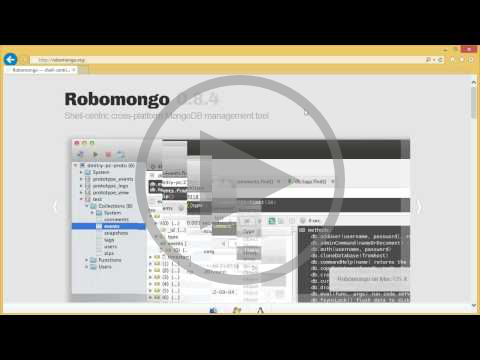

# Tutorial: Flask and MongoDB on Azure

[!INCLUDE[include](../../includes/tutorial-azure-mongodb-intro.md)]

[!INCLUDE[include](../../includes/tutorial-azure-mongodb-topic-toc.md)]

[!INCLUDE[include](../../includes/tutorial-prereqs.md)]

[!INCLUDE[include](../../includes/tutorial-create-intro.md)]

1. In Visual Studio, select **File > New > Project**, search for "Flask", select the **Polls Flask Web Project**, and click **OK**. If you don't see the Polls project template, you may not have installed the PTVS Sample Pack, and you may need to restart Visual Studio.
   
  

## Create a MongoDB database

For the database, create a MongoLab hosted database on Azure as follows. (Alternately, you can [create an Azure Virtual Machine and install and administer MongoDB directly](https://docs.microsoft.com/en-us/azure/virtual-machines/virtual-machines-windows-classic-install-mongodb).)

You can create a free trial with MongoLab by following these steps.

1. Log into the [Azure Management Portal](https://manage.windowsazure.com).

1. At the bottom of the navigation pane, click **NEW**.

  

1. Click **STORE**, then **MongoLab**.

  

1. In Name, type a name to use for the database service.

1. Choose a Region/Affinity Group in which to locate the database service. If 
   you will be using the database from your Azure application, select the same 
   region where you will deploy your application.

  

1. Click **PURCHASE**.