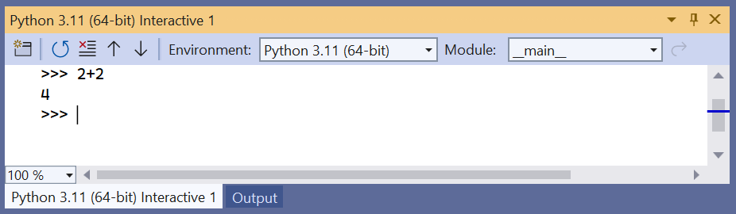

# Install Python support in Visual Studio

 [!INCLUDE [Visual Studio](~/includes/applies-to-version/vs-windows-only.md)]

> [!Note]
> Python support is presently available only on Visual Studio for Windows. On Mac and Linux, Python support is available through [Visual Studio Code](https://code.visualstudio.com/docs/python/python-tutorial).

1. Download and run the latest Visual Studio installer for Windows. Python support is present in the release 15.2 and later. If you have Visual Studio installed already, open Visual Studio and run the installer by selecting **Tools** > **Get Tools and Features**.

    > [!div class="nextstepaction"]
    > [Install Visual Studio Community](https://visualstudio.microsoft.com/thank-you-downloading-visual-studio/?sku=Community&rel=15&rid=34347&utm_source=docs&utm_medium=clickbutton&utm_campaign=python_gettingstarted)

    >[!Tip]
    > The Community edition is for individual developers, classroom learning, academic research, and open source development. For other uses, install [Visual Studio Professional](https://visualstudio.microsoft.com/thank-you-downloading-visual-studio/?sku=Professional&rel=15&rid=34347&utm_source=docs&utm_medium=clickbutton&utm_campaign=python_gettingstarted) or [Visual Studio Enterprise](https://visualstudio.microsoft.com/thank-you-downloading-visual-studio/?sku=Enterprise&rel=15&rid=34347&utm_source=docs&utm_medium=clickbutton&utm_campaign=python_gettingstarted).

1. The installer provides a list of workloads that are groups of related options for specific development areas. For Python, select the **Python development** workload and select **Install**:

    

1. To quickly test Python support, launch Visual Studio, press **Alt**+**I** to open the **Python Interactive** window, and enter `2+2`. If you don't see the output of **4**, recheck your steps.

    ::: moniker range="<=vs-2019"
    
    ::: moniker-end

    ::: moniker range=">=vs-2022"
    
    ::: moniker-end

## Next step

> [!div class="nextstepaction"]
> [Step 1: Create a Python project](tutorial-working-with-python-in-visual-studio-step-01-create-project.md)

## See also

- [Install Python support in Visual Studio 2022](installing-python-support-in-visual-studio.md#visual-studio-2022)
- [Install Python support in Visual Studio 2019](installing-python-support-in-visual-studio.md#visual-studio-2019)
- [Install Python support in Visual Studio 2015](installing-python-support-in-visual-studio.md#visual-studio-2015)
- [Manually identify an existing Python interpreter](managing-python-environments-in-visual-studio.md#manually-identify-an-existing-environment)
