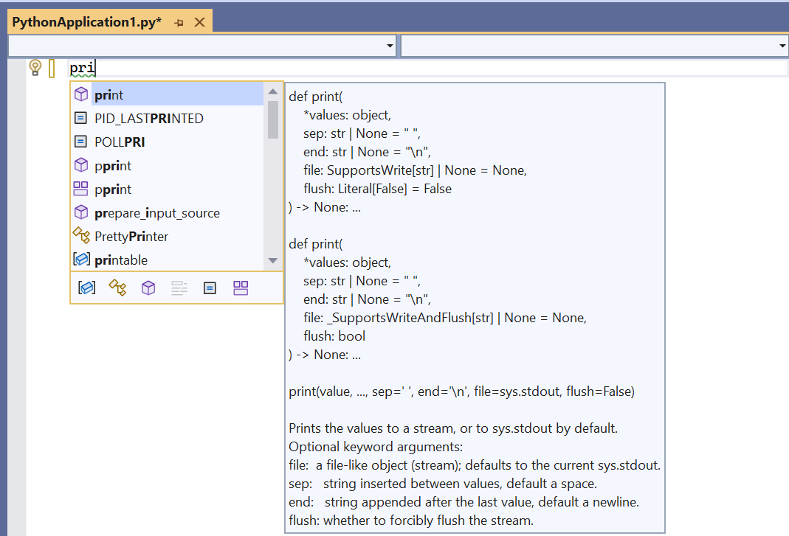
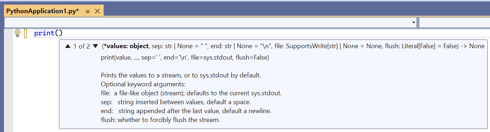
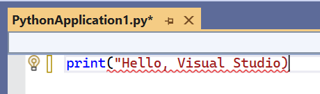
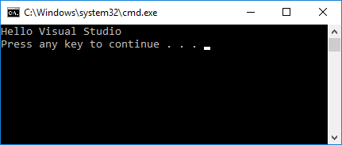
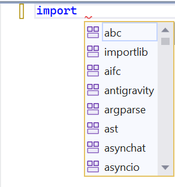
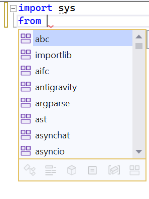
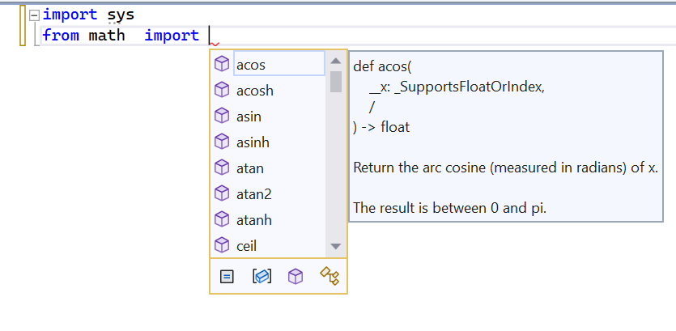

# Step 2: Writing and running code

**Previous step: [Creating a new Python project](tutorial-working-with-python-in-visual-studio-step-01-create-project.md)**

Although Solution Explorer is where you manage project files, the *editor* window is typically where you work with the *contents* of files, like source code. The editor is contextually aware of the type of file you're editing, including the programming language (based on the file extension), and offers features appropriate to that language such as syntax coloring and auto-completion using IntelliSense.

1. After creating a new "Python Application" project, a default empty file named `PythonApplication1.py` is open in the Visual Studio editor.

1. In the editor, start typing `print("Hello, Visual Studio")` and notice how Visual Studio IntelliSense displays auto-completion options along the way. The outlined option in the drop-down list is the default completion that's used when you press the Tab key. Completions are most helpful when longer statements or identifiers are involved.

    

1. IntelliSense shows different information depending on the statement you're using, the function you're calling, and so forth. With the `print` function, typing `(` after `print` to indicate a function call displays full usage information for that function. The IntelliSense pop up also shows the current argument in boldface (**value** as shown here):

    

1. Complete the statement so it matches the following:

    ```python
    print("Hello, Visual Studio")
    ```

1. Notice the syntax coloration that differentiates the statement `print` from the argument `"Hello Visual Studio"`. Also, temporarily delete the last `"` on the string and notice how Visual Studio will show a red underline for code that contains syntax errors. Then replace the `"` to correct the code.

    

    > [!Tip]
    > Because one's development environment is a very personal matter, Visual Studio gives you complete control over Visual Studio's appearance and behavior. Select the **Tools > Options** menu command and explore the settings under the **Environment** and **Text Editor** tabs. By default you'll see only a limited number of options; to see every option for every programming language, select **Show all settings** at the bottom of the dialog box. 

1. Run the code you've written to this point by pressing Ctrl+F5 or selecting **Debug > Start Without Debugging** menu item. Visual Studio warns you if you still have errors in your code.

1. When you run the program, a console window appears displaying the results, just as if you'd run a Python interpreter with `PythonApplication1.py` from the command line. Press a key to close the window and return to the Visual Studio editor.

    

1. In addition to completions for statements and functions, IntelliSense provide completions for Python `import` and `from` statements. These completions help you easily discover what modules are available in your environment and the members of those modules. In the editor, delete the `print` line and start typing `import `. A list of modules appears when you type the space:

    

1. Complete the line by typing or selecting `sys`.

1. On the next line, type `from` to again see a list of modules:

    

1. Select or type `math`, then continue typing with a space and `import`, which displays the module members:

    

1. Finish by importing the `sin`, `cos`, and `radians` members, noticing the auto-completions available for each. When you're done, your code should appear as follows:

    ```python
    import sys
    from math import sin, cos, radians
    ```

    > [!Tip]
    > Completions work with substrings as you type, matching parts of words, letters at the beginning of words, and even skipped characters. See [Editing code - Completions](code-editing.md#completions) for details.

1. Add a little more code to print the cosine values for 360 degrees:

    ```python
    for i in range(360):
        print(cos(radians(i)))
    ```

1. Run the program again with Ctrl+F5 or **Debug > Start Without Debugging**. Close the output window when you're done.

## Next steps

> [!div class="nextstepaction"]
> [Using the interactive REPL window](tutorial-working-with-python-in-visual-studio-step-03-interactive-repl.md)

## Going deeper

- [Editing code](code-editing.md)
- [Formatting code](code-formatting.md)
- [Refactoring code](code-refactoring.md)
- [Using PyLint](code-pylint.md)
