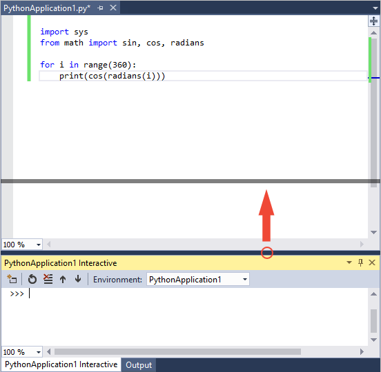
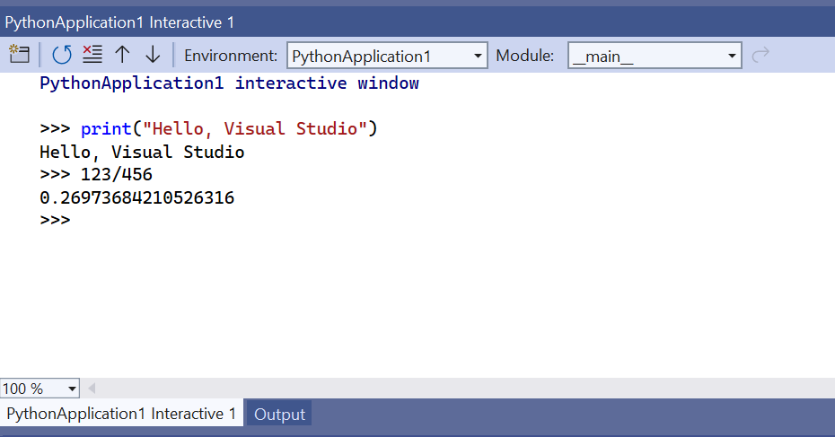
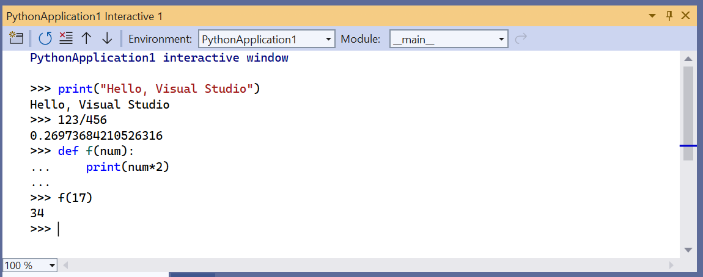
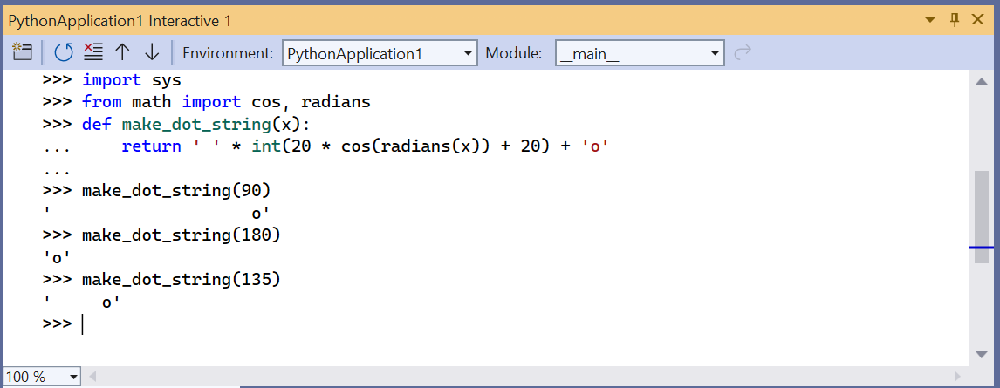
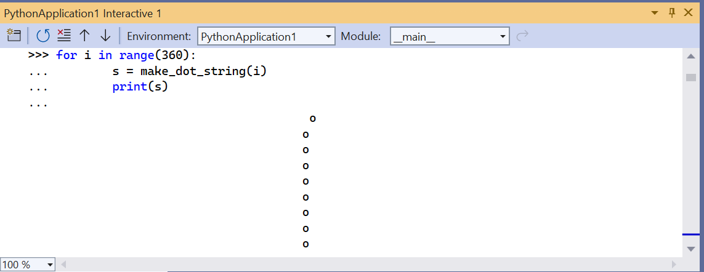
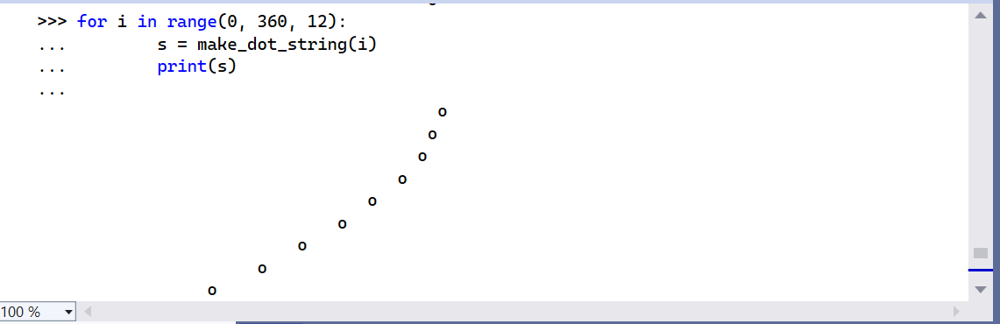

# Step 3: Use the Interactive REPL window

 [!INCLUDE [Visual Studio](~/includes/applies-to-version/vs-windows-only.md)]

**Previous step: [Write and run code](tutorial-working-with-python-in-visual-studio-step-02-writing-code.md)**

The Visual Studio **Interactive** window for Python provides a rich read-evaluate-print-loop (REPL) experience that greatly shortens the usual edit-build-debug cycle. The **Interactive** window provides all the capabilities of the REPL experience of the Python command line. It also makes it easy to exchange code with source files in the Visual Studio editor, which is otherwise cumbersome with the command line.

> [!NOTE]
> For issues with REPL, be sure to have `ipython` and `ipykernel` packages installed, and for help installing packages, see [Python environments packages tab](./python-environments-window-tab-reference.md#packages-tab).

1. Open the **Interactive** window by right-clicking the project's Python environment in **Solution Explorer** (such as **Python 3.6 (32-bit)** shown in an earlier graphic) and selecting **Open Interactive Window**. Another way is, to select **View** > **Other Windows** > **Python Interactive Windows** from the main Visual Studio menu.

1. The **Interactive** window opens below the editor with the standard **>>>** Python REPL prompt. The **Environment** drop-down list allows you to select a specific interpreter to work with. If you'd like to make the **Interactive** window larger you can drag the separator between the two windows, seen in the image below:

    

    > [!Tip]
    > You can resize all of the windows in Visual Studio by dragging the bordering separators. You can also drag windows out independently of the Visual Studio frame, and rearrange them however you like within the frame. For complete details, see [Customize window layouts](../ide/customizing-window-layouts-in-visual-studio.md).

1. Enter a few statements like `print("Hello, Visual Studio")` and expressions like `123/456` to see immediate results:

    

1. When you start writing a multiline statement (like a function definition), the **Interactive** window shows Python's **...** prompt for continuing lines. Unlike the command-line REPL, this will provide automatic indentation. You can add a new **...** line by pressing `Shift+Enter`:

    

1. The **Interactive** window provides a full history of everything you've entered, and improves upon the command-line REPL with multiline history items. For example, you can easily recall the entire definition of the `f` function as a single unit and easily change the name to `make_double`, rather than re-creating the function line by line.

1. Visual Studio can send multiple lines of code from an editor window to the **Interactive** window. This capability allows you to maintain code in a source file and easily send the chosen fragments to the **Interactive** window. You can then work with such code fragments in the rapid REPL environment rather than having to run the whole program. To see this feature, first replace the `for` loop in the *PythonApplication1.py* file with the code below:

    ```python
    # Create a string with spaces proportional to a cosine of x in degrees
    def make_dot_string(x):
        return ' ' * int(20 * cos(radians(x)) + 20) + 'o'
    ```

1. Select the `import`, `from`, and `make_dot_string` function statements in the *.py* file. Right-click the selected text and chose **Send to Interactive** (or press **Ctrl**+**Enter**). The code fragment is immediately pasted into the **Interactive** window and run. Because the code has defined a function, you can quickly test that function by calling it a few times:

    

    > [!Tip]
    > Using **Ctrl**+**Enter** in the editor *without* a selection runs the current line of code in the **Interactive** window and automatically places the caret on the next line. With this feature, pressing **Ctrl**+**Enter** repeatedly provides a convenient way to step through your code that is not possible with only the Python command line. It also lets you step through your code without running the debugger and without necessarily starting your program from the beginning.

1. You can also copy and paste multiple lines of code into the **Interactive** window from any source, such as the snippet below, which is difficult to do with the Python command-line REPL. When pasted, the **Interactive** window runs that code as if you'd typed it in:

    ```python
    for i in range(360):
        s = make_dot_string(i)
        print(s)
    ```

    

1. As you can see, this code works fine but its output isn't inspiring. A different step value in the `for` loop would show more of the cosine wave. The entire for loop is available in the REPL history as a single unit. You can go back and make whatever changes you want and then test the function again. Press the up arrow to first recall the `for` loop. You can navigate in the code by pressing the left or right arrows (until you do so, the up and down arrows continue to cycle through the history). Navigate to and change the `range` specification to `range(0, 360, 12)`. Then press **Ctrl**+**Enter** anywhere in the code, to run the whole statement again:

    

1. Repeat the process to experiment with different step settings until you find a value you like best. You can also make the wave repeat by lengthening the range, for example, `range(0, 1800, 12)`.

1. When you're satisfied with the code you wrote in the **Interactive** window, select it. Next, right-click the code and choose **Copy Code** (**Ctrl**+**Shift**+**C**). Finally, paste the selected code into the editor. Notice how this special feature of Visual Studio automatically omits any output, along with the `>>>` and `...` prompts. For example, the image below shows using the **Copy Code** command on a selection that includes prompts and output:

    

    When you paste into the editor, you get only the code:

    ```python
    for i in range(0, 1800, 12):
        s = make_dot_string(i)
        print(s)
    ```

    If you want to copy the exact contents of the **Interactive** window, including prompts and output, use the standard **Copy** command.

1. What you've done is use the rapid REPL environment of the **Interactive** window to work out the details for a small piece of code, then you conveniently added that code to your project's source file. When you now run the code again with **Ctrl**+**F5** (or **Debug** > **Start without Debugging**), you see the exact results you wanted.

## Next step

> [!div class="nextstepaction"]
> [Run code in the debugger](tutorial-working-with-python-in-visual-studio-step-04-debugging.md)

## Go deeper

- [Use the Interactive window](python-interactive-repl-in-visual-studio.md)
- [Use IPython REPL](interactive-repl-ipython.md)