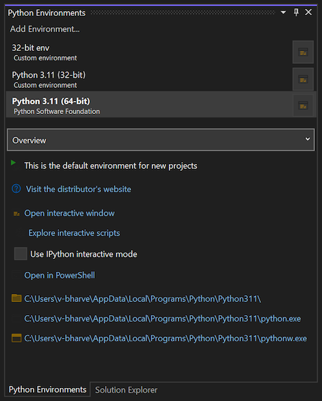
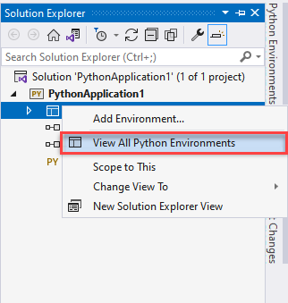
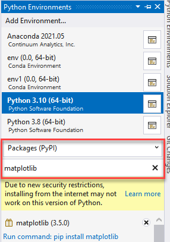
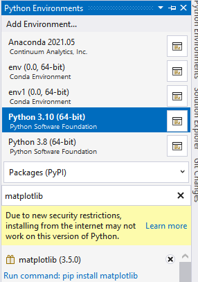

# Step 5: Install packages in your Python environment

 [!INCLUDE [Visual Studio](~/includes/applies-to-version/vs-windows-only.md)]

**Previous step: [Run code in the debugger](tutorial-working-with-python-in-visual-studio-step-04-debugging.md)**

The Python developer community has produced thousands of useful packages that you can incorporate into your own projects. Visual Studio provides a UI to manage packages in your Python environments.

## View environments

1. Select the **View** > **Other Windows** > **Python Environments** menu command. The **Python Environments** window opens as a peer to **Solution Explorer** and shows the different environments available to you. The list shows both environments that you installed using the Visual Studio installer and environments you installed separately. That includes global, virtual, and conda environments. The environment in bold is the default environment that's used for new projects. For more information about working with environments, see [How to create and manage Python environments in Visual Studio environments](managing-python-environments-in-visual-studio.md).

   :::moniker range=">=vs-2022"
   
   :::moniker-end

   :::moniker range="<=vs-2019"
   
   :::moniker-end

   > [!NOTE]
   > You can also use the **Ctrl+K, Ctrl+`** keyboard shortcut to open the **Python Environments** window from the Solution Explorer window. If the shortcut doesn't work and you can't find the Python Environments window in the menu, it's possible that you haven't installed the Python workload. See [How to install Python support in Visual Studio on Windows](installing-python-support-in-visual-studio.md#how-to-install-python-support-in-visual-studio-on-windows) for guidance about how to install Python.

   With a Python project open, you can open the **Python Environments** window from **Solution Explorer**. Right-click **Python Environments** and select **View All Python Environments**.

   :::moniker range="vs-2022"
   
   :::moniker-end

   :::moniker range="<=vs-2019"
   
   :::moniker-end

1. Now, create a new project with **File** > **New** > **Project**, selecting the **Python Application** template.

1. In the code file that appears, paste the following code, which creates a cosine wave like the previous tutorial steps, only this time plotted graphically. You can also use the project you previously created and replace the code.

    ```python
    from math import radians
    import numpy as np # installed with matplotlib
    import matplotlib.pyplot as plt

    def main():
        x = np.arange(0, radians(1800), radians(12))
        plt.plot(x, np.cos(x), 'b')
        plt.show()

    main()
    ```

1. In the editor window, hover over the `numpy` and `matplotlib` import statements. You'll notice that they aren't resolved. To resolve the import statements, install the packages to the default global environment.
   :::moniker range=">=vs-2022"
   
   :::moniker-end

   :::moniker range="<=vs-2019"
    
   :::moniker-end

1. When you look at the editor window, notice that when you hover over the `numpy` and `matplotlib` import statements that they aren't resolved. The reason is the packages haven't been installed to the default global environment.

    For example, select **Open interactive window** and an **Interactive window** for that specific environment appears in Visual Studio.

1. The **Packages** tab in the Python Environments window lists all packages that are currently installed in the environment.

## Install packages using the Python Environments window

1. From the Python Environments window, select the default environment for new Python projects and choose the **Packages** tab. You'll then see a list of packages that are currently installed in the environment.

   :::moniker range=">=vs-2022"
   [Install packages in an environment](media/environments/install-python-packages-2022.gif)
   :::moniker-end

1. Install `matplotlib` by entering its name into the search field and then selecting the **Run command: pip install matplotlib** option. Running the command will install `matplotlib`, and any packages it depends on (in this case that includes `numpy`).

1. Choose the **Packages** tab.

1. Consent to elevation if prompted to do so.

1. After the package is installed, it appears in the **Python Environments** window. The **X** to the right of the package uninstalls it.

   :::moniker range="vs-2022"
    
   :::moniker-end
   :::moniker range="<=vs-2019"
   
   :::moniker-end

1. Consent to elevation if prompted to do so.

1. After the package installs, it appears in the **Python Environments** window. The **X** to the right of the package uninstalls it.

   :::moniker range="vs-2022"
   
   :::moniker-end

   :::moniker range="<=vs-2019"
   
   :::moniker-end

    > [!NOTE]
   > A small progress bar might appear underneath the environment to indicate that Visual Studio is building its IntelliSense database for the newly-installed package. The **IntelliSense** tab also shows more detailed information. Be aware that until that database is complete, IntelliSense features like auto-completion and syntax checking won't be active in the editor for that package.

   > Visual Studio 2017 version 15.6 and later uses a different and faster method for working with IntelliSense, and displays a message to that effect on the **IntelliSense** tab.

## Run the program

Now that [matplotlib](https://matplotlib.org/) is installed, run the program with (**F5**) or without the debugger (**Ctrl**+**F5**) to see the output:

   

## Next step

> [!div class="nextstepaction"]
> [Work with Git](tutorial-working-with-python-in-visual-studio-step-06-working-with-git.md)

## Go deeper

- [Python environments](managing-python-environments-in-visual-studio.md)
- [Learn Django in Visual Studio](learn-django-in-visual-studio-step-01-project-and-solution.md)
- [Learn Flask in Visual Studio](learn-flask-visual-studio-step-01-project-solution.md)
