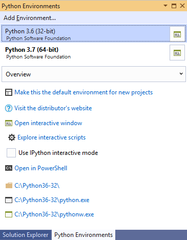
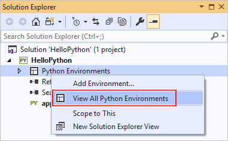
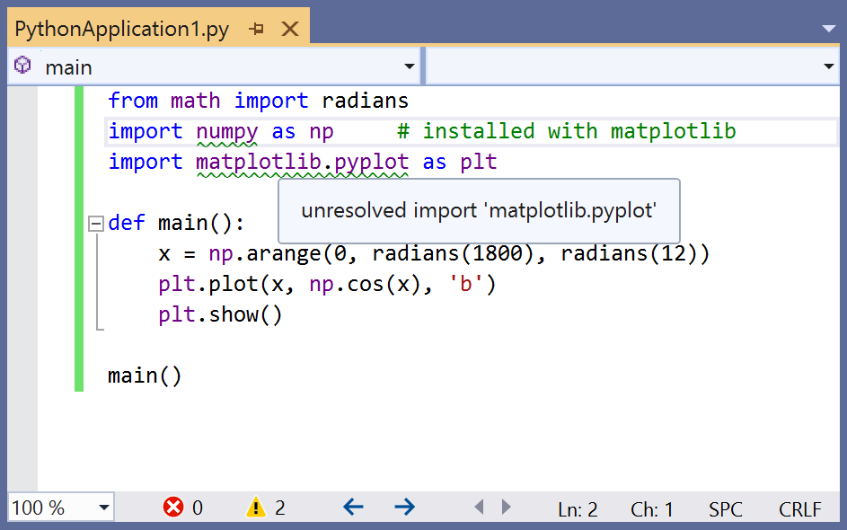
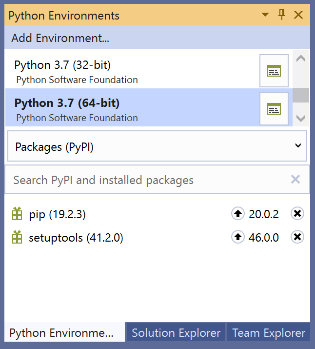
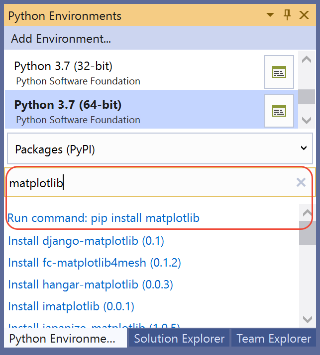
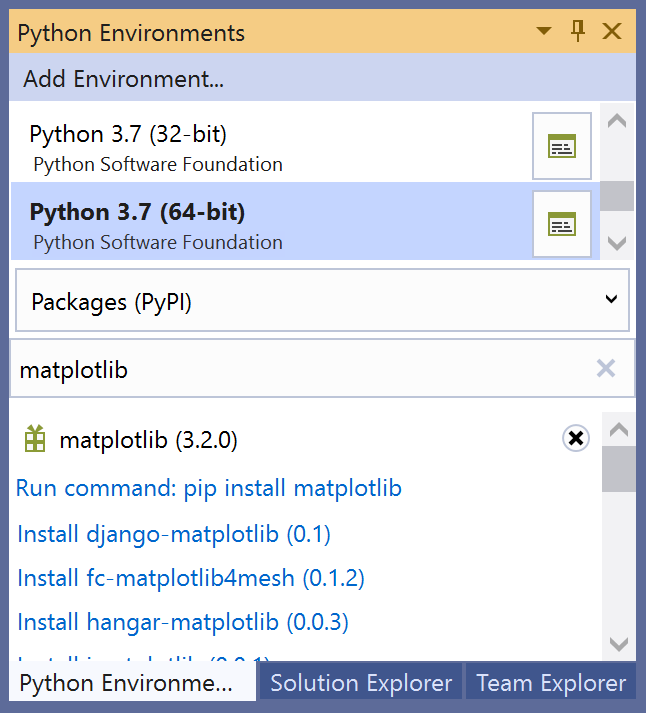

# Step 5: Install packages in your Python environment

**Previous step: [Run code in the debugger](tutorial-working-with-python-in-visual-studio-step-04-debugging.md)**

The Python developer community has produced thousands of useful packages that you can incorporate into your own projects. Visual Studio provides a UI to manage packages in your Python environments.

## View environments

1. Select the **View** > **Other Windows** > **Python Environments** menu command. The **Python Environments** window opens as a peer to **Solution Explorer** and shows the different environments available to you. The list shows both environments that you installed using the Visual Studio installer and those you installed separately. That includes global, virtual, and conda environments. The environment in bold is the default environment that's used for new projects. For additional information about working with environments, see [How to create and manage Python environments in Visual Studio environments](managing-python-environments-in-visual-studio.md).

   

   > [!NOTE]
   > You can also open the Python Environments window by selecting the Solution Explorer window and using the **Ctrl+K, Ctrl+`** keyboard shortcut. If the shortcut doesn't work and you can't find the Python Environments window in the menu, it's possible you haven't installed the Python workload. See [How to install Python support in Visual Studio](installing-python-support-in-visual-studio.md) for guidance about how to install Python.

2. The environment's **Overview** tab provides quick access to an **Interactive** window for that environment along with the environment's installation folder and interpreters. For example, select **Open interactive window** and an **Interactive** window for that specific environment appears in Visual Studio.

3. Now, create a new project with **File** > **New** > **Project**, selecting the **Python Application** template. In the code file that appears, paste the following code, which creates a cosine wave like the previous tutorial steps, only this time plotted graphically. Alternatively, you can use the project you previously created and replace the code.

    ```python
    from math import radians
    import numpy as np     # installed with matplotlib
    import matplotlib.pyplot as plt

    def main():
        x = np.arange(0, radians(1800), radians(12))
        plt.plot(x, np.cos(x), 'b')
        plt.show()

    main()
    ```

4. With a Python project open, you can also open the Python Environments window from Solution Explorer by right-clicking **Python Environments** and selecting **View All Python Environments**

   

5. Looking at the editor window, you'll notice that if you hover over the `numpy` and `matplotlib` import statements that they are not resolved. That's because the packages have not been installed to the default global environment.

   

## Install packages using the Python Environments window

1. From the Python Environments window, select the default environment for new Python projects and choose the **Packages** tab. You will then see a list of packages that are currently installed in the environment.

   

2. Install `matplotlib` by entering its name into the search field and then selecting the **Run command: pip install matplotlib** option. This will install `matplotlib`, as well as any packages it depends on (in this case that includes `numpy`).

   

5. Consent to elevation if prompted to do so.

6. After the package is installed, it appears in the **Python Environments** window. The **X** to the right of the package uninstalls it.

   

   > [!NOTE]
   > A small progress bar might appear underneath the environment to indicate that Visual Studio is building its IntelliSense database for the newly-installed package. The **IntelliSense** tab also shows more detailed information. Be aware that until that database is complete, IntelliSense features like auto-completion and syntax checking won't be active in the editor for that package.
   >
   > Visual Studio 2017 version 15.6 and later uses a different and faster method for working with IntelliSense, and displays a message to that effect on the **IntelliSense** tab.

## Run the program

1. Now that [matplotlib](https://matplotlib.org/) is installed, run the program with (**F5**) or without the debugger (**Ctrl**+**F5**) to see the output:

   

## Next step

> [!div class="nextstepaction"]
> [Work with Git](tutorial-working-with-python-in-visual-studio-step-06-working-with-git.md)

## Go deeper

- [Python environments](managing-python-environments-in-visual-studio.md)
- [Learn Django in Visual Studio](learn-django-in-visual-studio-step-01-project-and-solution.md)
- [Learn Flask in Visual Studio](learn-flask-visual-studio-step-01-project-solution.md)
