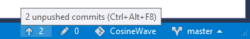
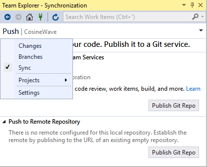
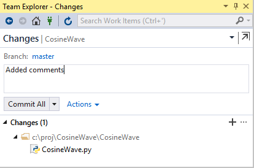
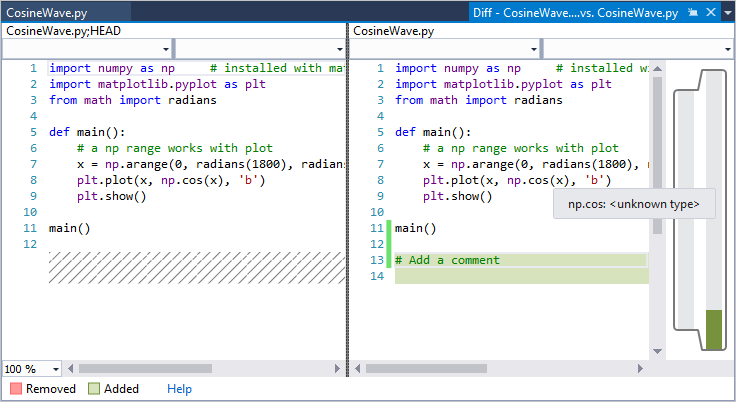
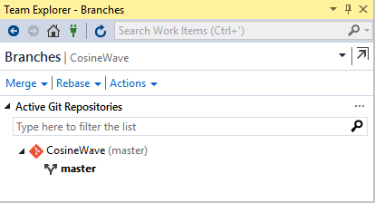

# Step 6: Work with Git

**Previous step: [Install packages and manage your Python environment](tutorial-working-with-python-in-visual-studio-step-05-installing-packages.md)**

[!INCLUDE[..get-started/includes/git-source-control.md](../get-started/includes/git-source-control.md)]

::: moniker range="vs-2017"

Visual Studio provides direct integration with local Git repositories and remote repositories on services like GitHub and Azure Repos. The integration includes cloning a repository, committing changes, and managing branches.

This article provides a basic overview of creating a local Git repository for an existing project, and familiarizing yourself with some of Visual Studio's Git-related features.

1. With a project open in Visual Studio, such as the project from the [previous step](tutorial-working-with-python-in-visual-studio-step-05-installing-packages.md), right-click the solution and select **Add Solution to Source Control**. Visual Studio creates a local Git repository that contains your project code.

1. When Visual Studio detects that the project is managed in a Git repository Git-related controls appear along the bottom right corner of the Visual Studio window. The controls show pending commits, changes, the name of the repository, and the branch. Hover over the controls to see additional information.

    

1. When you create a new repository or select any of the Git controls, Visual Studio opens the **Team Explorer** window. (You can open the window at any time with the **View** > **Team Explorer** menu command.) The window has three main panes, which you switch between using the drop-down on the **Team Explorer** header. The **Sync** pane, which provides publishing operations, also appears when you select the **Push** control (the up arrow icon):

    

1. Select **Changes** (or the Git control with the pencil icon) to review uncommitted changes and to commit them when desired.

    

    Double-click a file in the **Changes** list to open a diff view for that file:

    

1. Select **Branches** (or the Git control with a branch name) to examine branches and perform merge and rebase operations:

    

1. Selecting the Git control with the repository name (**CosineWave** in a previous image), **Team Explorer** shows a **Connect** interface with which you can quickly switch to another repository entirely.

1. When using a local repository, committed changes go directly into the repository. If you're connected to a remote repository, select the drop-down header in **Team Explorer**, choose **Sync** to switch to the **Synchronization** section, and work with the **Pull** and **Fetch** commands presented there.

## Go deeper

For a short walkthrough of creating a project from a remote Git repository, see [Quickstart: Clone a repository of Python code in Visual Studio](quickstart-03-python-in-visual-studio-project-from-repository.md).

For a much more comprehensive tutorial, including handling merge conflicts, reviewing code with pull requests, rebasing, and cherry-picking changes between branches, see [Get started with Git and Azure Repos](/azure/devops/repos/git/gitquickstart).

::: moniker-end

## Tutorial review

Congratulations on completing this tutorial on Python in Visual Studio. In this tutorial you've learned how to:

- Create projects and view a project's contents.
- Use the code editor and run a project.
- Use the **Interactive** window to develop new code and easily copy that code into the editor.
- Run a completed program in the Visual Studio debugger.
- Install packages and manage Python environments.
- Work with code in a Git repository.

From here, explore the Concepts and How-to guides, including the following articles:

- [Create a C++ extension for Python](working-with-c-cpp-python-in-visual-studio.md)
- [Publish to Azure App Service](publishing-python-web-applications-to-azure-from-visual-studio.md)
- [Profiling](profiling-python-code-in-visual-studio.md)
- [Unit testing](unit-testing-python-in-visual-studio.md)
