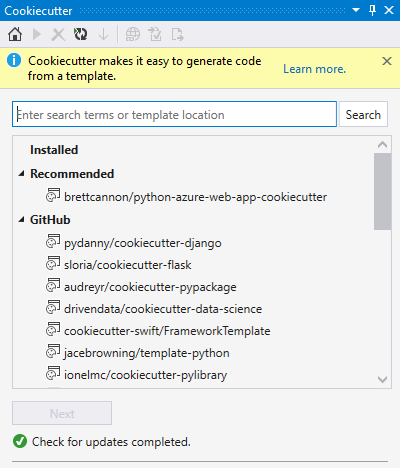
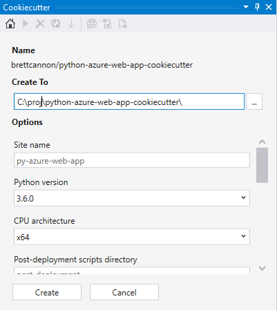
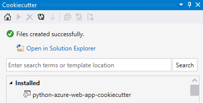
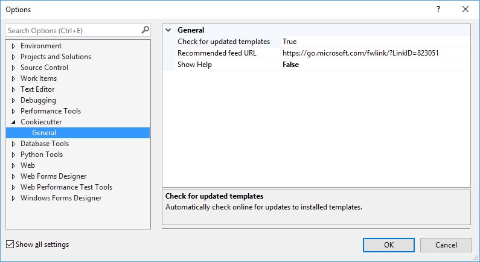

# Use the Cookiecutter extension

[Cookiecutter](https://cookiecutter.readthedocs.io/en/latest/) provides a graphical user interface to discover templates, input template options, and create projects and files. It's included with Visual Studio 2017 and later and can be installed separately in earlier versions of Visual Studio.

Cookiecutter requires Python 3.3 or later (32-bit or 64-bit) or Anaconda 3 4.2 or later (32-bit or 64-bit). If a suitable Python interpreter isn't available, Visual Studio displays a warning. If you install a Python interpreter while Visual Studio is running, click the **Home** button on the Cookiecutter toolbar to detect the newly installed interpreter. (See [Python environments](managing-python-environments-in-visual-studio.md) for more about environments in general.)

Once installed, select **View** > **Cookiecutter Explorer** to open its window:



## Cookiecutter workflow

Working with Cookiecutter is a process of browsing and selecting a template, cloning it to your local computer, setting options, then creating code from that template, as described in the sections that follow.

### Browse templates

The Cookiecutter home page displays a list of templates to choose from, organized into the following groups:

| Group | Description |
| --- | --- |
| **Installed** | Templates that have been installed to your local computer. When an online template is used, its repository is automatically cloned to a subfolder of *~/.cookiecutters*. You can delete a selected installed template by pressing **Delete**. |
| **Recommended** | Templates loaded from the recommended feed. The default feed is curated by Microsoft. See [Cookiecutter options](#cookiecutter-options) below for details on customizing the feed. |
| **GitHub** | GitHub search results for the cookiecutter keyword. Results from GitHub come back paginated, if more results are available, **Load More** appears at the end of the list. |
| **Custom** | When a custom location is entered in the search box, it appears in this group. You can either type in a full path to the GitHub repository, or the full path to a folder on your local disk. |

### Cloning

When you select a template followed by **Next**, Cookiecutter makes a local copy to work from.

If you select a template from the **Recommended** or **GitHub** groups, or enter a custom URL into the search box and select that template, it's cloned and installed on your local computer. If that template was installed in a previous session of Visual Studio, it's automatically deleted and the latest version is cloned.

If you select a template from the **Installed** group, or enter a custom folder path into the search box and select that template, Visual Studio loads that template without cloning.

> [!Important]
> Cookiecutter templates are cloned under a single folder *~/.cookiecutters*. Each subfolder is named after the git repository name, which does not include the GitHub user name. Conflicts can arise if you clone different templates with the same name that come from different authors. In this case, Cookiecutter prevents you from overwriting the existing template with a different template of the same name. To install the other template, you must first delete the existing one.

### Set template options

After the template is installed locally, Cookiecutter displays an options page where you can specify where you want Cookiecutter to generate files along with other options:



Each Cookiecutter template defines its own set of options, and specifies a default value for each one (displayed as the suggested text in each entry field). A default value may be a code snippet, often when it's a dynamic value that uses other options.

It's possible to customize default values for specific options with a user configuration file. When the Cookiecutter extension detects a user configuration file, it overwrites the template's default values with the user config's default values. This behavior is discussed in the [User Config](https://cookiecutter.readthedocs.io/en/latest/advanced/user_config.html) section of the Cookiecutter documentation.

If the template specifies specific Visual Studio tasks to run after code generation, an additional **Run additional tasks on completion** option appears that allows you to opt out of those tasks. The most common use of tasks is to open a web browser, open files in the editor, install dependencies, and so on.

### Create

Once you've set your options, select **Create** to generate code (a warning appears if the output folder isn't empty). If you're familiar with the template's output and don't mind overwriting files, you can dismiss the warning. Otherwise, select **Cancel**, specify an empty folder, and then manually copy the created files to your non-empty output folder.

After the files are created successfully, Cookiecutter provides an option to open the files in **Solution Explorer**:



## Cookiecutter options

Cookiecutter options are available through **Tools** > **Options** > **Cookiecutter**:



| Option | Description |
| --- | --- |
| **Recommended feed URL** | The location of the recommended templates feed. It can be a URL or a path to a local file. Leave the URL empty to use the default Microsoft curated feed. The feed provides a simple list of template locations, separated by newlines. To request changes to the curated feed, make a pull request against [the source on GitHub](https://github.com/Microsoft/PTVS/blob/master/Python/Product/Cookiecutter/CookiecutterFeed.txt). |
| **Show Help** | Controls the visibility of the help information bar at the top of the Cookiecutter window. |

## Optimize Cookiecutter templates for Visual Studio

For the basics of authoring a Cookiecutter template, see the [Cookiecutter documentation](https://cookiecutter.readthedocs.io/en/latest/first_steps.html). The Cookiecutter extension for Visual Studio supports templates created for Cookiecutter v1.4.

The default rendering of template variables depends on the type of data (string or list):

- String: Label for variable name, text box for entering value, and a watermark showing the default value. Tooltip on the text box shows the default value.
- List: Label for variable name, combo box for selecting a value. Tooltip on the combo box shows the default value.

It's possible to improve on this rendering by specifying additional metadata in your *cookiecutter.json* file that's specific to Visual Studio (and ignored by the Cookiecutter CLI). All properties are optional:

| Property | Description |
| --- | --- |
| Label | Specifies what appears above the editor for the variable, instead of the name of the variable. |
| Description | Specifies the tooltip that appears on the edit control, instead of the default value for that variable. |
| URL | Changes the label into a hyperlink, with a tooltip that shows the URL. Clicking on the hyperlink opens the user's default browser to that URL. |
| Selector | Allows customization of the editor for a variable. The following selectors are currently supported:<ul><li>`string`: Standard text box, default for strings.</li><li>`list`: Standard combo box, default for lists.</li><li>`yesno`: Combo box to choose between `y` and `n`, for strings.</li><li>`odbcConnection`: Text box with a **...** button that brings up a database connection dialog.</li></ul> |

Example:

```json
{
    "site_name": "web-app",
    "python_version": ["3.5.2", "2.7.12"],
    "use_azure": "y",

    "_visual_studio": {
        "site_name": {
            "label": "Site name",
            "description": "E.g. <site-name>.azurewebsites.net (can only contain alphanumeric characters and `-`)"
        },
        "python_version": {
            "label": "Python version",
            "description": "The version of Python to run the site on"
        },
        "use_azure" : {
            "label": "Use Azure",
            "description": "Include Azure deployment files",
            "selector": "yesno",
            "url": "https://azure.microsoft.com"
        }
    }
}
```

### Run Visual Studio tasks

Cookiecutter has a feature called *Post-Generate Hooks* that allows for running arbitrary Python code after the files are generated. Although flexible, it doesn't allow easy access to Visual Studio.

For example, you may want to open a file in the Visual Studio editor, or in its web browser, or trigger the Visual Studio UI that prompts the user to create a virtual environment and install package requirements.

To allow these scenarios, Visual Studio looks for extended metadata in *cookiecutter.json* that describes the commands to run after the user opens the generated files in **Solution Explorer** or after the files are added to an existing project. (Again, the user can opt out of running the tasks by clearing **Run additional tasks on completion** in the template options.)

Example:

```json
"_visual_studio_post_cmds": [
    {
        "name": "File.OpenFile",
        "args": "{{cookiecutter._output_folder_path}}\\readme.txt"
    },
    {
        "name": "Cookiecutter.ExternalWebBrowser",
        "args": "https://docs.microsoft.com"
    },
    {
        "name": "Python.InstallProjectRequirements",
        "args": "{{cookiecutter._output_folder_path}}\\dev-requirements.txt"
    }
]
```

Commands are specified by name, and should use the non-localized (English) name to work on localized installs of Visual Studio. You can test and discover command names in the Visual Studio **Command** window.

If you want to pass a single argument, specify it as a string like in the previous example.

If you don't need to pass an argument, leave it an empty string or omit it from the JSON:

```json
"_visual_studio_post_cmds": [
    {
        "name": "View.WebBrowser"
    }
]
```

Use an array for multiple arguments. For switches, split the switch and its value into separate arguments and use proper quoting. For example:

```json
"_visual_studio_post_cmds": [
    {
        "name": "File.OpenFile",
        "args": [
            "{{cookiecutter._output_folder_path}}\\read me.txt",
            "/e:",
            "Source Code (text) Editor"
        ]
    }
]
```

Arguments can refer to other Cookiecutter variables. In the examples above, the internal `_output_folder_path` variable is used to form an absolute path to generated files.

Note that the `Python.InstallProjectRequirements` command works only when adding files to an existing project. This limitation exists because the command is processed by the Python project in **Solution Explorer**, and there's no project to receive the message while in **Solution Explorer** - **Folder View**. We hope to remove the limitation win a future release (and provide better **Folder View** support in general).

## Troubleshooting

### Error loading template

Some templates may be using invalid data types, such as boolean, in their *cookiecutter.json*. Report such instances to the template author by selecting the **Issues** link in the template information pane.

### Hook script failed

Some templates may use post-generation scripts that are not compatible with the Cookiecutter UI. For example, scripts that query the user for input fails due to not having a terminal console.

### Hook script not supported on Windows

If the post script is *.sh*, then it may not be associated with an application on your Windows computer. You may see a Windows dialog asking you to find a compatible application in the Windows store.

### Templates with known issues

Clone failures:

- **wildfish/cookiecutter-django-crud** (invalid character `|` in subfolder name)
- **cookiecutter-pyvanguard** (invalid character `|` in subfolder name)

Load failures:

- **chrisdev/wagtail-cookiecutter-foundation** (uses a boolean type in *cookiecutter.json*)
- **quintoandar/cookiecutter-android** (no template folder)

Run failures:

- **iknite/cookiecutter-ansible-role** (post hook script requires console input)
- **benregn/cookiecutter-django-ansible** (Jinja error)

Uses bash (not fatal):

- **openstack-dev/cookiecutter**
