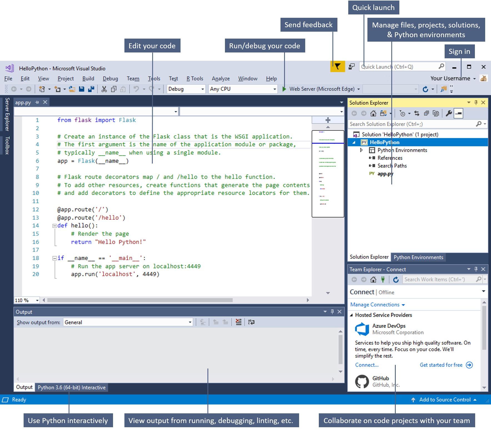
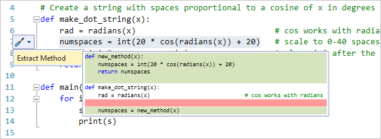
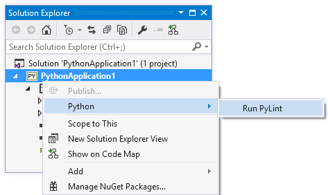
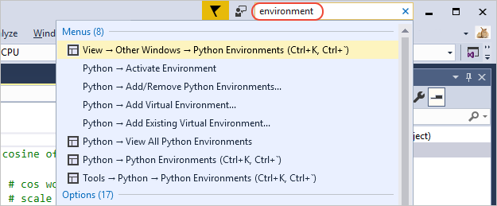
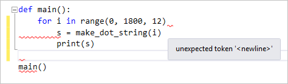
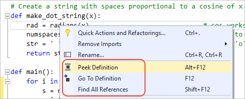
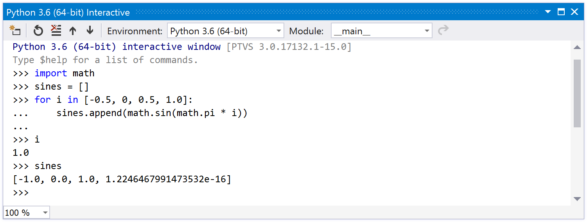
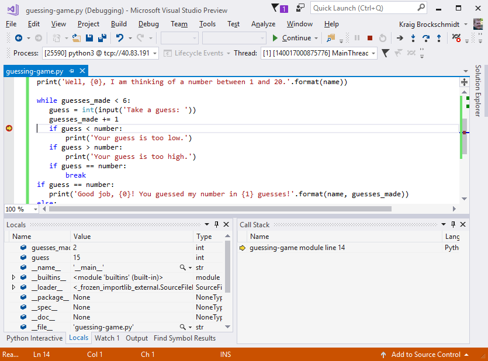
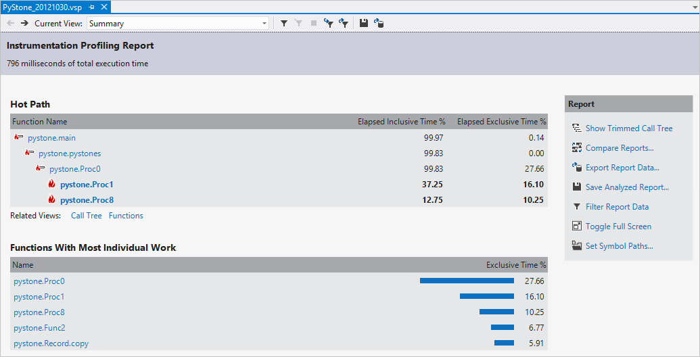

# Welcome to the Visual Studio IDE | Python

The Visual Studio *integrated development environment* is a creative launching pad for Python (and other languages) that you can use to edit, debug, and test code, and then publish an app. An integrated development environment (IDE) is a feature-rich program that can be used for many aspects of software development. Over and above the standard editor and debugger that most IDEs provide, Visual Studio includes code completion tools, interactive REPL environments, and other features to ease the software development process.

This image shows Visual Studio with an open Python project and several key tool windows you'll likely use:

- [**Solution Explorer**](../ide/solutions-and-projects-in-visual-studio.md) (top right) lets you view, navigate, and manage your code files. **Solution Explorer** can help organize your code by grouping the files into [solutions and projects](../get-started/tutorial-projects-solutions.md).
  - Alongside **Solution Explorer** is [**Python Environments**](managing-python-environments-in-visual-studio.md), where you manage the different Python interpreters that are installed on your computer.

  ::: moniker range=">=vs-2019"
  - You can also open and run Python code in a folder without creating Visual Studio project and solution files. For more information, see [Quickstart: Open and run Python code in a folder](quickstart-05-python-visual-studio-open-folder.md).
  ::: moniker-end

- The [editor window](../ide/writing-code-in-the-code-and-text-editor.md) (center), where you'll likely spend a majority of your time, displays file contents. This is where you [edit Python code](editing-python-code-in-visual-studio.md), navigate within your code structure, and set breakpoints during debugging sessions. With Python, you can also select code and press Ctrl+Enter to run that code in an [interactive REPL window](python-interactive-repl-in-visual-studio.md).

- The [Output window](../ide/reference/output-window.md) (bottom center) is where Visual Studio sends notifications such as debugging and error messages, warnings, publishing status messages, and more. Each message source has its own tab.
  - A [Python Interactive REPL window](python-interactive-repl-in-visual-studio.md) appears in the same area as the Output window.

- [Team Explorer](/azure/devops/user-guide/work-team-explorer?view=vsts) (bottom right) lets you track work items and share code with others using version control technologies such as [Git](https://git-scm.com/) and [Team Foundation Version Control (TFVC)](/azure/devops/repos/tfvc/overview?view=vsts).

## Editions

Visual Studio is available for Windows and Mac; however, Python support is available only on Visual Studio for Windows.

There are three editions of Visual Studio on Windows: Community, Professional, and Enterprise. See [Compare Visual Studio IDEs](https://visualstudio.microsoft.com/vs/compare/) to learn about which features are supported in each edition.

## Popular productivity features

Some of the popular features in Visual Studio that help you to be more productive as you develop software include:

- [IntelliSense](editing-python-code-in-visual-studio.md#intellisense)

   IntelliSense is a term for a set of features that displays information about your code directly in the editor and, in some cases, write small bits of code for you. It's like having basic documentation inline in the editor, which saves you from having to look up type information elsewhere. IntelliSense features vary by language, and the [Editing Python code](editing-python-code-in-visual-studio.md#intellisense) article has details for Python. The following illustration shows how IntelliSense displays a member list for a type:

   

- [Refactoring](refactoring-python-code.md)

   By right-clicking on a piece of code and selecting **Quick actions and Refactorings**, Visual Studio provides you with operations such as intelligent renaming of variables, extracting one or more lines of code into a new method, changing the order of method parameters, and more.

   

- [Linting](refactoring-python-code.md)

   Linting checks for errors and common problems in your Python code, encouraging you with good Python coding patterns.

   

- Search box

   Visual Studio can seem overwhelming at times with so many menus, options, and properties. The search box is a great way to rapidly find what you need in Visual Studio. When you start typing the name of something you're looking for, Visual Studio lists results that take you exactly where you need to go. If you need to add functionality to Visual Studio, for example to add support for an additional programming language, the search box provides results that open Visual Studio Installer to install a workload or individual component.

   

- Squiggles and [Quick Actions](../ide/quick-actions.md)

   Squiggles are wavy underlines that alert you to errors or potential problems in your code as you type. These visual clues enable you to fix problems immediately without waiting for the error to be discovered during build or when you run the program. If you hover over a squiggle, you see additional information about the error. A light bulb may also appear in the left margin with actions, known as Quick Actions, to fix the error.

   

- [Go To and Peek Definition](../ide/go-to-and-peek-definition.md)

   The **Go To Definition** feature takes you directly to the location where a function or type is defined. The **Peek Definitions** command displays the definition in a window without opening a separate file. The **Find All References** command also provides a helpful way to discover where any given identifier is both defined and used.

   

## Powerful features for Python

::: moniker range=">=vs-2019"
- [Run code without a project](quickstart-05-python-visual-studio-open-folder.md)

    Starting in Visual Studio 2019, you can open a folder containing Python code to enjoy features like IntelliSense and debugging without having to create a Visual Studio project for the code.
::: moniker-end

- [Collaborate using Visual Studio](/visualstudio/liveshare/)
  
    Visual Studio Live Share enables you to collaboratively edit and debug with others in real time, regardless of what programming language you're using or app types you're building. 

- [Python Interactive REPL](python-interactive-repl-in-visual-studio.md)

    Visual Studio provides an interactive read-evaluate-print loop (REPL) window for each of your Python environments, which improves upon the REPL you get with *python.exe* on the command line. In the **Interactive** window you can enter arbitrary Python code and see immediate results.

    

- [Debugging](debugging-python-in-visual-studio.md)

    Visual Studio provides a comprehensive debugging experience for Python, including attaching to running processes, evaluating expressions in the **Watch** and **Immediate** windows, inspecting local variables, breakpoints, step in/out/over statements, **Set Next Statement**, and more. You can also debug remote Python code running on Linux computers.

    

- [Interacting with C++](working-with-c-cpp-python-in-visual-studio.md)

    Many libraries created for Python are written in C++ for optimal performance. Visual Studio provides rich facilities for developing C++ extensions, including [mixed-mode debugging](debugging-mixed-mode-c-cpp-python-in-visual-studio.md).

    

- [Profiling](profiling-python-code-in-visual-studio.md)

    When using a CPython-based interpreter, you can evaluate the performance of your Python code within Visual Studio.

    

- [Unit Testing](unit-testing-python-in-visual-studio.md)

    Visual Studio provides integrated support for discovering, running, and debugging unit tests all in the context of the IDE.

    

## Next steps

Explore Python in Visual Studio further by following one of the following quickstarts or tutorials:

> [!div class="nextstepaction"]
> [Quickstart: Create a web app with Flask](../ide/quickstart-python.md?toc=/visualstudio/python/toc.json&bc=/visualstudio/python/_breadcrumb/toc.json)

> [!div class="nextstepaction"]
> [Work with Python in Visual Studio](tutorial-working-with-python-in-visual-studio-step-01-create-project.md)

> [!div class="nextstepaction"]
> [Get started with the Django web framework in Visual Studio](learn-django-in-visual-studio-step-01-project-and-solution.md)

> [!div class="nextstepaction"]
> [Get started with the Flask web framework in Visual Studio](learn-flask-visual-studio-step-01-project-solution.md)

## See also

- Discover [more Visual Studio features](../ide/advanced-feature-overview.md)
- Visit [visualstudio.microsoft.com](https://visualstudio.microsoft.com/vs/)
- Read [The Visual Studio blog](https://devblogs.microsoft.com/visualstudio/)
