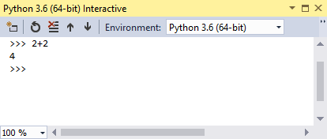

# Install Python support in Visual Studio

Visual Studio 2017 supports Python development with easy-to-install options in the Visual Studio installer. Here's how. 

1. Download and run the latest Visual Studio 2017 installer from [visualstudio.com](https://www.visualstudio.com/downloads). Python is supported in all editions of Visual Studio 2017 release 15.3 and higher; it may not appear with earlier release channels.

1. The installer presents you with a list of workloads, which are groups of related options for specific development areas. For Python, select the **Python development** workload.

    

    Optional: if you're working with data science, also consider the **Data science and analytical applications** workload. This workload includes support for Python as well as the R and F# languages. For more information, see [Data science and analytical applications workload](../rtvs/data-science-workload.md).

1. On the right side of the installer, chose additional options if desired. Skip this step to accept the default options.

    

    | Option | Description | 
    | --- | --- |
    | Python distributions | Choose any combination of the 32-bit and 64-bit variants of the Python 2, Python 3, Anaconda2, and Anaconda3 distributions that you plan to work with. Each includes the distribution's interpreter, runtime, and libraries. Anaconda, specifically, is an open data science platform that includes a wide range of packages. (You can return to the Visual Studio installer at any time to add or remove distributions.) |
    | Cookiecutter template support | Installs the Cookicutter graphical UI to discover templates, input template options, and create projects and files. See [Using the Cookicutter extension](cookiecutter.md). |
    | Python web support | Installs tools for web development including HTML, CSS, and JavaScript editing support, along with templates for projects using the Bottle, Flask, and Django frameworks. See [Python web project templates](template-web.md). |
    | Python IoT support | Supports Windows IoT Core development using Python. |
    | Python native development tools | Installs the C++ compiler and other necessary components to develop native extensions for Python. See [Creating a C++ extension for Python](cpp-and-python.md). |
    | Azure Cloud Services core tools | Provides additional support for developer Azure Cloud Services in Python. See [zure Cloud Service Projects](template-azure-cloud-service.md). |

1. After installation, the installer provides options to modify, launch, repair, or uninstall Visual Studio. The **Modify** button changes to **Update** when updates to Visual Studio when updates are available for any installed components. (The modify option is then available on the drop-down menu.) You can also launch Visual Studio and the installer from the Windows Start menu by searching on "Visual Studio".

    

1. To quickly test Python support, launch Visual Studio, press Alt+I to open the Python Interactive window, and enter `2+2`. If you don't see the output of `4`, recheck your steps.

    

## Next Steps

> [!div class="nextstepaction"]
> [Step 1: Create a Python project](vs-tutorial-01-01.md)

## See Also

- [Creating an environment for an existing Python interpreter](python-environments.md#creating-an-environment-for-an-existing-interpreter).
- [Install Python support in Visual Studio 2015 and earlier](installation.md).
- [Install locations](installation.md#install-locations).
