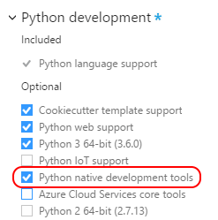
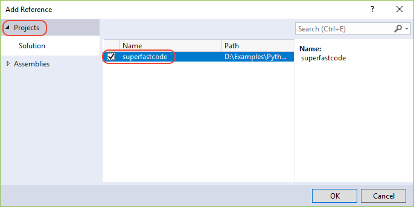
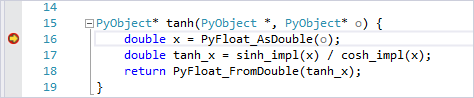

# Create a C++ extension for Python

Modules that are written in C++ (or C) are commonly used to extend the capabilities of a Python interpreter. They're also used to enable access to low-level operating system capabilities. 

Modules come in three primary types:

- **Accelerator modules**: Because Python is an interpreted language, you can write accelerator modules in C++ for higher performance.
- **Wrapper modules**: These modules expose existing C/C++ interfaces to Python code or expose a more "pythonic" API that's easy to use from Python.
- **Low-level system access modules**: You can create these modules to access lower-level features of the `CPython` runtime, the operating system, or the underlying hardware.

This article walks you through building a C++ extension module for `CPython` that computes a hyperbolic tangent and calls it from Python code. The routine is implemented first in Python to demonstrate the relative performance gain of implementing the same routine in C++.

The article also demonstrates two ways to make the C++ extension available to Python:

- Use the standard `CPython` extensions, as described in the [Python documentation](https://docs.python.org/3/c-api/).
- Use [PyBind11](https://github.com/pybind/pybind11), which we recommend for C++11 because of its simplicity.

You'll find the completed sample from this walkthrough on GitHub at [python-samples-vs-cpp-extension](https://github.com/Microsoft/python-sample-vs-cpp-extension).

## Prerequisites

- Visual Studio 2017 or later, with the Python Development workload installed. The workload includes the Python native development tools, which bring in the C++ workload and toolsets that are necessary for native extensions.

    

    > [!NOTE]
    > When you install the **Data science and analytical applications** workload, Python and the **Python native development tools** option are installed by default.

For more information about the installation options, see [Install Python support for Visual Studio](installing-python-support-in-visual-studio.md). If you install Python separately, be sure to select **Download debugging symbols** under **Advanced Options** in its installer. This option is required for you to use mixed-mode debugging between your Python code and native code.

## Create the Python application

1. Create a new Python project in Visual Studio by selecting **File** > **New** > **Project**. Search for **Python**, select the **Python Application** template, enter a name and location, and then select **OK**.

1. In the project's *.py* file, paste the following code. To experience some of the [Python editing features](editing-python-code-in-visual-studio.md), try entering the code manually.  

   This code computes a hyperbolic tangent without using the math library, and it's what you'll be accelerating with native extensions.

    > [!Tip]
    > Write your code in pure Python before you rewrite it in C++. This way, you can more easily check to ensure that your native code is correct.

    ```python
    from random import random
    from time import perf_counter

    COUNT = 500000  # Change this value depending on the speed of your computer
    DATA = [(random() - 0.5) * 3 for _ in range(COUNT)]

    e = 2.7182818284590452353602874713527

    def sinh(x):
        return (1 - (e ** (-2 * x))) / (2 * (e ** -x))

    def cosh(x):
        return (1 + (e ** (-2 * x))) / (2 * (e ** -x))

    def tanh(x):
        tanh_x = sinh(x) / cosh(x)
        return tanh_x

    def test(fn, name):
        start = perf_counter()
        result = fn(DATA)
        duration = perf_counter() - start
        print('{} took {:.3f} seconds\n\n'.format(name, duration))

        for d in result:
            assert -1 <= d <= 1, " incorrect values"

    if __name__ == "__main__":
        print('Running benchmarks with COUNT = {}'.format(COUNT))

        test(lambda d: [tanh(x) for x in d], '[tanh(x) for x in d] (Python implementation)')
    ```

1. To view the results, run the program by selecting **Debug** > **Start without Debugging** or by selecting Ctrl+F5. 

   You can adjust the `COUNT` variable to change how long the benchmark takes to run. For the purpose of this walkthrough, set the count so that the benchmark takes about two seconds.

   > [!TIP]
   > When you run benchmarks, always use **Debug** > **Start without Debugging**. This helps avoid the overhead that you incur when you run the code within the Visual Studio debugger.

## Create the core C++ projects

Follow the instructions in this section to create two identical C++ projects, *superfastcode* and *superfastcode2*. Later, you'll use a separate approach in each project to expose the C++ code to Python.

1. In **Solution Explorer**, right-click the solution,  and then select **Add** > **New Project**. A Visual Studio solution can contain both Python and C++ projects, which is one of the advantages of using Visual Studio for Python.

1. Search on **C++**, select **Empty project**, specify either **superfastcode** for the first project or **superfastcode2** for the second project, and then select **OK**.

    > [!Tip]
    > Alternatively, with the Python native development tools installed in Visual Studio, you can start with the Python Extension Module template. The template has much of what's described here already in place. 
    > 
    > For this walkthrough, though, starting with an empty project demonstrates building the extension module step by step. After you understand the process, you can use the template to save time when you write your own extensions.

1. To create a C++ file in the new project, right-click the **Source Files** node, and then select **Add** > **New Item**.

1. Select **C++ File**, name it *module.cpp*, and then select **OK**.

    > [!Important]
    > A file with the *.cpp* extension is necessary to turn on the C++ property pages in the steps that follow.

1. On the main toolbar, use the dropdown menu to do either of the following:

   * For a 64-bit Python runtime, activate the **x64** configuration. 
   * For a 32-bit Python runtime, activate the **Win32** configuration.

1. In **Solution Explorer**, right-click the C++ project, select **Properties**, and then do the following: 

   a. For **Configuration**, enter **Active (Debug)**.  
   b. For **Platform**, enter either **Active (x64)** or **Active (Win32)**, depending on your selection in the preceding step.

    > [!NOTE]
    > When you create your own projects, you'll want to configure both the *debug* and *release* configurations. In this unit, you're configuring only the debug configuration and setting it to use a release build of CPython. This configuration disables some debugging features of the C++ runtime, including assertions. Using CPython debug binaries (*python_d.exe*) requires different settings.

1. Set the properties as described in the following table:

    ::: moniker range=">=vs-2019"

    | Tab | Property | Value |
    | --- | --- | --- |
    | **General** | **Target Name** | Specify the name of the module to refer to it from Python in `from...import` statements. You use this same name in the C++ code when you define the module for Python. To use the name of the project as the module name, leave the default value of **$\<ProjectName>**.  For `python_d.exe`, add `_d` to the end of the name. |
    | | **Configuration Type** | **Dynamic Library (.dll)** |
    | | **Advanced** > **Target File Extension** | **.pyd** |
    | | **Project Defaults** > **Configuration Type** | **Dynamic Library (.dll)** |
    | **C/C++** > **General** | **Additional Include Directories** | Add the Python *include* folder as appropriate for your installation (for example, `c:\Python36\include`).  |
    | **C/C++** > **Preprocessor** | **Preprocessor Definitions** | If it's present, change the **_DEBUG** value to **NDEBUG** to match the non-debug version of CPython. When you're using *python_d.exe*, leave this value unchanged. |
    | **C/C++** > **Code Generation** | **Runtime Library** | **Multi-threaded DLL (/MD)** to match the non-debug version of CPython. When you're using *python_d.exe*, leave this value as **Multi-threaded Debug DLL (/MDd)**. |
    | **Linker** > **General** | **Additional Library Directories** | Add the Python *libs* folder that contains *.lib* files, as appropriate for your installation (for example, *c:\Python36\libs*). Be sure to point to the *libs* folder that contains *.lib* files, and *not* the *Lib* folder that contains *.py* files. |
    | | |

    ::: moniker-end

    ::: moniker range="=vs-2017"

    | Tab | Property | Value |
    | --- | --- | --- |
    | **General** | **General** > **Target Name** | Specify the name of the module to refer to it from Python in `from...import` statements. You use this same name in the C++ code when you define the module for Python. To use the name of the project as the module name, leave the default value of **$\<ProjectName>**. For `python_d.exe`, add `_d` to the end of the name. |
    | | **General** > **Target Extension** | **.pyd** |
    | | **Project Defaults** > **Configuration Type** | **Dynamic Library (.dll)** |
    | **C/C++** > **General** | **Additional Include Directories** | Add the Python *include* folder, as appropriate for your installation (for example, *c:\Python36\include*).  |
    | **C/C++** > **Preprocessor** | **Preprocessor Definitions** | If it's present, change the **_DEBUG** value to **NDEBUG** to match the non-debug version of `CPython`. When you're using `python_d.exe`, leave this value unchanged. |
    | **C/C++** > **Code Generation** | **Runtime Library** | **Multi-threaded DLL (/MD)** to match the non-debug version of `CPython`. When you're using `python_d.exe`, leave this value unchanged. |
    | **Linker** > **General** | **Additional Library Directories** | Add the Python *libs* folder that contains *.lib* files, as appropriate for your installation (for example, *c:\Python36\libs*). Be sure to point to the *libs* folder that contains *.lib* files, and *not* the *Lib* folder that contains *.py* files. |
    | | |

    ::: moniker-end
    
    > [!NOTE]
    > If the **C/C++** tab isn't displayed in the project properties, the project contains no files that it identifies as C/C++ source files. This condition can occur if you create a source file without a *.c* or *.cpp* file extension. 
    > 
    > For example, if you accidentally entered *module.coo* instead of *module.cpp* earlier in the new item dialog, Visual Studio creates the file but doesn't set the file type to *C/C+ Code*, which activates the C/C++ properties tab. Such misidentification remains even if you rename the file with a *.cpp* file extension. 
    > 
    > To set the file type properly, in **Solution Explorer**, right-click the file and select **Properties**. Then, for **File Type**, select **C/C++ Code**.

1. Select **OK**.

1. To test your configurations (both *debug* and *release*), right-click the C++ project, and then select **Build**. 

   You'll find the *.pyd* files in the *solution* folder, under *Debug* and *Release*, not in the C++ project folder itself.

1. In the C++ project's *module.cpp* file, add the following code:

    ```cpp
    #include <Windows.h>
    #include <cmath>

    const double e = 2.7182818284590452353602874713527;

    double sinh_impl(double x) {
        return (1 - pow(e, (-2 * x))) / (2 * pow(e, -x));
    }

    double cosh_impl(double x) {
        return (1 + pow(e, (-2 * x))) / (2 * pow(e, -x));
    }

    double tanh_impl(double x) {
        return sinh_impl(x) / cosh_impl(x);
    }
    ```

1. Build the C++ project again to confirm that your code is correct.

1. If you haven't already done so, repeat the preceding steps to create a second project named *superfastcode2* with an identical configuration.

## Convert the C++ projects to extensions for Python

To make the C++ DLL an extension for Python, you first modify the exported methods to interact with Python types. You then add a function that exports the module, along with definitions of the module's methods.

The sections that follow explain how you perform these steps by using both the CPython extensions and PyBind11.

### Use CPython extensions

For more background on the code shown in this section, see the [Python/C API Reference Manual](https://docs.python.org/3/c-api/index.html) and, especially, the [Module Objects](https://docs.python.org/3/c-api/module.html) page. Be sure to select your version of Python in the dropdown list at the upper right.

1. At the top of the *module.cpp* file, include *Python.h*:

    ```cpp
    #include <Python.h>
    ```

1. Modify the `tanh_impl` method to accept and return Python types (that is, a `PyObject*`):

    ```cpp
    PyObject* tanh_impl(PyObject* /* unused module reference */, PyObject* o) {
        double x = PyFloat_AsDouble(o);
        double tanh_x = sinh_impl(x) / cosh_impl(x);
        return PyFloat_FromDouble(tanh_x);
    }
    ```

1. Add a structure that defines how the C++ `tanh_impl` function is presented to Python:

    ```cpp
    static PyMethodDef superfastcode_methods[] = {
        // The first property is the name exposed to Python, fast_tanh
        // The second is the C++ function with the implementation
        // METH_O means it takes a single PyObject argument
        { "fast_tanh", (PyCFunction)tanh_impl, METH_O, nullptr },

        // Terminate the array with an object containing nulls.
        { nullptr, nullptr, 0, nullptr }
    };
    ```

1. Add a structure that defines the module as you want to refer to it in your Python code, specifically when you use the `from...import` statement. 

   The name that's being imported in this code should match the value in the project properties under **Configuration Properties** > **General** > **Target Name**. 

   In the following example, the `"superfastcode"` module name means that you can use `from superfastcode import fast_tanh` in Python, because `fast_tanh` is defined within `superfastcode_methods`. File names that are internal to the C++ project, such as *module.cpp*, are inconsequential.

    ```cpp
    static PyModuleDef superfastcode_module = {
        PyModuleDef_HEAD_INIT,
        "superfastcode",                        // Module name to use with Python import statements
        "Provides some functions, but faster",  // Module description
        0,
        superfastcode_methods                   // Structure that defines the methods of the module
    };
    ```

1. Add a method that Python calls when it loads the module, which must be named `PyInit_<module-name>`, where *\<module-name>* exactly matches the C++ project's **General** > **Target Name** property. That is, it matches the file name of the *.pyd* file that's built by the project.

    ```cpp
    PyMODINIT_FUNC PyInit_superfastcode() {
        return PyModule_Create(&superfastcode_module);
    }
    ```

1. Build the C++ project again to verify your code. If you encounter errors, see the ["Troubleshooting"](#troubleshoot-compiling-failures) section.

### Use PyBind11

If you completed the steps in the previous section, you certainly noticed that you used lots of boilerplate code to create the necessary module structures for the C++ code. PyBind11 simplifies the process through macros in a C++ header file that accomplish the same result, but with much less code. 

For more information about the code in this section, see [PyBind11 basics](https://github.com/pybind/pybind11/blob/master/docs/basics.rst).

1. Install PyBind11 by using pip: `pip install pybind11` or `py -m pip install pybind11`. 

   Alternatively, you can install PyBind11 by using the Python Environments window, and then use its **Open in PowerShell** command for the next step.

1. In the same terminal, run `python -m pybind11 --includes` or `py -m pybind11 --includes`. 

   This prints a list of paths that you should add to your project's **C/C++** > **General** > **Additional Include Directories** property. Be sure to remove the `-I` prefix, if it's present.

1. At the top of a fresh *module.cpp* that doesn't include any of the changes from the previous section, include *pybind11.h*:

    ```cpp
    #include <pybind11/pybind11.h>
    ```

1. At the bottom of *module.cpp*, use the `PYBIND11_MODULE` macro to define the entry point to the C++ function:

    ```cpp
    namespace py = pybind11;

    PYBIND11_MODULE(superfastcode2, m) {
        m.def("fast_tanh2", &tanh_impl, R"pbdoc(
            Compute a hyperbolic tangent of a single argument expressed in radians.
        )pbdoc");

    #ifdef VERSION_INFO
        m.attr("__version__") = VERSION_INFO;
    #else
        m.attr("__version__") = "dev";
    #endif
    }
    ```

1. Build the C++ project to verify your code. If you encounter errors, see the next section, "Troubleshoot compiling failures," for solutions.

### Troubleshoot compiling failures

The C++ module might fail to compile for the following reasons:

- Error: Unable to locate *Python.h* (**E1696: cannot open source file "Python.h"** and/or **C1083: Cannot open include file: "Python.h": No such file or directory**) 

  Solution: Verify that the path in **C/C++** > **General** > **Additional Include Directories** in the project properties points to your Python installation's *include* folder. See step 6 under [Create the core C++ project](#create-the-core-c-projects).

- Error: Unable to locate Python libraries 
 
   Solution: Verify that the path in **Linker** > **General** > **Additional Library Directories** in the project properties points to your Python installation's *libs* folder. See step 6 under [Create the core C++ project](#create-the-core-c-projects).

- Linker errors related to target architecture
   
   Solution: Change the C++ target's project architecture to match that of your Python installation. For example, if you're targeting Win32 with the C++ project but your Python installation is 64-bit, change the C++ project to x64.

## Test the code and compare the results

Now that you have the DLLs structured as Python extensions, you can refer to them from the Python project, import the modules, and use their methods.

### Make the DLL available to Python

You can make the DLL available to Python in any of several ways. Here are two approaches to consider: 

* This first method works if the Python project and the C++ project are in the same solution. Do the following: 

   1. In **Solution Explorer**, right-click the **References** node in your Python project, and then select **Add Reference**. 
   1. In the dialog that appears, select the **Projects** tab, select both the **superfastcode** and **superfastcode2** projects, and then select **OK**.

      

* An alternative method installs the module in your Python environment, which makes the module available to other Python projects as well. For more information, see the [**setuptools** project documentation](https://setuptools.readthedocs.io/). Do the following:

    1. Create a file named *setup.py* in the C++ project by right-clicking the project and selecting **Add** > **New Item**. 
    
    1. Select **C++ File (.cpp)**, name the file *setup.py*, and then select **OK**.
    
       Naming the file with the *.py* extension makes Visual Studio recognize it as a Python file despite the use of the C++ file template. 

       When the file appears in the editor, paste the following code into it, as appropriate to the extension method:
    
        **For `CPython` extensions (superfastcode project)**:
    
        ```python
        from setuptools import setup, Extension
    
        sfc_module = Extension('superfastcode', sources = ['module.cpp'])
    
        setup(
            name='superfastcode',
            version='1.0',
            description='Python Package with superfastcode C++ extension',
            ext_modules=[sfc_module]
        )
        ```
    
        **For `PyBind11` (superfastcode2 project)**:
    
        ```python
        from setuptools import setup, Extension
        import pybind11
    
        cpp_args = ['-std=c++11', '-stdlib=libc++', '-mmacosx-version-min=10.7']
    
        sfc_module = Extension(
            'superfastcode2',
            sources=['module.cpp'],
            include_dirs=[pybind11.get_include()],
            language='c++',
            extra_compile_args=cpp_args,
            )
    
        setup(
            name='superfastcode2',
            version='1.0',
            description='Python package with superfastcode2 C++ extension (PyBind11)',
            ext_modules=[sfc_module],
        )
        ```
    
    1. Create a second file named *pyproject.toml* in the C++ project, and paste the following code into it:
    
        ```toml
        [build-system]
        requires = ["setuptools", "wheel", "pybind11"]
        build-backend = "setuptools.build_meta"
        ```
    
    1. To build the extension, right-click the open *pyproject.toml* tab, and then select **Copy Full Path**. You'll delete the *pyproject.toml* name from the path before you use it.
    
    1. In **Solution Explorer**, right-click the active Python environment, and then select **Manage Python Packages**.
    
        > [!Tip]
        > If you've already installed the package, you'll see it listed here. Before you continue, click the **X** to uninstall it.
    
    1. In the search box, paste the copied path, delete *pyproject.toml* from the end, and then select Enter to install the module from that directory.
    
        > [!Tip]
        > If the installation fails because of a permission error, add *--user* to the end, and try the command again.


### Call the DLL from Python

After you've made the DLL available to Python, as described in the preceding section, you can call the `superfastcode.fast_tanh` and `superfastcode2.fast_tanh2` functions from Python code and compare their performance to the Python implementation. To call the DLL, do the following:

1. Add the following lines in your *.py* file to call the methods that were exported from the DLLs and display their outputs:

    ```python
    from superfastcode import fast_tanh
    test(lambda d: [fast_tanh(x) for x in d], '[fast_tanh(x) for x in d] (CPython C++ extension)')

    from superfastcode2 import fast_tanh2
    test(lambda d: [fast_tanh2(x) for x in d], '[fast_tanh2(x) for x in d] (PyBind11 C++ extension)')
    ```

1. Run the Python program by selecting **Debug** > **Start without Debugging** or by selecting Ctrl+F5.

    > [!NOTE]
    > If the **Start Without Debugging** command is disabled, in **Solution Explorer**, right-click the Python project, and then select **Set as Startup Project**.  

    Observe that the C++ routines run approximately five to twenty times faster than the Python implementation. Typical output appears as follows:

    ```output
    Running benchmarks with COUNT = 500000
    [tanh(x) for x in d] (Python implementation) took 0.758 seconds

    [fast_tanh(x) for x in d] (CPython C++ extension) took 0.076 seconds

    [fast_tanh2(x) for x in d] (PyBind11 C++ extension) took 0.204 seconds
    ```

1. Try increasing the `COUNT` variable so that the differences are more pronounced. 

    A *debug* build of the C++ module also runs slower than a *release* build, because the debug build is less optimized and contains various error checks. Feel free to switch between those configurations for comparison, but remember to go back and update the properties that you set earlier for the release configuration.

In the output, you might see that the PyBind11 extension isn't as fast as the CPython extension, though it should be significantly faster than the pure Python implementation. This difference is largely because you used the `METH_O` call, which doesn't support multiple parameters, parameter names, or keywords arguments. PyBind11 generates slightly more complex code to provide a more Python-like interface to callers. But, because the test code calls the function 500,000 times, the results might greatly amplify that overhead!

You could reduce the overhead further by moving the `for` loop into the native code. This approach would involve using the [iterator protocol](https://docs.python.org/c-api/iter.html) (or the PyBind11 `py::iterable` type for [the function parameter](https://pybind11.readthedocs.io/en/stable/advanced/functions.html#python-objects-as-args)) to process each element. Removing the repeated transitions between Python and C++ is an effective way to reduce the time it takes to process the sequence.

### Troubleshoot importing errors

If you receive an `ImportError` message when you try to import your module, you can resolve it in one of the following ways:

* When you're building through a project reference, ensure that your C++ project properties match the Python environment that's activated for your Python project, especially the *Include* and *Library* directories.

* Ensure that your output file is named *superfastcode.pyd*. Any other name or extension will prevent it from being imported.

* If you installed your module by using the *setup.py* file, check to ensure that you ran the *pip* command in the Python environment that's activated for your Python project. Expanding the Python environment in Solution Explorer should display an entry for *superfastcode*.

## Debug the C++ code

Visual Studio supports debugging Python and C++ code together. In this section, you walk through the process by using the *superfastcode* project. The process is the same for the *superfastcode2* project.

1. In **Solution Explorer**, right-click the Python project, select **Properties**, select the **Debug** tab, and then select the **Debug** > **Enable native code debugging** option.

    > [!Tip]
    > When you enable native code debugging, the Python output window might close immediately after the program has finished without giving you the usual **Press any key to continue** pause. 
    >
    > Solution: To force a pause after you've enabled native code debugging, add the `-i` option to the **Run** > **Interpreter Arguments** field on the **Debug** tab. This argument puts the Python interpreter into interactive mode after the code has run, at which point it waits for you to select Ctrl+Z and then Enter to close the window. 
    >
    > Alternatively, if you don't mind modifying your Python code, you can add `import os` and `os.system("pause")` statements at the end of your program. This code duplicates the original pause prompt.

1. Select **File** > **Save** to save the property changes.

1. On the Visual Studio toolbar, set the build configuration to **Debug**.

    

1. Because code generally takes longer to run in the debugger, you might want to change the `COUNT` variable in your *.py* file to a value that's about five times smaller than the default value. For example, change it from **500000** to **100000**.

1. In your C++ code, set a breakpoint on the first line of the `tanh_impl` method, and then start the debugger by selecting **F5** or **Debug** > **Start Debugging**. 

    The debugger stops when the breakpoint code is called. If the breakpoint isn't hit, check to ensure that the configuration is set to **Debug** and that you've saved the project, which doesn't happen automatically when you start the debugger.

    

1. At the breakpoint, you can step through the C++ code, examine variables, and so on. For more information about these features, see [Debug Python and C++ together](debugging-mixed-mode-c-cpp-python-in-visual-studio.md).

## Alternative approaches

You can create Python extensions in a variety of ways, as described in the following table. The first two rows, `CPython` and `PyBind11`, are discussed in this article.

| Approach | Vintage | Representative users | 
| --- | --- | --- |
| C/C++ extension modules for `CPython` | 1991 | Standard Library | 
| [PyBind11](https://github.com/pybind/pybind11) (recommended for C++) | 2015 |  |
| [Cython](https://cython.org) (recommended for C) | 2007 | [gevent](https://www.gevent.org/), [kivy](https://kivy.org/) |
| [HPy](https://hpyproject.org/) | 2019 | |
| [mypyc](https://mypyc.readthedocs.io/) | 2017 | |
| ctypes | 2003 | [oscrypto](https://github.com/wbond/oscrypto) | 
| cffi | 2013 | [cryptography](https://cryptography.io/), [pypy](https://pypy.org/) |
| SWIG | 1996 | [crfsuite](http://www.chokkan.org/software/crfsuite/) | 
| [Boost.Python](https://www.boost.org/doc/libs/1_66_0/libs/python/doc/html/index.html) | 2002 | |
| [cppyy](https://cppyy.readthedocs.io/) | 2017 | |

## See also

You'll find the completed sample from this walkthrough on GitHub at [python-samples-vs-cpp-extension](https://github.com/Microsoft/python-sample-vs-cpp-extension).
