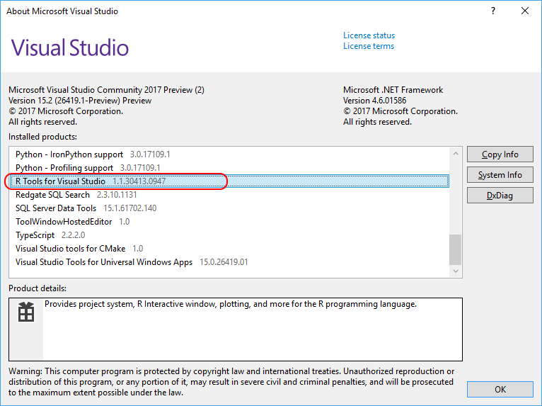

# RTVS current version

You can check your version by going to **Help** > **About** in Visual Studio and scrolling down to the **R Tools for Visual Studio** entry:

To update your version of RTVS in Visual Studio 2017, go to the Visual Studio installer and select the **Update** button.

For Visual Studio 2015, the most recent installer is available from [aka.ms/rtvs-current](https://rtvs.blob.core.windows.net/download/RTVS_2017-12-18.1.exe) (direct download).

See [Installation](installing-r-tools-for-visual-studio.md) for Visual Studio and Windows requirements.

For updates on Microsoft R Open and Microsoft Machine Learning Server (formerly Microsoft R Server), see: [Microsoft R products.](https://azure.microsoft.com/?ocid=cloudplat_hp)
