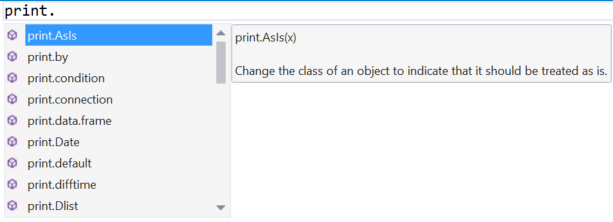
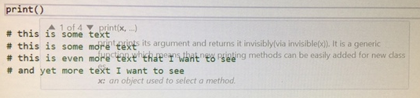

# IntelliSense

IntelliSense in Visual Studio puts information about functions that you can call, members of objects, and [code snippets](code-snippets.md) you can insert directly in your line of sight as you code. It displays possible completions as you type, and completes when you press the Tab or Enter keys.

 

IntelliSense is a feature that interactively provides hints about available commands, functions, members, and snippets as you type. It is available in both the editor and the Interactive Window. 

IntelliSense is automatic as you. Note that we have both the name of the function in the IntelliSense drop-down, as well a brief summary of what the function does. Note that matches are case-sensitive.

IntelliSense suggestions are also available for members of R objects:
 

 
To accept the current highlighted suggestion while typing, press the Tab key:

 

To dismiss the IntelliSense suggestions while typing, press Esc.

To manually activate IntelliSense suggestions while typing (i.e., you dismissed the drop-down), press Ctrl-Space.

For a function completion, when you type the open parenthesis character `(`, we will auto-type the close parenthesis character and pop up function parameter help:

You can dismiss the parameter help by pressing Esc.

If you have dismissed the parameter help pop-up and you want to get it back, press Ctrl-Shift-Space to restore it.

If you find the parameter help is obscuring text underneath it, as can be the case in the file editor, you can press and hold the Ctrl key to make the parameter help text translucent.

 
## Scope of IntelliSense

You can get IntelliSense for user-defined functions in the same file:

IntelliSense also assists in named parameter completion for functions defined in
the same file:

This also works for variables defined in the file:

IntelliSense behaves subtly differently depending on where you are currently typing:

* **IntelliSense and the Interactive Window**: When typing in the Interactive Window, IntelliSense considers only names that are defined in your current R session. IntelliSense doesn't look in the files within your project for names that are defined there.

* **IntelliSense and the Editor**: When typing in an editor window, IntelliSense looks at both the contents of the current file, and any names defined in your current R session.

## Code Suggestions

When a light bulb appears in the margin, Visual Studio is suggesting that there is a shortcut available for a commonly used action. If you hover over a line that contains a `library` statement in the editor, we will display a light bulb to the left of that line. Clicking on the light bulb will reveal a couple of options. 

