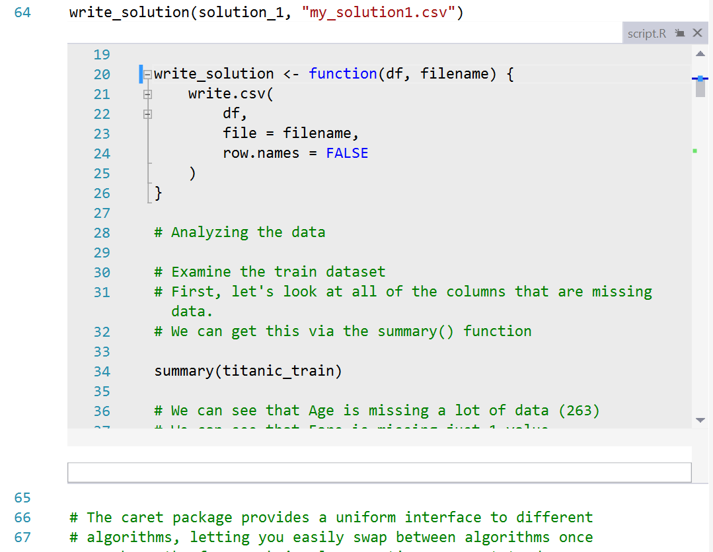

# Code Navigation

**Code navigation** gives you quick access to the source code of your program and its libraries. You can quickly go to the definition of one of your functions by pressing F12, or pop up an inline mini editor to read the source code of a library function by pressing Alt-F12 (see below). This is a key feature to help keep you in the flow of your work vs. being distracted by having to search for and manually navigate to the code of interest.

When writing code, you often want to quickly look up the definition of a function that you are calling. RTVS gives you two different ways of doing this. The first is the straightforward `Go To Definition` command, that you can invoke one of two ways:

1. Right click on the function that you want to navigate and select the **Go To Definition** command from the context menu. 
1. Place your cursor on the function name and press F12.

This command will open up a new editor window containing the source code for the function, and with the cursor conveniently positioned at the start of the function definition.

The second is the `Peek Definition` command, which inserts a read-only scrollable region containing the source code of the function below the function call, as you can see from the animated GIF below:

You can run the `Peek Definition` command one of two ways:

1. Right click on the function that you want to navigate and select the `Peek Definition` command from the popup menu. 
1. Place your cursor on the function name and press Alt-F12
