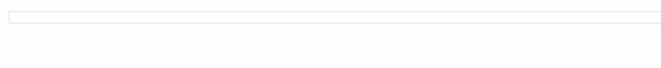
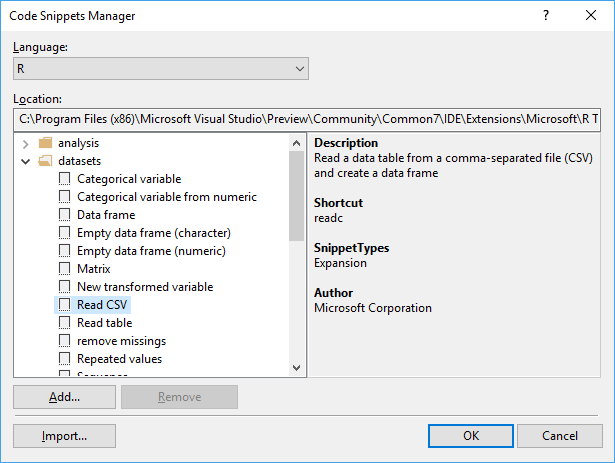

# Code snippets for R

Code snippets in Visual Studio provide shortcuts to quickly insert code blocks of arbitrary length, helping you avoid retyping similar code over and over. The R Tools for Visual Studio (RTVS) add dozens of useful R snippets to Visual Studio's collection.

To insert a snippet, type the abbreviated name of snippet (IntelliSense is provided), then press **Tab** to insert.

Some simple examples:

- type `=` then Tab and RTVS expands it to the `<-` assignment operator.
- type `>` then Tab and RTVS expands it the `%>%` pipe operator.

Snippets can be much more than just character completion of characters. A snippet for reading a CSV file with the `read.csv` function, for example, can relieve you from having to remember the names or parameters:



In this case, as you type `readc`, IntelliSense displays a completion list. Selecting that completion in the drop-down and pressing **Tab** selects `readc`, and pressing **Tab** again expands the snippet. (For this reason, snippet expansion is often thought of as "type the snippet and press TAB twice"). In most cases, the first Tab completes the IntelliSense selection and the second Tab triggers the expansion.

To see all the available snippets, open the **Tools** > **Code Snippets Manager** dialog box (**Ctrl**+**K**,**B**) and select **R** for **Language**. Expand the groups and select individual snippets to see a description and the shortcut text:



To create custom code snippets, following the instructions on [Walkthrough: Create a code snippet](../ide/walkthrough-creating-a-code-snippet.md). Ultimately, a code snippet is just an XML file. For example, the following code is the snippet for the pipe operation (shortcut `>`):

```xml
<?xml version="1.0" encoding="utf-8" ?>
<CodeSnippets  xmlns="http://schemas.microsoft.com/VisualStudio/2005/CodeSnippet">
  <CodeSnippet Format="1.0.0">
    <Header>
      <Title>Dplyr pipe</Title>
      <Shortcut>&gt;</Shortcut>
      <Description>Code snippet for '%&gt;%' operator</Description>
      <Author>Microsoft Corporation</Author>
      <SnippetTypes>
        <SnippetType>Expansion</SnippetType>
       </SnippetTypes>
    </Header>
    <Snippet>
      <Code Language="R">
        <![CDATA[ %>% $end$]]>
      </Code>
    </Snippet>
  </CodeSnippet>
</CodeSnippets>
```

The XML files for all code snippets are installed with RTVS; the **Location** field in the **Code Snippets Manager** provides the path. You can also find them in the RTVS source code on GitHub under [src/Package/Impl/Snippets](https://github.com/Microsoft/RTVS/tree/master/src/Package/Impl/Snippets).
