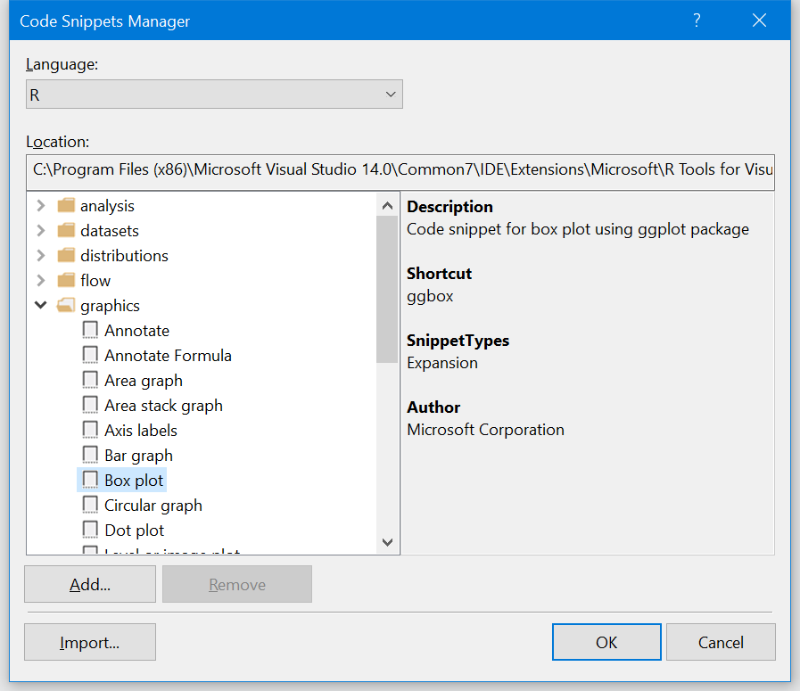
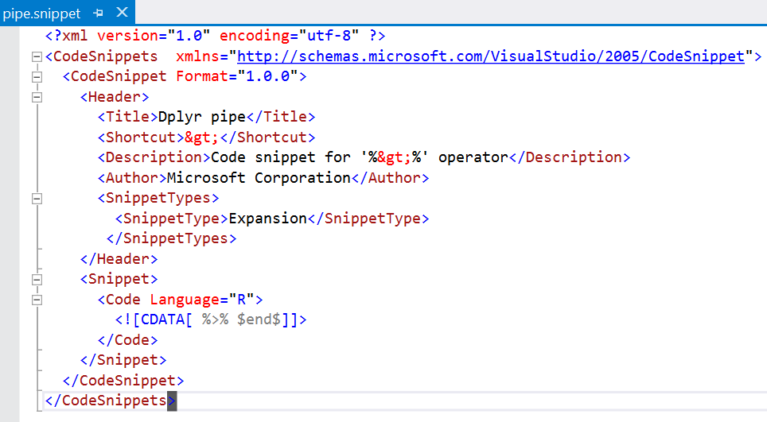

# Code snippets

There are common pieces of code that you type every day such as create a plot or read a CSV file. To help make you more productive in your day-to-day work, we have added a number of *code snippets* to Visual Studio. A code snippet makes it easier for you to enter repeating code patterns. To insert one of those code patterns into your editor, you need:

1. Type the abbreviated name of the Code Snippet (IntelliSense is available)
1. Press the trigger key, TAB, to insert the code snippet.

Some simple examples:

- type =Tab and VS expands to the <- assignment operator.
- type >Tab and VS expands to the %>% pipe operator

Snippets can be much more than just completion of characters. They can save you from having to remember the names of parameters in complex function calls. Here's an example of a snippet for reading a CSV file via the `read.csv` function:

The characters you type will be `readc`. As you type, you can see that it shows up on your IntelliSense completions list as well as you type. Once it is selected in the IntelliSense dropdown, you can complete the selection by pressing Tab. At this point, the string `readc` will be immediately to the left of your cursor. Pressing TAB again will cause the expansion of the snippet. This explains why sometimes you think of snippet expansion as being "type the snippet and press TAB twice". In most cases, the first TAB completes the selection in IntelliSense, and the second TAB triggers the snippet expansion.

## Create your own code snippets

If you want to examine the code snippets in Visual Studio, use the **Tools > Code Snippets Manager** command to bring up the UI. Select **R** from the list of languages in the drop-down to see all of the snippets that we've defined:

You can create your own code snippets as well as described on [Walkthrough: Creating a code snippet](../ide/walkthrough-creating-a-code-snippet.md).

Note that a code snippet is just an XML file; here's the Code Snippet for the pipe operator:

