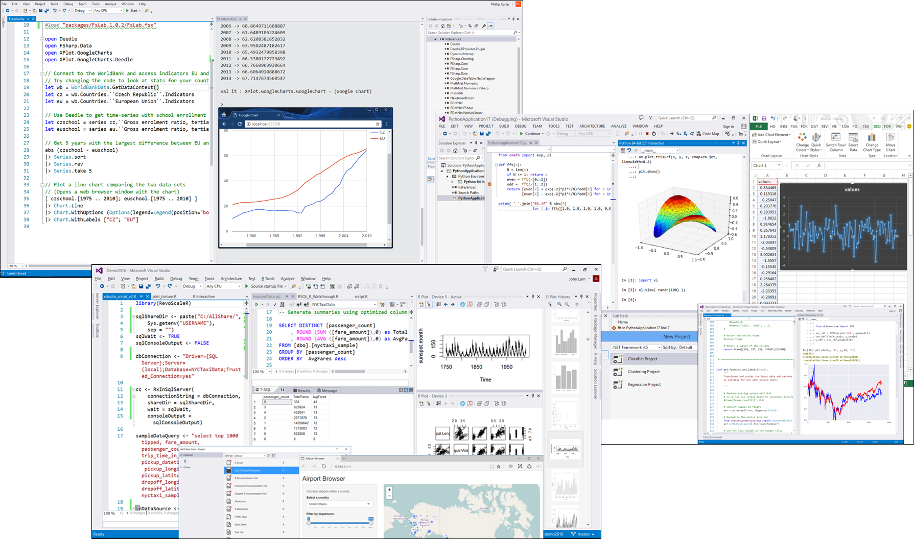
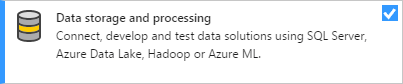
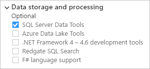
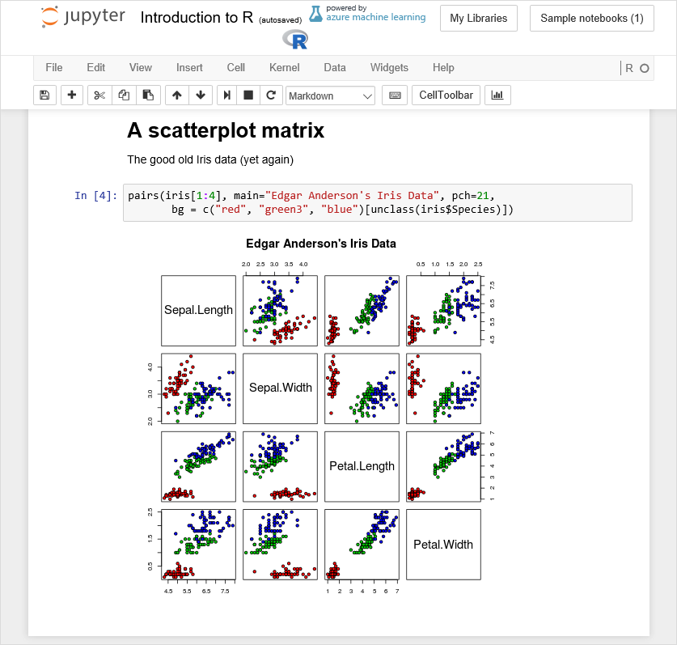

# Data Science and Analytical Applications workload

The Data Science and Analytical Applications workload, which you select and install through the Visual Studio installer, brings together three languages and their respective runtime distributions:

- [R and Microsoft R Client](../rtvs/index.md)
- [Python and Anaconda](../python/overview-of-python-tools-for-visual-studio.md)
- [F# with the .NET framework](/dotnet/fsharp/)

R and Python are two of the primary scripting languages used for data science. Both languages are easy to learn and are supported by a rich ecosystem of packages. Those packages address a wide range of scenarios such as data acquisition, cleaning, model training, deployment, and plotting. F# is also a powerful functional-first .NET language that’s suited for a wide variety of data processing tasks.

<!--Note link on the image because this one is large -->

## Workload options

By default, the workload installs the following options, which you can modify in the summary section for the workload in the Visual Studio installer:

- F# language support
- Python:
  - Python language support
  - [Anaconda3 64-bit](https://www.continuum.io) (A Python distro that includes extensive data science libraries and a Python interpreter)
  - Python web support
  - - Cookiecutter template support
- R:
  - R language support
  - Runtime support for R development tools
  - [Microsoft R Client](/machine-learning-server/r-client/what-is-microsoft-r-client) (Microsoft’s fully compatible, community-supported R interpreter with ScaleR libraries for faster computation on single nodes or clusters. You can also use any R from [CRAN](https://cran.r-project.org/).)

Although F# is included with a number of other workloads and Python has a workload of its own, Data Science and Analytical Applications is the only workload at present that includes R. However, you can also install R independent of the workload. On the **Individual Components** tab in the installer, select the following R options:

- **Development activities > R language support**
- **Development activities > Microsoft R Client**
- **Compilers, build tools, and runtimes > Runtime support for R development tools**

## SQL Server integration

SQL Server supports using both R and Python to do advanced analytics directly inside SQL Server. R support is included with SQL Server 2016 and later; Python support is available in SQL Server 2017 CTP 2.0 and later.

You enjoy the following advantages by running your code where your data already lives:

- **Elimination of data movement**: Instead of moving data from the database to your application or model, you can build R and Python applications in the database. This capability eliminates barriers of security, compliance, governance, integrity, and a host of similar issues related to moving vast amounts of data around. You can also consume datasets that couldn't fit into the memory of a client machine.

- **Easy deployment**: Once you have an R or Python model ready, deploying it to production is a simple matter of embedding it in a T-SQL script. Any SQL client application written in any language can then take advantage of the models and intelligence through a stored procedure call. No specific R or Python integrations are necessary.

- **Enterprise-grade performance and scale**: You can use SQL Server’s advanced capabilities like in-memory table and column store indexes with the high-performance scalable APIs in the RevoScaleR and RevoScalePy packages. The elimination of data movement also means that you avoid client memory constraints as your data grows or you wish to increase the performance of the application.

- **Rich extensibility**: You can install and run any of the latest open source R or Python packages in SQL Server to build deep learning and AI applications on huge amounts of data in SQL Server. Installing a package in SQL Server is as simple as installing a package on your local machine.

- **Wide availability at no additional cost**: R and Python integrations are available in all editions of SQL Server 2017 and later, including the Express edition. (R support is available in SQL Server 2016 and later.)

To take full advantage of SQL Server integration, use the Visual Studio installer to install the **Data storage and processing** workload with the **SQL Server Data Tools** option. The latter option enables SQL IntelliSense, syntax highlighting, and deployment.

 &nbsp;&nbsp;&nbsp;&nbsp; 

For more information:

- [Working with SQL Server and R](../rtvs/sql-server.md)
- [In-database Advanced Analytics with R in SQL Server 2016 (blog)](https://blogs.technet.microsoft.com/dataplatforminsider/2016/03/29/in-database-advanced-analytics-with-r-in-sql-server-2016/)
- [Python in SQL Server 2017: enhanced in-database machine learning (blog)](https://blogs.technet.microsoft.com/dataplatforminsider/2017/04/19/python-in-sql-server-2017-enhanced-in-database-machine-learning/)

## Additional services and SDKs

In addition to what's in the Data Science and Analytics Applications workload directly, the Azure Notebooks service and the Azure SDK for Python are also helpful for data science.

The Azure SDK for Python makes it easy to consume and manage Microsoft Azure services from applications running on Windows, Mac, and Linux. For more information, see [Azure SDK for Python](../python/azure-sdk-for-python.md)

Azure Notebooks (currently in preview) provides free online access to Jupyter notebooks running in the cloud on Microsoft Azure. The service includes sample notebooks in Python, R, and F# to get you started. Visit[notebooks.azure.com](https://notebooks.azure.com/).

<!--Note link on the image because this one is large -->
