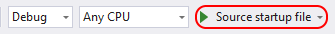
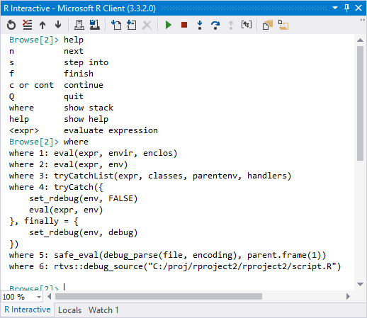

# Debug R in Visual Studio

R Tools for Visual Studio (RTVS) integrates with the full debugging experience of Visual Studio (see [Debugging in Visual Studio](../debugger/debugger-feature-tour.md). This support includes breakpoints, attaching to running processes, inspecting and watching variables, and inspecting the call stack. This article, then, explores those aspects of debugging that are unique to R and RTVS.

Starting the debugger for the startup R file in an R project is the same as for other project types: use **Debug** > **Start Debugging**, the **F5** key, or the **Source startup file** on the debug toolbar:



To change the startup file, right-click a file in Solution Explorer and select **Set As Startup R Script**.

In all cases, starting the debugger "sources" the file in the interactive window, which means loading it and running it there as shown in the interactive window's output:

```output
> rtvs::debug_source("c:/proj/rproject1/rproject1/script.R")
Sourcing: c:\proj\rproject1\rproject1\script.R
Sourcing: c:\proj\rproject1\rproject1\Settings.R
```

Notice that the `rtvs::debug_source` function is used to source the script. This function is required because RTVS needs to modify your code in preparation for debugging. When using any RTVS sourcing command and a debugger is attached, Visual Studio automatically uses `rtvs::debug_source`.

You can also manually attach the debugger from the interactive window directly using the **R Tools** > **Session** > **Attach Debugger** command, the **Debug** > **Attach to R Interactive** command, or the **Attach Debugger** command on the interactive window's toolbar. Once you have done so, it is your responsibility to source the files that you want to debug. If you want to manually source the files, make sure that you use `rtvs::debug_source` and not the regular `source` command in R.

This connection between the debugger and the interactive window makes it easier to do things like calling (and debugging) a function with different parameter values. For example, suppose you have the following function in a sourced file (meaning it's been loaded into the session):

```R
add <- function(x, y) {
    return(x + y)
}
```

Then you set a breakpoint on the `return` statement. Now, in the interactive window, entering `add(4,5)` stops the debugger on your breakpoint.

## Environment Browser in the interactive window

When you're stopped in the debugger, you're also stopped at the Environment Browser prompt in the [interactive window](interactive-repl-for-r-in-visual-studio.md). The prompt appears as `Browse[n]>` where n is a number.

The Environment Browser supports a number of special commands:

| Command | Description |
| --- | --- |
| n | next: runs the next statement in the code file (same as step over). |
| s | step into: runs the next statement in the code file, stepping into a function scope if the next statement is a function call. |
| f | finish: runs the remainder of the current function scope and returns to the caller (same as step out). |
| c, cont | continue: runs the program to the next breakpoint. |
| Q | quits: ends the debugging session. |
| where | show stack: displays the call stack in the interactive window. |
| help | show help: displays available commands in the interactive window. |
| &lt;expr&gt; | evaluate the expression in *expr*. |


