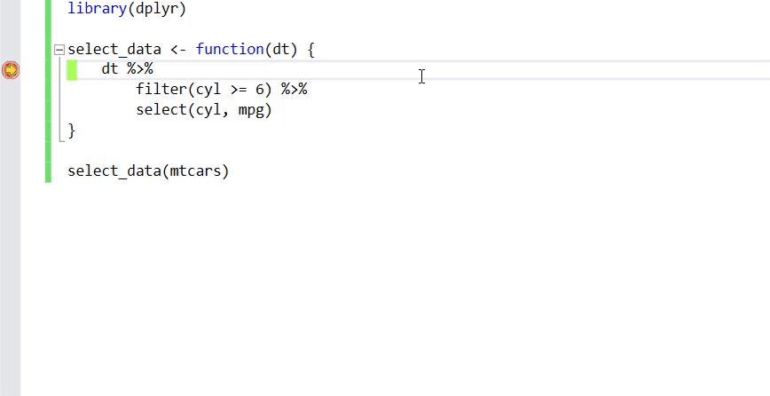
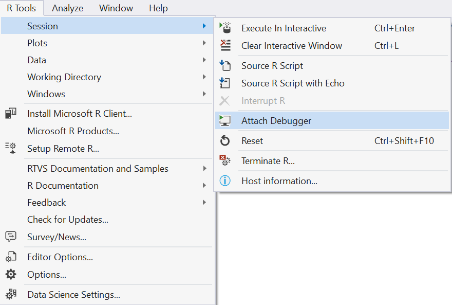
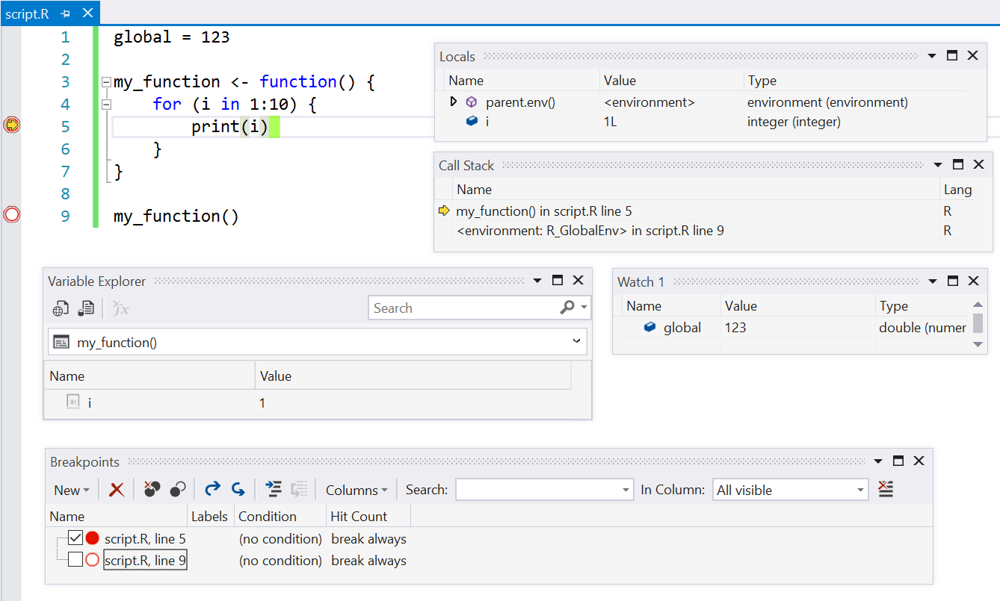

# Debugging R in Visual Studio

**Breakpoints** are key to the debugging experience. You can set standard breakpoints, which break into the debugger every time, and press F5 to launch the startup script under control of the Visual Studio debugger. 

**Watch windows** are windows that inspect variables. You can layout as many watch windows as you want, and the values of the variables that you are inspecting in those watch windows will update each time you break into the debugger. 

If you want to interactively inspect variables while stopped at the debugger, you can use Visual Studio's handy [Data Tips](../debugger/view-data-values-in-data-tips-in-the-code-editor.md) feature. Just hover over a variable using your mouse pointer, and you'll be able to inspect the variable and even drill down into sub-objects interactively:

While Visual Studio has a powerful set of features for inspecting variables, oftentimes R developers are using data structures such as data frames that aren't easily visualized using the Visual Studio UI. To improve this experience, we have created the [Variable Explorer](variable-explorer.md) which lets you interactively inspect data frames, and even export their contents to Excel. This makes it easy to snapshot the state of a data frame between transformations to better understand where things may have gone wrong in your computations:

There are two different ways to run code under the debugger: launching and attaching.

To launch code under the debugger, you must first tell Visual Studio what script to launch when you press F5. If you have created a new project using Visual Studio, the file `Script.R`, which was automatically created for you, is predefined as the startup script. If you want to launch a different script, all you need to do is right-click on a script in Solution Explorer and run the `Set As StartUp R Script` command:

You can set breakpoints in the startup script before you press F5 to launch the debugger.

Attaching the debugger to the Interactive Window lets you debug code that you are calling from the Interactive Window. This is especially useful when you are testing a function, and calling it repeatedly with different parameter values. There are two ways to attach a debugger to your Interactive Window session:

1. Use the **R Tools > Session > Attach Debugger**:

2. In your everyday work you should use the toolbar in R Interactive, as it saves you a number of mouse clicks / keystrokes:

It's important to note that if you attach a debugger to your session, you'll first need to tell RTVS what code you would like to debug. You do so by running the **Source** command on the files that you want to debug. You can do this by either:

1. Right-clicking on the editor window containing the file you want to source and running the **Source R Script** command
1. Right-clicking on the file in Solution Explorer and running the **Source Selected File(s)** command

If you use F5 to start the debugger, RTVS will automatically source the StartUp file on your behalf.

All standard Visual Studio debugger commands work, with a few limitations.

* Toggle Breakpoints (F9)
* Disable (Ctrl-F9) Breakpoints
* Step Over (F10) the current line 
* Step Into (F11) the current line
* Continue Execution (F5)
* Stop Execution under Debugger (Shift-F5)
* Execute the StartUp file without using the Debugger (Ctrl-F5)

Here's a screenshot that shows the many debugging windows and features available to you:

* Inspect local variables using the Locals Window
* Inspect local variables using the Variable Explorer 
* See where you are in your program using the Call Stack Window
* Fine-grained controls over your breakpoints, including *disabling* (but not deleting) a breakpoint
* Inspect arbitrary expressions (that are in scope) using Watch Windows

After each debugger command, you'll also see that you are stopped at the Environment Browser prompt in the R Interactive Window.  From there, you can also issue Environment Browser commands (e.g., `n` for next command, or `c` to continue execution).

## Visual Studio Data Tips

Visual Studio Data Tips let you hover over a variable that you want to inspect, and then drill down into the objects within that variable. This lets you inspect variables in-place, while stopped in the debugger, without having to resort to using other windows like the locals window.

