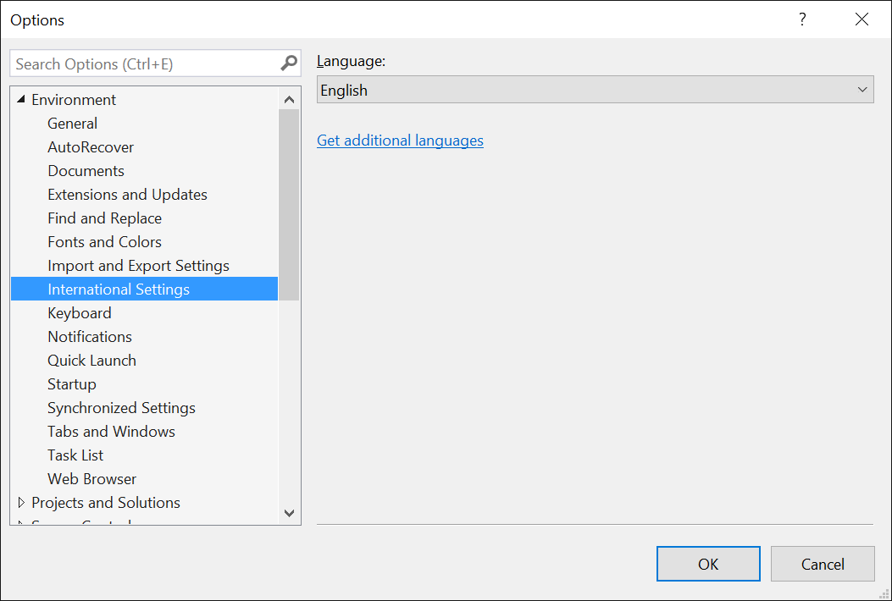

# Frequently asked questions

## Visual Studio support

**Q. Does RTVS work on OS X or Linux?**

A. RTVS is presently built on top of Visual Studio, which is a Windows-only implementation. Microsoft is investigating support on Visual Studio Code and Visual Studio for Mac. Refer to [RTVS issue #1295](https://github.com/Microsoft/RTVS/issues/1295).

**Q. Does RTVS work with Visual Studio Express editions?**

A. No.

**Q. Can I use Visual Studio extensions with RTVS?**

A. Absolutely. In fact, here are a few that are popular for people working with R.

- [VsVim for vim key bindings](https://marketplace.visualstudio.com/items?itemName=JaredParMSFT.VsVim)
- [GitHub](https://marketplace.visualstudio.com/items?itemName=GitHub.GitHubExtensionforVisualStudio)
- [Markdown editor with live preview](https://marketplace.visualstudio.com/items?itemName=MadsKristensen.MarkdownEditor)

See the [Visual Studio Marketplace](https://marketplace.visualstudio.com/) to find more.

**Q. Because RTVS is in Visual Studio, does it mean that R can be easily used with C#, C++ and other Microsoft languages?**

A. No. RTVS is a tool for developing R code, and uses the standard native R interpreters. Interop between R and other languages isn't currently supported.

**Q. Does RTVS work with a non-English locale?**

A. The 1.0 release of RTVS is English-only. The 1.1 release will be localized to the same set of languages that Visual Studio itself is. In the meantime, use the [English language pack for Visual Studio 2015](https://www.microsoft.com/download/details.aspx?id=48157), or in Visual Studio 2017, run the installer and select English in the **Language Packs** tab.

**Q. I really like my current Visual Studio settings, but I want to try out the new Data Science settings. What should I do?**

A. Save your current Visual Studio settings using **Tools** > **Import and Export Settings**, then switch to the Data Science settings. To restore the saved settings, use the **Import and Export Settings** command again.

**Q. Can I store my Visual Studio project on a network share?**

A. No, Visual Studio doesn't support loading projects from a network share.

## R interpreters/integration

**Q. What R interpreters does RTVS work with?**

A. [CRAN R](https://cran.r-project.org/), [Microsoft R Client, and Microsoft Machine Learning Server](/machine-learning-server/)

**Q. Where can I download these interpreters?**

A. See [Installation](installing-r-tools-for-visual-studio.md).

Q **What is Microsoft R Server?**

A. R Server is the former name of [Microsoft Machine Learning Server](/machine-learning-server/what-is-machine-learning-server).

**Q. Does RTVS work with 32-bit editions of R?**

A. No, RTVS only supports 64-bit editions of R running on 64-bit editions of Windows.

**Q. Does RTVS work with my source control system?**

A. Yes, you can use any source control system that is integrated into Visual Studio.

**Q. What are the recommended *.gitignore* settings for an RTVS project?**

A. GitHub maintains a master repository of recommended *.gitignore* files. You can see it here: [R .gitignore](https://github.com/github/gitignore/blob/master/R.gitignore)

## Remote services

Q. **What is Remote Services in Visual Studio?**

A. Remote R Services for Visual Studio allows you to set up Windows or Linux machine and then connect to it from RTVS. See [Set up remote workspaces](setting-up-remote-r-workspaces.md).

Q. **Can RTVS connect to Microsoft Machine Learning Server?**

A. No, because Microsoft ML Server is a different technology and does not provide same connectivity mechanism as required by RTVS.

Q. **Can RTVS connect to a VM created using the Data Science VM image on Azure?**

A. Yes; the [Data Science VM - Windows 2016](https://azure.microsoft.com/services/virtual-machines/data-science-virtual-machines/) image comes preinstalled with Remote R Services for Visual Studio.

Q, **Can RTVS connect to a remote machine with R installed?**

To execute R code on a remote machine there has to be some service listening to the requests, receiving code and sending results back to the client machine. This is what Remote R Services for Visual Studio do. See [Set up remote workspaces](setting-up-remote-r-workspaces.md).

Q. **What is Remote Session?**

A. See the article, [Execute on remote server](/machine-learning-server/r/how-to-execute-code-remotely) in the Machine Learning Server documentation.

## RTVS development and features

**Q. Feature X is missing, but RStudio has it!**

A. RStudio is a fantastic and mature IDE for R that's been under development for many years. RTVS seeks to have all the critical features that you need to be successful. Help prioritize future work by filing issues on [GitHub](https://github.com/Microsoft/RTVS/issues/).

**Q. Can I contribute to RTVS?**

A. Absolutely! The source code lives on [Github](https://github.com/microsoft/RTVS). Use the issue tracker to submit bugs and comment on those already filed.

You're also welcome to contribute to this documentation&mdash;just select the **Edit** command on the upper right of any page. Comments on the docs are also welcome, which you can add at the bottom of any page.
