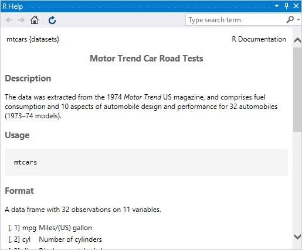
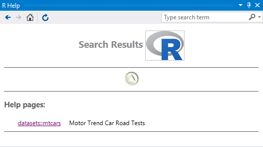
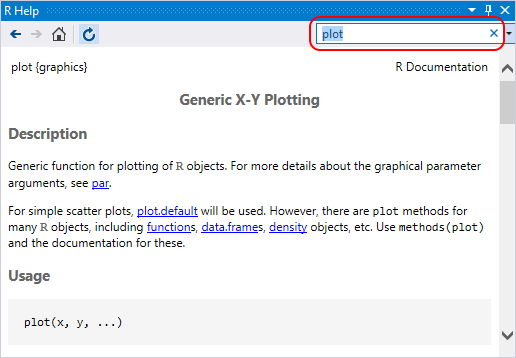
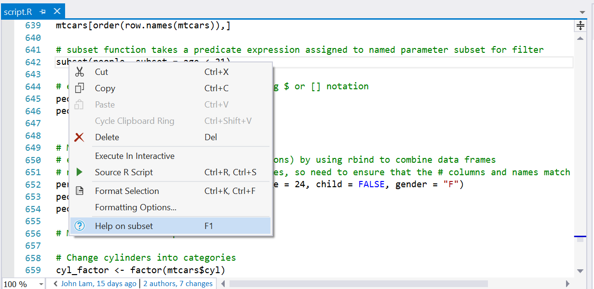
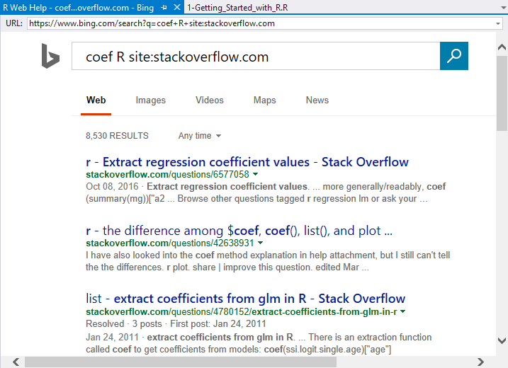

# Help in R Tools for Visual Studio

Help for R is integrated directly into the interactive window in Visual Studio. Whenever you use the `?` command, such as `?mtcars`, help from the R documentation appears in a Visual Studio window:



> [!Tip]
> The help window, like all others in Visual Studio, can be arranged and docked however you like. See [Customize window layouts in Visual Studio](../ide/customizing-window-layouts-in-visual-studio.md).
>
> To open help results in a browser, select the **R Tools > Options** menu and set the **R Help Browser** property to `External`. See [Options](options.md).

To search help, use the `??` command followed by the search term. Use quotes if the search term contains spaces:

```R
??"Motor Trend"
```



The help window also has a search input field through which you can conduct further searches in the R documentation directly:



## Integrated help lookup

Developers often search the R documentation for help on function names, datasets, and other elements. R Tools for Visual Studio (RTVS) streamlines the process by integrating help lookups directly into the editor and interactive windows.

- Pressing F1 during an auto-complete operation produces a list of help results that match the substring.
- Right-clicking a search term (like a function) and selecting the **Help on** command opens help for that function. You can also invoke **Help on** for any selection.

    

> [!Tip]
> To open integrated help in a browser, select **R Tools > Options** and set **F1 Web Browser** to `External`. See [Options](options.md).

## Integrated StackOverflow search

In addition to searching in the R documentation, developers often search StackOverflow while writing code. RTVS streamlines that process as well. Right-click a term or a selection, select the **Search web for** command (Ctrl+F1), and Visual Studio opens a window with search results scoped to StackOverflow:



You can change the appended scoping string, `R site:stackoverflow`, through the **R Tools > Options > F1 Web search string** option:


If you prefer to show results in a browser, change the **F1 Web Browser** option as described on [Options](options.md).