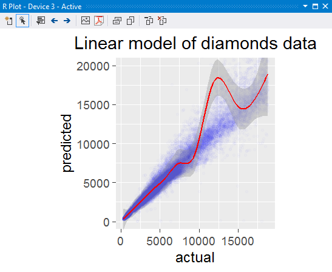
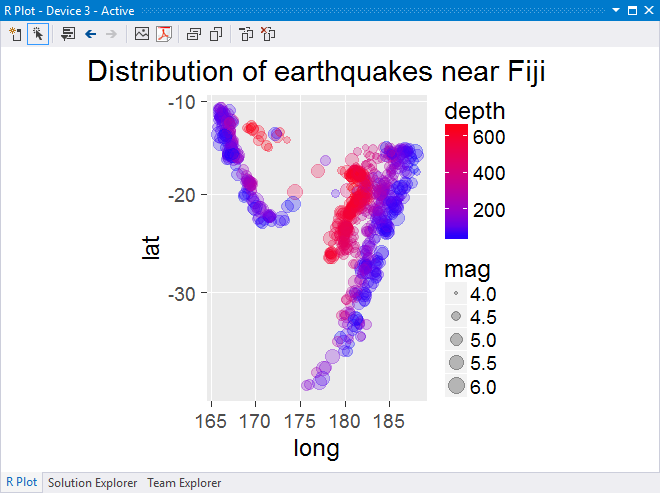
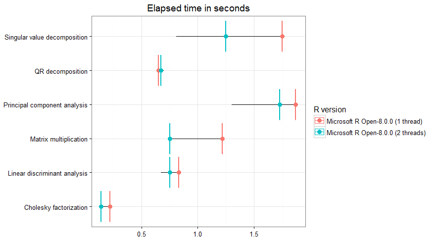
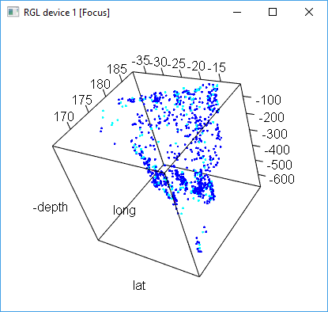
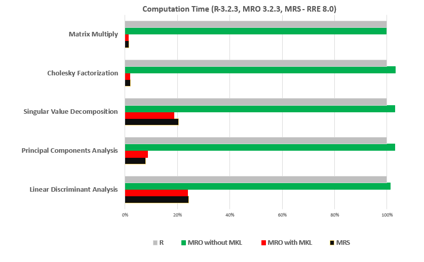

# R Tools for Visual Studio sample projects

This collection of samples gets you started on R, R Tools for Visual Studio (RTVS), and Microsoft Machine Learning Server:

1. Download the [samples zip file](https://github.com/Microsoft/RTVS-docs/archive/master.zip) and extract to a folder of your choice.
1. Open `examples/Examples.sln` to see two folders in the project:

    - *A First Look at R* gives a gentle introduction for newcomers to R.
    - *MRS and Machine Learning* gives examples of how to use R and Microsoft Machine Learning Server for machine learning.

## A First Look at R

This sample provides an in-depth introduction to R through the extensive comments in two source files. For the best experience, place the cursor at the top of the file and press Ctrl+Enter to send the code line-by-lie to the **R Interactive** window. (Lines that install packages might take a minute or two to complete.)

- `1-Getting Started with R.R` covers many R fundamentals including using packages, loading and analyzing data, and plotting.

    

- `2-Introduction to ggplot2.R` introduces the ggplot2 graphic package known for its visually appealing plots and simple syntax. This example visualizes earthquake data from Fiji.

    

## Microsoft Machine Learning Server and Machine Learning

This collection of examples shows how to use R to create machine learning models and to take advantage of [Microsoft Machine Learning Server](/machine-learning-server/what-is-machine-learning-server).

As with all examples, open the file, place the cursor at the top, and then step through the code line by line with **Ctrl**+**Enter**. The markdown files in each folder also contain additional details.

- `Benchmarks` runs a number of intensive, parallel linear algebra computations to show the performance gains that are possible through the use of Microsoft R Open and the Intel Math Kernel Library (MKL). With simulated data, the benchmarks specifically compare matrix calculations on one thread versus two.

    

- `Bike_Rental_Estimation_with_MRS` creates a demand prediction model for bike rentals based on a historical data set, using Microsoft ML Server.

- `Data_Exploration` contains three scripts:

  - `Import Data from URL.R` shows how to load a URL-identified data file into R.
  - `Import Data from URL to xdf.R` shows how to load a URL-identified data file into Microsoft ML Server as an xdf.
  - `Using ggplot2.R` is an extension of the `A First Look at R/2-Introduction to ggplot2.R` sample, giving a more extensive tour of ggplot2's functionality including interactive 3D plotting.

      

- `Datasets` contains three *.csv* files used by other samples
- `Flight_Delays_Prediction_with_R` and `Flight_Delays_Prediction_with_MRS` shows how to predict flight delays using R, machine learning, and historical on-time performance and weather data.
- `Machine learning` contains three samples for learning to predict flight delays, housing prices, and bike rentals. Together, these samples demonstrate the application of R and Microsoft ML Server to real-world problems. They also show you how to use several popular machine learning models and deploy them as an Azure Web Service using an [Azure Machine Learning](https://azure.microsoft.com/services/machine-learning/) workspace.

- `R_MRO_MRS_Comparison` is a six-part comparison that shows the similarities and differences of R, Microsoft R Open and Microsoft ML Server with commands, syntax, constructs, and performance.

## What's special about Microsoft R Open and Microsoft ML Server?

[Microsoft R Open](https://aka.ms/rtvs-r-open), Microsoft's distribution of R, is different from [CRAN R](https://cran.r-project.org/) in two important ways:

1. [Better computation performance](https://mran.revolutionanalytics.com/rro/#intelmkl1) when used with the [Intel Math Kernel Libraries](https://software.intel.com/intel-mkl). The libraries are available as a free download from Microsoft for use with Microsoft R Open.

1. [Reproducible R Toolkit](https://mran.revolutionanalytics.com/rro/#reproducibility) ensures that the libraries you used to build your R program are always available to others that want to reproduce your work.

[Microsoft ML Server (MLS)](/machine-learning-server/what-is-machine-learning-server) is an extension of R that allows you to handle more data and handle it faster. It gives R two powerful capabilities:

1. Larger data sets without RAM limitations. ML Server can process out-of-memory data from a variety of sources including Hadoop clusters, databases, and data warehouses.

1. Parallel, multi-core processing. MLS can efficiently distribute computation across all the computational resources it has available. On your personal workstation or a remote cluster, MLS gets an answer faster.

The following comparison shows that MLS and MRO with MKL have significantly better computation performance related to certain matrix calculation than R and MRO without MKL. Simulated data is used in this calculation:

For a technical comparison of R with MRO and MLS, check out [Lixun Zhang's detailed discussion](http://htmlpreview.github.io/?https://github.com/lixzhang/R-MRO-MRS/blob/master/Introduction_to_MRO_and_MRS.html) on the topic.

The following figure then compares elapsed time in seconds used in building Logistic Regression models to predict flight delays greater than 15 minutes.  Elapsed time used in CRAN R increases dramatically when increasing a small number of rows, while MLS increases only by approximately two times. For details of this benchmark, check out the *Benchmarks/rxGlm_benchmark.R* example.

