# Get started with R Tools for Visual Studio

Once you have R Tools for Visual Studio (RTVS) installed (see [Installation](installing-r-tools-for-visual-studio.md)), you can quickly get a taste of the experience that those tools provide.

## Create an R project

1. Open Visual Studio.
1. Choose **File** > **New** > **Project** (**Ctrl**+**Shift**+**N**)
1. Select "R Project" from under **Templates** > **R**, give the project a name and location, and select **OK**:

   

1. Once the project is created, you see the following windows:

    - On the right is Visual Studio Solution Explorer, where you see your project inside a containing *solution*. (Solutions can contain any number of projects of different types; see [Projects](r-projects-in-visual-studio.md) for details.
    - On the top left is a new R file (`script.R`) where you can edit source code with all of Visual Studio's editing features.
    - On the bottom left is the **R Interactive** window in which you can interactively develop and test code.

> [!Note]
> You can use the **R Interactive** window without having any projects open, and even when a different project type is loaded. Just select **R Tools** > **Windows** > **R Interactive** at any time.

## Explore the Interactive Window and IntelliSense

1. Test that the interactive window is working by typing in `3 + 4` and then **Enter** to see the result:

    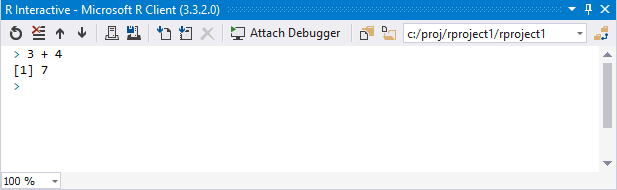

1. Enter something a little more complicated, `ds <- c(1.5, 6.7, 8.9) * 1:12`, and then enter `ds` to see the result:

    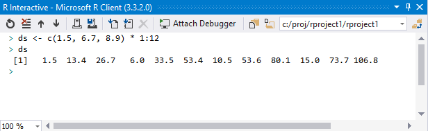

1. Type in `mean(ds)` but notice that as soon as you type `m` or `me`, Visual Studio IntelliSense provides auto-completion options. When the completion you want is selected in the list, press **Tab** to insert it; you can change the selection with the arrow keys or the mouse.

    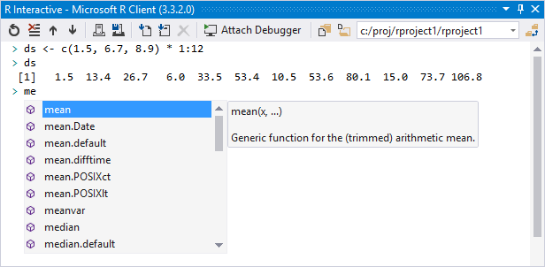

1. After completing `mean`, type the opening parenthesis `(` and note how IntelliSense gives you inline help for the function:

    

1. Complete the line `mean(ds)` and press Enter to see the result (`[1] 39.51667`).

1. The Interactive window is integrated with help, so entering `?mean` displays help for that function in the **R Help** window in Visual Studio. For details, see [Help in R Tools for Visual Studio](getting-started-help.md).

    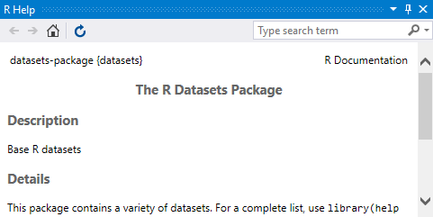

1. Some commands, such as `plot(1:100)`, open a new window in Visual Studio when the output can't be displayed directly in the interactive window:

    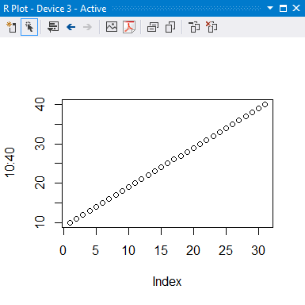

The interactive window also lets you review your history, load and save workspaces, attach to a debugger, and interact with source code files instead of using copy-paste. See [Working with the R Interactive Window](interactive-repl-for-r-in-visual-studio.md) for details.

## Experience code editing features

Working briefly with the interactive window demonstrates basic editing features like IntelliSense that also work in the code editor. If you enter the same code as before, you see the same auto-completion and IntelliSense prompts, but not the output.

Writing code in a *.R* file lets you see all your code at once, and makes it easier to make small changes and then quickly see the result by running the code in the interactive window. You can also have as many files as you want in a project. When code is in a file, you can also run it step-by-step in the debugger (discussed later in this article). These capabilities are helpful when you're developing computational algorithms and writing code to manipulate one or more datasets, especially when you want to examine all intermediate results.

As an example, the following steps create a little code to explore the [Central Limit Theorem](https://en.wikipedia.org/wiki/Central_limit_theorem) (Wikipedia). (This example is adapted from the *R Cookbook* by Paul Teetor.)

1. In the `script.R` editor, enter the following code:

    ```R
    mu <- 50
    stddev <- 1
    N <- 10000
    pop <- rnorm(N, mean = mu, sd = stddev)
    plot(density(pop), main = "Population Density", xlab = "X", ylab = "")
    ```

1. To quickly see the results, select all the code (**Ctrl**+**A**), then press **Ctrl**+**Enter** or right-click and select **Execute In Interactive**. All the selected code is run in the interactive window as if you typed it directly, showing the result in a plot window:

    

1. For a single line, just press **Ctrl**+**Enter** at any time to run that line in the interactive window.

> [!Tip]
> Learn the pattern of making edits and pressing **Ctrl**+**Enter** (or selecting everything with **Ctrl**+**A** and then pressing **Ctrl**+**Enter**) to quickly run the code. Doing so is much more efficient than using the mouse for the same operations.
>
> In addition, you can drag and drop the plot window out of the Visual Studio frame and place it whenever else you want on your display. You can then resize the plot window to the dimensions you want and then save it to an image or PDF file.

1. Add a few more lines of code to include a second plot:

    ```R
    n <- 30
    samp.means <- rnorm(N, mean = mu, sd = stddev / sqrt(n))
    lines(density(samp.means))
    ```

1. Press **Ctrl**+**A** and **Ctrl**+**Enter** again to run the code, producing the following result:

    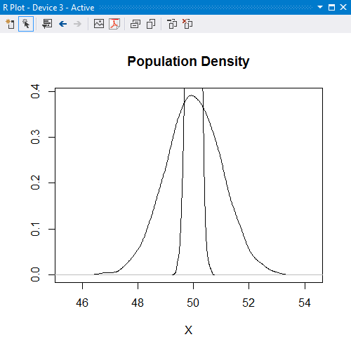

1. The problem is that the first plot determines the vertical scale, so the second plot (with `lines`) doesn't fit. To correct this problem, we need to set the `ylim` parameter on the `plot` call, but do so that properly we need to add code to calculate the maximum vertical value. Doing this line-by-line in the interactive window is inconvenient because we need to rearrange the code to use `samp.means` before calling `plot`. In a code file, though, we can easily make the appropriate edits:

    ```R
    mu <- 50
    stddev <- 1
    N <- 10000
    pop <- rnorm(N, mean = mu, sd = stddev)

    n <- 30
    samp.means <- rnorm(N, mean = mu, sd = stddev / sqrt(n))
    max.samp.means <- max(density(samp.means)$y)

    plot(density(pop), main = "Population Density",
        ylim = c(0, max.samp.means),
        xlab = "X", ylab = "")
    lines(density(samp.means))
    ```

1. **Ctrl**+**A** and **Ctrl**+**Enter** again to see the result:

    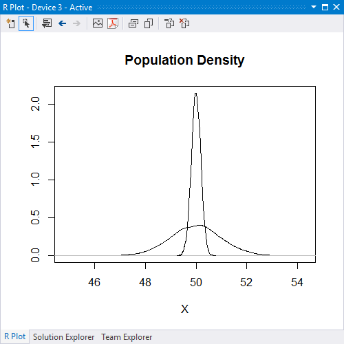

There's more you can do in the editor. For details, see [Edit R code](editing-r-code-in-visual-studio.md), [IntelliSense](r-intellisense.md), and [Code snippets](code-snippets-for-r.md).

## Debug your code

One of the key strengths of Visual Studio is its debugging UI. RTVS builds on top of this strong foundation and adds innovative UI such as the [Variable Explorer](variable-explorer.md). Here, let's just take a first look at debugging.

1. To begin, reset the current workspace to clear everything you've done so far by using the **R Tools** > **Session** > **Reset** menu command. By default, everything you do in the interactive window accrues to the current session, which is then also used by the debugger. By resetting the session, you ensure that the debugging session starts with no pre-existing data. The **Reset** command, however, doesn't affect your *script.R* source file, because that's managed and saved outside of the workspace.

1. With the *script.R* file created in the previous section, set a breakpoint on the line that begins with `pop <-` by placing the caret on that line and then pressing **F9**, or selecting the **Debug** > **Toggle Breakpoint** menu command. Alternately, simply click in the left-hand margin (or gutter) for that line where the red breakpoint dot appears:

    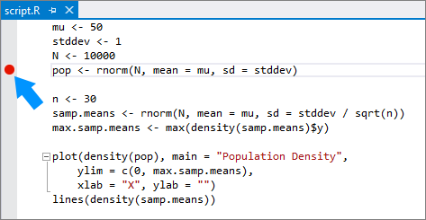

1. Launch the debugger with the code in *script.R* by either selecting the **Source startup file** button on the toolbar, selecting the **Debug** > **Source startup file** menu items, or pressing **F5**. Visual Studio enters its debugging mode and starts running the code. It stops, however, on the line where you set the breakpoint:

    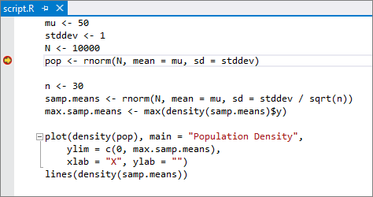

1. During debugging, Visual Studio provides the ability to step through your code line by line. You can also step into functions, step over them, or step out of them to the calling context. These capabilities, along with others, can be found on the **Debug** menu, the right-click context menu in the editor, and the Debug toolbar:

    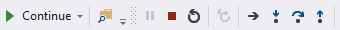

1. When stopped at a breakpoint, you can examine the values of variables. Locate the **Autos** window in Visual Studio and select the tab along the bottom named **Locals**. The **Locals** window shows local variables at the current point in the program. If you're stopped on the breakpoint set earlier, you see that the `pop` variable isn't yet defined. Now use the **Debug** > **Step Over** command (**F10**), and you see the value for `pop` appear:

    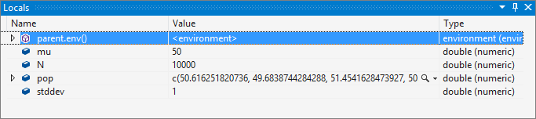

1. To examine variables in different scopes, including the global scope and package scopes, use the [Variable Explorer](variable-explorer.md). The Variable Explorer also gives you the ability to switch to a tabular view with sortable columns and to export data to a CSV file.

    

1. You can continue stepping through the program line by line, or select **Continue** (**F5**) to run it to completion (or the next breakpoint).

To go deeper, see [Debugging](debugging-r-in-visual-studio.md) and [Variable Explorer](variable-explorer.md).

## Next steps

In this walkthrough you've learned the basics of R projects, using the interactive window, code editing, and debugging in Visual Studio. To continue exploring more capabilities, see the following articles as well as articles shown in the table of contents:

- [Sample projects](getting-started-samples.md)
- [Editing code](editing-r-code-in-visual-studio.md)
- [Debugging](debugging-r-in-visual-studio.md)
- [Workspaces](r-workspaces-in-visual-studio.md)
- [Visualizing data](visualizing-data-with-r-in-visual-studio.md)
