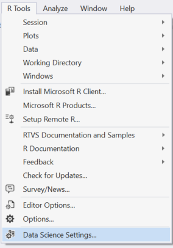

# Installation and Getting Started

## Installation and Getting Started

The pre-requisites for RTVS are: 

* Visual Studio 2015 Community, Professional or Enterprise
* Visual Studio 2015 Update 3
* An R interpreter: CRAN-R or Microsoft R Open
* Note that the [Visual Studio 2017](https://www.visualstudio.com/vs/whatsnew/) release of RTVS is not quite ready yet, but will ship soon.

You may have tools installed on your computer that ship with the *Visual Studio Shell*, e.g., [Test
Professional](https://www.microsoft.com/download/details.aspx?id=48154) and [SQL Management Studio](https://docs.microsoft.com/sql/ssms/download-sql-server-management-studio-ssms). The Visual Studio Shell lacks several components that are required by RTVS, so we explicitly block the installation of RTVS if it detects the presence of the Visual Studio Shell. You must install one of the supported versions of Visual Studio before you install RTVS.

If you already have Visual Studio 2015 with Update 3 and R installed, you can download and run the RTVS setup from the link below - but we highly recommend following the [Installation guide](installation.md):

* [Download R Tools for Visual Studio](https://aka.ms/rtvs-current)

## Prerequisites

RTVS 1.0 can be installed on only Visual Studio 2015 Update 3 and higher. We support the following editions of Visual Studio:

* [Visual Studio 2015 Community](https://www.visualstudio.com/products/visual-studio-community-vs.aspx) (free)
* Visual Studio 2015 Professional 
* Visual Studio 2015 Enterprise

To check what version of Visual Studio 2015 you currently have, go to **Help > About**. It should say Visual Studio 2015 with Update 3 and higher.

The current version of Visual Studio 2015 is Update 3, and contains important updates that RTVS uses. If you do not have Update 3, you can install it from here:

* [Visual Studio 2015 Update 3](http://go.microsoft.com/fwlink/?LinkId=691129)

RTVS requires an installation of R on your computer. We support only **64 bit** editions of R versions 3.2.1, and higher. We support both the CRAN R distributions as well as the Microsoft R distributions. You can download them from for free from these locations:

* [Microsoft R Open](https://mran.microsoft.com/download/)
* [Microsoft R Client](https://msdn.microsoft.com/microsoft-r/r-client-get-started)
* [CRAN R](https://cran.r-project.org/bin/windows/base/)

If you don't have an R distribution installed before you install RTVS, you will be prompted to install an R distribution during setup.

Next [download R Tools for Visual Studio 1.0](https://aka.ms/rtvs-current), and run the installer.

## Offline installation of Visual Studio and RTVS

Some customers want to install RTVS onto air-gapped computers that do not have access to the Internet. To do this, you'll need two things:

1. An ISO image of the Visual Studio 2015 edition that you want to use (e.g., Community, Professional or Enterprise). To download an ISO image of Visual    Studio 2015, you have a couple of options:

    * If you are an MSDN subscriber [click here](https://msdn.microsoft.com/subscriptions/hh442898.aspx) to go to the MSDN subscribers download site to download an ISO of the edition of Visual Studio 2015 that you want to use.

    * If you aren't an MSDN subscriber [click here](https://www.microsoft.com/download/details.aspx?id=48146) to download an ISO of Visual Studio 2015 Community Edition.

1. A zip file containing all of the RTVS installation files. Click [here](https://aka.ms/rtvs-current-zip) to download a zip file containing RTVS.

1. Copy all of these files to your air-gapped computer. 
1. Mount the Visual Studio ISO image and run the installer `setup.exe` from the root directory.
1. When Visual Studio is done installing, unzip the contents of the RTVS zip file into its own directory, and run the `EXE` from that directory.

## Window Layout for Data Scientists in Visual Studio

Visual Studio is a fantastic developer tool, and its user interface is optimized around the needs of a developer. We realize that data scientists have different needs, so we've come up with a streamlined experience that is tailored for the needs of data scientists.

We know that some of you prefer to retain your existing Visual Studio settings, so we leave things this way by default. However, for those of you who want our tailored experience, enabling it is really easy to do. Just run the Data Science Settings from the R Tools menu:

> [!Important]		
> Save your current settings if you want to revert back to them using this command: Tools > Import and Export Settings.

After running this command, you'll have a Visual Studio layout that resembles this:

## Where is RTVS installed?

R Tools for Visual Studio installs in this folder:

`%ProgramFiles(x86)%\Microsoft Visual Studio <VS version>\Common7\IDE\Extensions\Microsoft\R Tools for Visual Studio`

## Try the samples

Once you've installed RTVS, try some of the samples from Github:

[Samples documentation](samples.md)
