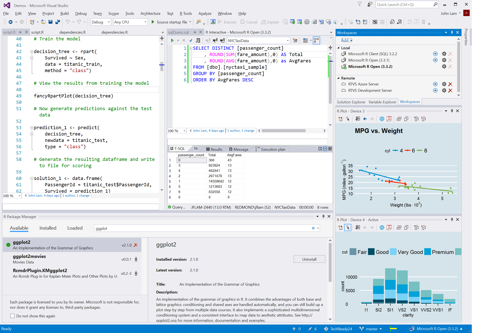

# Welcome to R Tools for Visual Studio

Thank you for installing R Tools for Visual Studio (RTVS)! Check it out and let us know what you think using the links under [Resources](#resources).

## Resources

- [Documentation](index.md)
- [How to install R Tools for Visual Studio](installing-r-tools-for-visual-studio.md)
- [Submit and browse bugs and feature requests on GitHib](https://github.com/Microsoft/RTVS/issues)
- [Explore and contribute to the source code](https://github.com/Microsoft/RTVS/blob/master/LICENSE)
- To send feedback without using GitHub (which is preferred), use the **R Tools > Feedback** menu in Visual Studio.

## Microsoft R distributions

RTVS supports CRAN R, and Microsoft R distributions, including the version of R that is distributed with SQL Server 2016. The following links provide more information on the different Microsoft R distributions:

- [Microsoft R Open](https://mran.microsoft.com/download/)
- [Microsoft R Client](/machine-learning-server/r-client/what-is-microsoft-r-client)
- [Microsoft Machine Learning Server (formerly R Server)](/machine-learning-server/)
