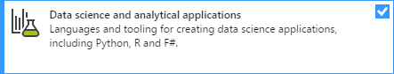

# How to install R Tools for Visual Studio

In this article:

- [Supported versions of Visual Studio](#supported-versions-of-visual-studio)
- [Install RTVS in Visual Studio 2017](#install-rtvs-in-visual-studio-2017)
- [Install RTVS in Visual Studio 2015](#install-rtvs-in-visual-studio-2015)
- [Offline installation](#offline-installation-of-visual-studio-and-rtvs)

> [!Note]
> After installing R Tools, you may want to configure Visual Studio for an optimized data scientist layout, as described on the [Options](options-for-r-tools-in-visual-studio.md) article.

## Supported versions of Visual Studio

R Tools for Visual Studio (RTVS) is supported on Windows with the Community (free), Professional, and Enterprise editions of both [Visual Studio 2017](https://visualstudio.microsoft.com/vs/older-downloads/?utm_medium=microsoft&utm_source=docs.microsoft.com&utm_campaign=vs+2017+download) and [Visual Studio 2015 Update 3 (or higher)](http://htmlpreview.github.io/?https://github.com/lixzhang/R-MRO-MRS/blob/master/Introduction_to_MRO_and_MRS.html) (direct download).

RTVS is not presently supported on Visual Studio for Mac.

RTVS does not install if you have only the Visual Studio Shell that's included with products such as Visual Studio Test Professional and SQL Server Management Studio. Visual Studio Shell lacks the necessary components for RTVS.

## Install RTVS in Visual Studio 2017

1. Run the Visual Studio installer and select the **Modify** option (for details, see [Modify Visual Studio](../install/modify-visual-studio.md)). If you don't yet have Visual Studio installed, see [Install Visual Studio](../install/install-visual-studio.md). On Windows 7, be sure that your installer is updated to show Visual Studio 2017 version *15.2 build 26430.12* or later.

1. Select the **Data science and analytical applications** workload:

    

1. Set any additional options on the right side under the same workload name. By default, this workload includes F# and Python support. For R, minimum requirements are **R language support**, **Runtime support for R development**, and **Microsoft R client**.

RTVS is installed in: *%ProgramFiles(x86)%\Microsoft Visual Studio\<version>\<edition>Common7\IDE\Extensions\Microsoft\R Tools for Visual Studio* where *\<version>* is typically `2017` and *\<edition>* is `Community`, `Professional`, or `Enterprise`.

## Install RTVS in Visual Studio 2015

With Visual Studio 2015, you need to install an R interpreter and the R Tools separately.

### Install an R interpreter

RTVS requires a 64-bit installation of R version 3.2.1 or higher from one or more of the following sources:

- [Microsoft R Open](https://mran.microsoft.com/download/)
- [Microsoft R Client](/machine-learning-server/r-client/what-is-microsoft-r-client)
- [CRAN R](https://cran.r-project.org/bin/windows/base/)

Microsoft R Open and CRAN R both allow for multiple side-by-side versions. Microsoft R Client, however, supports only one version and always uses the latest one you installed.

### Install the R tools

Download the current RTVS for Visual Studio 2015 from [https://rtvs.blob.core.windows.net/download/RTVS_2017-12-18.1.exe](https://rtvs.blob.core.windows.net/download/RTVS_2017-12-18.1.exe). RTVS checks for a suitable version of Visual Studio and helps you install an R interpreter if you haven't already.

> [!Note]
> The standalone RTVS installer works only with Visual Studio 2015; with Visual Studio 2017, install R support through the [Data Science and Analytical Applications workload](#install-rtvs-in-visual-studio-2017) as described earlier.

RTVS for Visual Studio 2015 is installed in: `%ProgramFiles(x86)%\Microsoft Visual Studio 14\Common7\IDE\Extensions\Microsoft\R Tools for Visual Studio`

## Offline installation of Visual Studio and RTVS

Offline installation is suitable for computers that are not connected to the Internet:

1. Go to [Create an offline installation of Visual Studio 2017](../install/create-an-offline-installation-of-visual-studio.md).

1. If you use Visual Studio 2015, select **2015** in the selector above the table of contents.

1. Follow the instructions for creating an offline installation in the web page.

1. For Visual Studio 2015, download the offline RTVS installers from [https://rtvs.blob.core.windows.net/download/RTVS_2017-12-18.1.zip](https://rtvs.blob.core.windows.net/download/RTVS_2017-12-18.1.zip) and [https://rtvs.blob.core.windows.net/download/RTVS_Remote_2017-12-12.1.zip](https://rtvs.blob.core.windows.net/download/RTVS_Remote_2017-12-12.1.zip).

1. Install Visual Studio and RTVS from the offline installers.

## See also

- [Get started with R](getting-started-with-r.md)
- [R Tools sample projects](getting-started-samples.md)
- [Help in R Tools](getting-started-help.md)
- [R Tools options](options-for-r-tools-in-visual-studio.md)
- [Microsoft Machine Learning Server (formerly R Server)](/machine-learning-server/)
