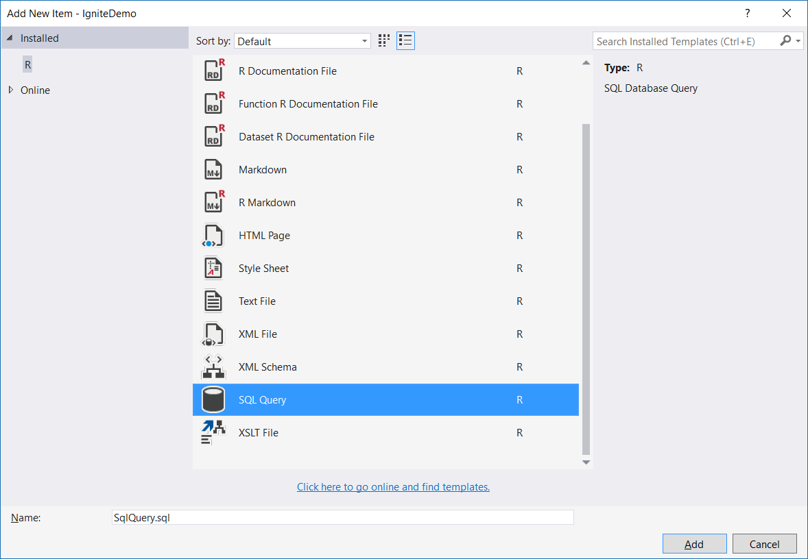
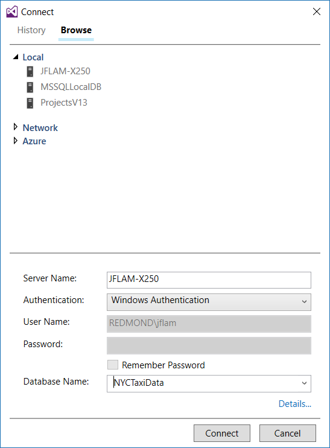
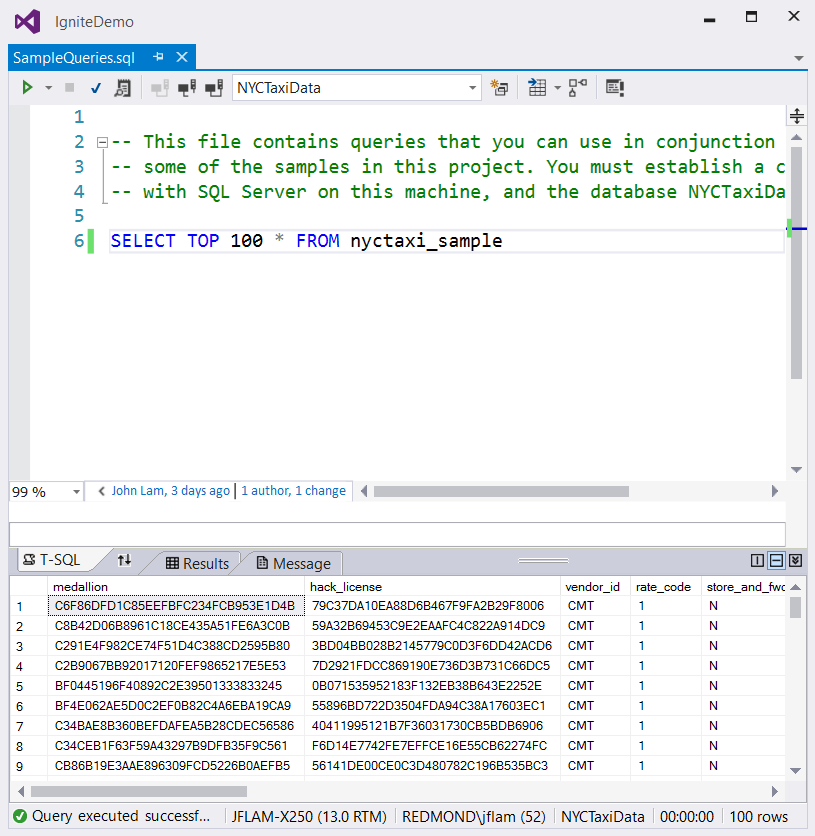
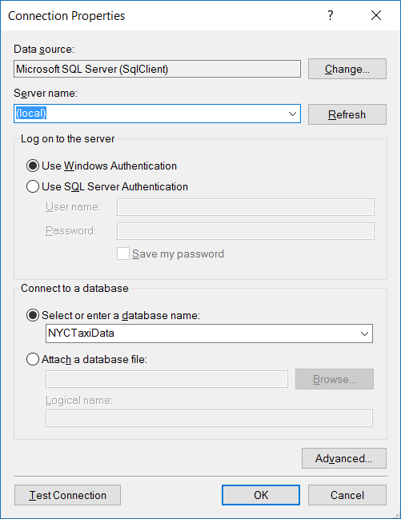
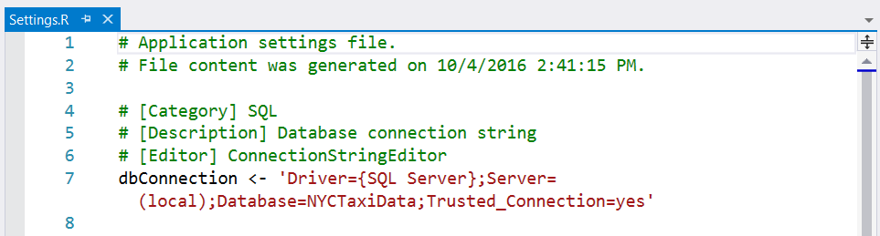
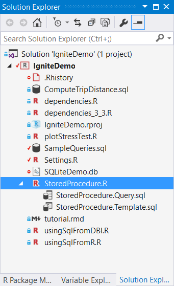
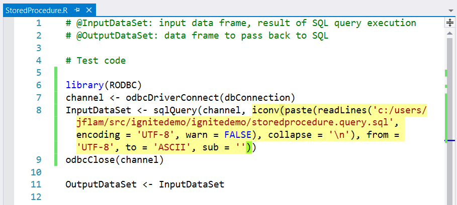
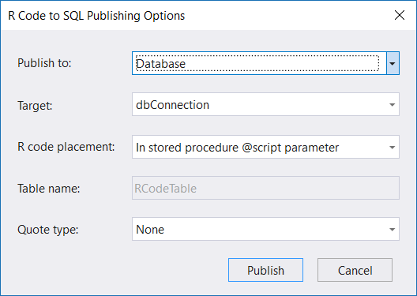

# Work with SQL Server and R

Visual Studio's excellent support for SQL Server helps data scientists work with R and SQL databases through the ability to create and run SQL queries and to work with stored procedures.

> [!Note]
> To work with SQL and R together, you must have the SQL Server Data Tools installed:
> - Visual Studio 2017: run the Visual Studio installer and select the Data storage and processing workload, which includes SQL Server Data tools.
> - Visual Studio 2015: follow the instructions on [Download SQL Server Data Tools](/sql/ssdt/download-sql-server-data-tools-ssdt).

:::row:::
    :::column:::
        
    :::column-end:::
    :::column:::
        [Watch a video (youtube.com)](https://www.youtube.com/watch?v=n4AYr0QIwdQ) for an overview of SQL Server and R (3m 03s).
    :::column-end:::
:::row-end:::

## Create and run SQL queries

RTVS supports adding SQL queries into R projects, allowing you to iteratively develop SQL queries in a separate context until you get the results you're looking for.

To add a SQL query file, right-click the project in Solution Explorer, select **Add** > **New Item**, and select the **SQL Query** file type:



This command opens the file in Visual Studio's Transact-SQL editor, which provides full IntelliSense for SQL and the ability to run queries. For these features to work, you need to connect to a database using the connect button in the editor's toolbar or try to run a query (**Ctrl**+**Shift**+**E**, which also works on a selection). Either way brings up the connection dialog:



Once a connection is established, you can run queries and see results:



The Transact-SQL editor supports a variety of other features, such as viewing the execution plan for the query and a query debugger.
For more information, see [Use Transact-SQL Editor to Edit and Execute Scripts](/previous-versions/sql/sql-server-data-tools/hh272706(v=vs.103)).

## Work with SQL Server stored procedures

[SQL Server R Services](/sql/advanced-analytics/r/sql-server-r-services) (SQL Server 2016 and later) lets you embed and run R code from a T-SQL stored procedure. You can run R code on a SQL Server computer, operate on data returned from a SQL query, and generate a SQL result set that can be processed by further SQL or returned to the client.

RTVS simplifies the otherwise unwieldy and error-prone process of combining SQL and R code inside a single SQL statement, as described in the following sections:

- [Add a database connection](#add-a-database-connection)
- [Write and test a SQL stored procedure](#write-and-test-a-sql-stored-procedure)
- [Publish a SQL stored procedure](#publish-a-sql-stored-procedure)

:::row:::
    :::column:::
        
    :::column-end:::
    :::column:::
        [Watch a video (youtube.com)](https://www.youtube.com/watch?v=dFKIT2OitWQ) for an overview of R and SQL stored procedures (6m 09s).
    :::column-end:::
:::row-end:::

### Add a database connection

1. Select **R Tools** > **Data** > **Add Database Connection** to bring up the **Connection Properties** dialog. Here you specify the name of the data source (SQL Server in this case), the name of the server, the authentication mode, and the name of the database. Select **Test Connection** to verify your input before closing the dialog.

    

1. Once you select **OK** with a valid connection, Visual Studio generates a connection string named `dbConnection` in a new *settings.R* file. RTVS automatically sources (runs) this file, so you can immediately use the connection from R scripts:



### Write and test a SQL stored procedure

To add a new SQL Stored Procedure, right-click your project, select **Add** > **New Item**, select **SQL Stored Procedure with R** from the list of templates, give the file a name , and select **OK**. The default filename is *SqlSProc.R*; for ease of reading, the filename *StoredProcedure.R* is used in the rest of this section. If you have multiple stored procedures, each file must have a unique filename.

RTVS creates three files for the stored procedure: an *.R* file for your R code, a *.Query.sql* file for the SQL code, and a *.Template.sql* file that combines the two. They latter two appear in Solution Explorer as children of the *.R* file:



The *.R* file (*StoredProcedure.R* this example) is where you write R code. The default contents are:

```R
# @InputDataSet: input data frame, result of SQL query execution
# @OutputDataSet: data frame to pass back to SQL

# Test code
# library(RODBC)
# channel <- odbcDriverConnect(dbConnection)
# InputDataSet <- sqlQuery(channel, )
# odbcClose(channel)

OutputDataSet <- InputDataSet
```

Simply said, the code receives an R dataframe called `InputDataSet` and returns its results in `OutputDataSet`, with the template code merely copying the input to the output.

> [!Note]
> The names of these dataframes are controlled by the `@input_data_1_name` and `@output_data_1_name` parameters in the call to the `sp_execute_external_script` system stored procedure. For more details on the design of this calling convention and some examples of its usage, see [sp_execute_external_script (Transact-SQL)](/sql/relational-databases/system-stored-procedures/sp-execute-external-script-transact-sql).

The other generated code (in comments) provides a small test script that uses the [RODBC package](https://cran.r-project.org/web/packages/RODBC/index.html) to transmit a SQL statement to SQL Server, run it, and retrieve its result set as an R dataframe. You can uncomment this test code to interactively write your R code against the result set that you get from SQL Server.

The *.Query.sql* file (*StoredProcedure.Query.sql* in this example) is where you write and test the SQL query that generates the data for `InputDataSet`. With this *.sql* file, the editor provides all the usual Transact-SQL features to you.

Once you're happy with your SQL code, integrate it with your R code by dragging the *.sql* file onto the open editor for the *.R* file. In the image below, *StoredProcedure.Query.sql* has been dragged to the point in *StoredProcedure.R* after the comma in `sqlQuery(channel, )`:



As you can see, this simple step automatically generates R code to open the *.sql* file, read its content into a string, and pass it to the RODBC package to send it to SQL Server.

You can now interactively write R code that manipulates the `InputDataSet` dataframe as desired. Remember that you can just select R code in the editor and send it to the [interactive window](interactive-repl-for-r-in-visual-studio.md) by pressing **Ctrl**+**Enter**.

The *.Template.sql* file (*StoredProcedure.Template.sql* in this example), finally, contains the template for generating your SQL Stored Procedure:

```sql
CREATE PROCEDURE [StoredProcedure]
AS
BEGIN
EXEC sp_execute_external_script @language = N'R'
    , @script = N'_RCODE_'
    , @input_data_1 = N'_INPUT_QUERY_'
--- Edit this line to handle the output data frame.
    WITH RESULT SETS (([MYNEWCOLUMN] NVARCHAR(max)));
END;
```

- The `_RCODE_` placeholder is replaced by the contents of the *.R* file (for example, *StoredProcedure.R*).
- The `_INPUT_QUERY_` placeholder is replaced by the contents of the *.Query.sql* file (for example, *StoredProcedure.Query.sql*).
- Edit the `WITH RESULT SETS` clause to describe the schema of the result set returned from the stored procedure. Specifically identify the columns from the `OutputDataSet` dataframe that you want to return to the caller of the stored procedure.

For example, for the following query:

```sql
SELECT TOP 100 medallion, hack_license FROM nyctaxi_sample
```

You'd use the following `WITH RESULT SETS` clause to specify the data types of the return values:

```sql
WITH RESULT SETS ((medallion NVARCHAR(max), hack_license NVARCHAR(max)));
```

### Publish a SQL stored procedure

1. Select the **R Tools** > **Data** > **Publish With Options** menu command.
1. In the dialog that appears, change **Publish to:** to **Database**, specify the target, select **Publish**, and RTVS builds and publishes the stored procedure:

    

1. To publish all stored procedures in a project, you can use the **R Tools** > **Data** > **Publish Stored Procedures** command, which is also available when you right-click the project in Solution Explorer.

> [!Tip]
> If you have the SQL Server Object Explorer open in Visual Studio, your published stored procedure appears in the **Programmability** > **Stored Procedures** folder of your database. You can also run it from the Object Explorer by right-clicking and selecting **Execute Procedure**, or by calling it interactively from a *.sql* query window.