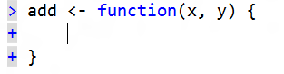
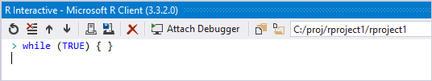
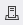
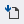
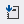

# Work with the R interactive window

R Tools for Visual Studio (RTVS) provides an R interactive window, also known as a **REPL** (Read-Evaluate-Print-Loop) window, in which you can enter R code and immediately see the results. All modules, syntax, and variables, as well as IntelliSense, is available in the interactive window.

The interactive window is also integrated with regular R editor windows. You can select code and press **Ctrl**+**Enter**, or right-click and select **Execute in Interactive**, and the code is run line-by-line in the interactive window as if you typed it directly. When the cursor is on a single line in an editor window, **Ctrl**+**Enter** sends that line to the interactive window and then moves the cursor to the next line. This way you can just press **Ctrl**+**Enter** repeatedly to step through the code.

To experience these features, follow the [Get started with R](getting-started-with-r.md) walkthrough as well as the sections in this article. [Code snippets](code-snippets-for-r.md) also work in the interactive window like they do in R editor windows.

## Overview of the Interactive Window

Typing valid R code and pressing **Enter** at the end of the line runs the code on that line:

```repl
> 3 + 3
[1] 6
```

Pressing **Enter** anywhere on a single-line input also runs that line.

All previous input and output in the REPL is read-only and cannot be changed. However, you can select and copy text from the window at any time, as well as pasted. Pasted code runs as if it were entered line by line.

That is, when you start typing a statement and press **Enter**, RTVS knows when the statement must be continued and enters multi-line mode with a + prompt on the left and the appropriate indentation. RTVS also completes parentheses, brackets, and curly braces:



In this multi-line mode, the **Enter** key runs the code block only when positioned at the end of the block, otherwise it inserts a new line. However, you can press **Ctrl**+**Enter** at any position to run that code block immediately.

### Toolbar commands

Here is the interactive window with its toolbar:



The toolbar commands are as follows, most of which have keyboard equivalents and are also available on the **R Tools** > **Session** and **R Tools** > **Working Directory** menus (or as noted):

| Button | Command | Key combination | Description |
| --- | --- | --- | --- |
|  | Reset | **Ctrl**+**Shift**+**F10** | Resets the interactive window session, clearing all variables and history. |
|  | Clear | **Ctrl**+**L** | Clears the output shown in the interactive window; does not affect session variables or history. |
|  | Previous History Command<br/>Next History Command | **Up**, **Down**<br/>**Alt**+**Up**, **Alt**+**Down** | Scrolls through the history, with certain behaviors for multi-line code blocks. See [History](#history). |
|  | Load Workspace | n/a | Loads a previous saved workspace (see [Workspaces and sessions](#workspaces-and-sessions). |
| | Save Workspace As | n/a | Saves the current state of the session as a workspace (see [Workspaces and sessions](#workspaces-and-sessions). |
|  | Source R Script | **Ctrl**+**Shift**+**S** | Calls `source` with the currently active R script in the Visual Studio editor, which runs the code.  This button appears only when an R file is open in the Visual Studio editor. |
|  | Source R Script with Echo | **Ctrl**+**Shift**+**Enter** | Same as Source R Script but displays the script's contents in the interactive window. |
| | Interrupt R | **Esc** | Stops any running code in the interactive window, such as the `while` loop in the screenshot shows at the beginning of this section. |
| | Attach Debugger | n/a | Also available using the **Debug** > **Attach to R Interactive** command. |
| | Set Working Directory to Source File Location | **Ctrl**+**Shift**+**E** | Sets the working directory to the most recently sourced file loaded to the interactive window (using `source`). See [Working directory](#working-directory). |
|  | Set Working Directory to Project Location | **Ctrl**+**Shift**+**P** | Sets the working directory to the root of the currently loaded project in Visual Studio. See [Working directory](#working-directory). |
| (Text field) | Select Working Directory | n/a | Direct input field for the working directory. See [Working directory](#working-directory). |

## Workspaces and sessions

Running code in the interactive window builds up a context in your current session. The context is composed of global variables, function definitions, library loads, and so forth. This context is collectively called a *workspace*, and you can save and load workspaces at any time.

Selecting the **Save Workspace As** button or using the **R Tools** > **Session** > **Save Workspace As** command prompts you for a location and filename (default extension is *.RData*).

To save a Workspace using a specific filename (the default is *.RData*), click on the **Save Workspace** button in the REPL:

To reload a previously saved workspace, select the **Load Workspace** button or use **R Tools** > **Session** > **Load Workspace** and navigate to the workspace file.

The **Reset** button or **R Tools** > **Session** > **Reset** clears the session context. If you're using a remote session, resetting also deletes the user profile on the remote machine to clear off all files stored there. (See [Workspaces](r-workspaces-in-visual-studio.md#directories-on-local-and-remote-computers).)

## Working directory

Developers commonly want to change their working directory while in an interactive session. Various commands, available on the toolbar, the **R Tools** > **Working directory** menu, and the project context menu allows you to easily set a working directory to the location of a source file, the location or your project, or any other arbitrary location. Doing so helps you avoid typing out full pathnames or lengthy relative pathnames when referring to files.

## History

Every line you enter in the interactive window, includes lines sent from an editor, are preserved in the REPL's history. You can then navigate through history with the Up and Down arrow keys, as you are likely accustomed to on the command line.

One difference is that if you start typing on the current line and press Up, that current line is preserved in your history even through you haven't run that line yet.

History in the interactive window also works intelligently with statements of other code block that span lines. When cycling through history with the Up and Down arrow keys, multi-line code blocks are retrieved as a whole unit and shown as the current entry. At this point, the arrow keys navigate through that code block line by line, until the top or bottom is reached. At the top of the code block, the up arrow retrieves the previous item in the history; at the bottom line, the down arrow retrieves the next item.

This behavior accommodates the typical case of rerunning the last item in the history with an Up arrow and **Enter** keystroke combination, while naturally allowing for editing of a multi-line code block by pressing the Up arrow to navigate into it.

To avoid navigating into multi-line code blocks, use the toolbar buttons or **Alt**+**Up** and **Alt**-**Down**, and all such blocks are treated as a single line.

The easiest way to experience the history features is to try them for yourself in the interactive window. The code below provides several suitable single- and multi-line statements. Use copy-paste with each statement individually, however, to create the appropriate history. (You can also paste the code into a separate code file and then send the lines to the interactive window with **Ctrl**+**Enter**.)

```R
3 + 3

4 + 4

5 + 5

add <- function (x, y) {
  return (x + y)
}

sub <- function (x, y) {
  return (x - y)
}
```