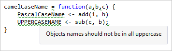

# Lint R code in Visual Studio

A linter analyzes code to reveal potential errors, formatting issues, and other code noise such as spurious whitespace. Using a linter also helps encourage certain coding conventions, such as how identifiers are named. Such conventions are helpful within teams and other collaborative situations.

R Tools for Visual Studio (RTVS) provides a built-in linter for R, the behavior of which is controlled through a variety of options described in this article. These options are found in **Tools** > **Options** > **Text Editor** > **R** > **Lint**.

The lint is disabled by default. To enable the lint, set the **All** > **Enable lint** option to **True**.

When enabled, the linter runs in the editor while you type. Issues appear as green squiggles. In the following graphic, for example, RTVS has identified six lint issues, including use of `=` instead of `<-` for an assignment, lack of spacing around function arguments, use of Pascal case and uppercase identifiers, and use of a semicolon. Hovering over an issue provides a description.

You often change linter options depending on the needs of a project or file. For example, sample code from an online course might use `=` instead of `<-` along with Pascal-case identifiers. Such code would show frequent linter warnings because the default linter options flag these cases. While working with that code, then, you can disable the options instead of spending time correcting each instance.

## Assignment group

| Option | Default value | Lint effect |
| --- | --- | --- |
| **Enforce \<-** | **True** | Identifies when `<-` isn't used for assignment. |

## Naming group

These options flag identifiers that use different naming conventions:

| Option | Default value | Lint effect |
| --- | --- | --- |
| **Flag camelCase** | **False** | Flags identifiers that use camelCase. |
| **Flag long names** | **False** | Flags identifiers whose names exceed the **Max name length** setting. |
| **Flag multiple dots** | **True** | Flags identifiers that use multiple dots. |
| **Flag PascalCase** | **True** | Flags identifiers that use PascalCase. |
| **Flag snake_case** | **False** | Flags identifiers that use underscores. |
| **Flag UPPERCASE** | **True** | Flags identifiers that use all caps. |
| **Max name length** | **32** | The length applied with the **Flag long names** setting. |

## Spacing group

These options, all of which are set to **True** by default, control where the linter identifies spacing issues: after function names, around commas, around operators, opening and closing curly positions, space before (, and space inside ().

## Statements group

| Option | Default value | Lint effect |
| --- | --- | --- |
| **Multiple** | **True** | Identifies when multiple statements are on the same line. |
| **Semicolons** | **True** | Identifies uses of semicolons. |

## Text group

| Option | Default value | Lint effect |
| --- | --- | --- |
| **Line length limit** | **False** | Sets whether the linter flags lines longer than the **Max line length** option. |
| **Max line length** | **80** | Sets the line length applied by the **Line length limit** option. |

## Whitespace group

These options, all of which are set to **True** by default, control where the linter identifies whitespace issues: use of tabs, use of double-quotes, trailing empty lines, and trailing whitespace.