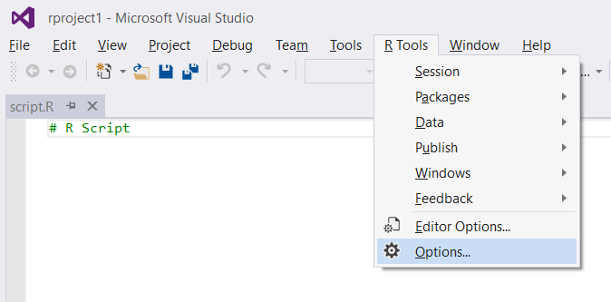
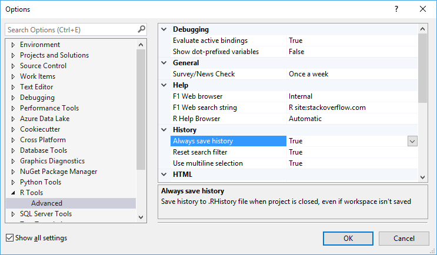

# R Tools for Visual Studio Options
 
From the **R Tools** top-level menu, you can also bring up general RTVS settings using the **Options** command:
 
  

Which brings up:
 
  

There are a number of configurable options here:

### Debugging

**Evaluate active bindings** Ensures that you always get the most up to date value when inspecting variables and properties in the Variable Explorer, and Debugger Tool Windows like Watch and Locals. The risk is that evaluating the expressions may cause side-effects, depending on how they were implemented.

**Show dot-prefixed variables** Shows variables prefixed with "." in Variable Explorer and Debugger Tool Windows.

### General

**Survey/News Check** Survey/News is a feature that pushes news about RTVS updates and surveys. This setting controls the frequency of how often RTVS checks for updates.

### Help

**F1 Web browser** Controls how help is displayed when you are searching for a term using Ctrl-F1. When set to `Internal`, you will see help rendered within a tool window in Visual Studio. When set to `External`, you will see help rendered using your default web browser.

**F1 Web Search String** Controls how search terms are passed to your search engine when you press Ctrl-F1 on a term in the editor. By default the string is `R site:stackoverflow.com`, which appends `R` to your search term. The `site:stackoverflow.com` is a directive to the search engine which tells it to scope the search to pages within the `stackoverflow.com` domain. 

**R Help Browser** Controls how help is displayed when you are searching the R documentation using F1, `?` or `??`. 

When set to `Automatic`, you will see help rendered using the appropriate window. For example, if you are rendering HTML help, it will appear within a tool window in Visual Studio. If you are rendering a PDF, it will render using the default PDF viewer on your computer.

When set to `External`, you will see help rendered using your default web browser.

### History

**Always save history** Controls whether RTVS writes your command history to a `.RHistory` file in your working directory whenever the project is closed. Note that this happens even if you don't save your project before you exit.

**Reset search filter** The History window can filter your command history to show only the commands that substring match against the filter term in the R History dialog. This setting determines whether to reset your History search filter whenever you run a new command, or switch to a new project, which will trigger the load of a different `.RHistory` file. The default setting of `Yes` minimizes surprise when you execute a command with a filter set, and you wonder why the command you just ran didn't show up in the History.

**Use multiline selection** It is quite common to execute statements that span several lines in the Interactive Window. The default setting of `Yes` will let you single click a multi-line statement in History to select it.

### HTML

**HTML Pages browser** When viewing content such as a `ggvis` plot, or a `shiny` application, the output will be rendered in a web browser. The default setting of `Internal` will show your HTML output within a tool window in Visual Studio. When set to `External`, you will see your HTML output rendered using your default web browser.

### Logging

**Log events** This setting controls the verbosity of the logging used for RTVS diagnostics. The default setting of `Normal` creates a log file in your TEMP directory. When set to `Traffic`, RTVS logs all commands, and responses in your session. These log files never leave your machine, but may be helpful for diagnosing problems in RTVS.

### Markdown

**Markdown preview browser** When viewing RMarkdown HTML output, the defaultsetting of `Internal` will show your RMarkdown HTML document within a tool window in Visual Studio. When set to `External`, you will see your RMarkdown HTML document rendered using your default web browser.

### R Engine

**Code page** The default setting of `OS Default` will instruct R to use the default OS locale. You can use the dropdown to change the locale setting to a different local as well.

**CRAN Mirror** The default setting of `Use .Rprofile` will respect the CRAN Mirror settings in your `.RProfile` file. You can override this setting by selecting one of the listed CRAN mirrors in the dialog.

**Working directory** This is the current working directory, and is typically set whenever a project is opened.

### Workspace

**Load workspace when project opens** The default setting of `No` disables loading of the session data from the `.RData` file into the global environment when the project is opened.

**Prompt to save workspace on reset** The default setting of `No` disables prompting of saving your workspace when you click on the Reset button in the Interactive Window.

**Save workspace when project closes** The default setting of `No` disables saving the global environment to the `.RData` file when the project is closed.

**Show confirmation dialog before switching workspaces** The default setting of `No` disables prompting the user for confirmation when switching between different workspaces.
 