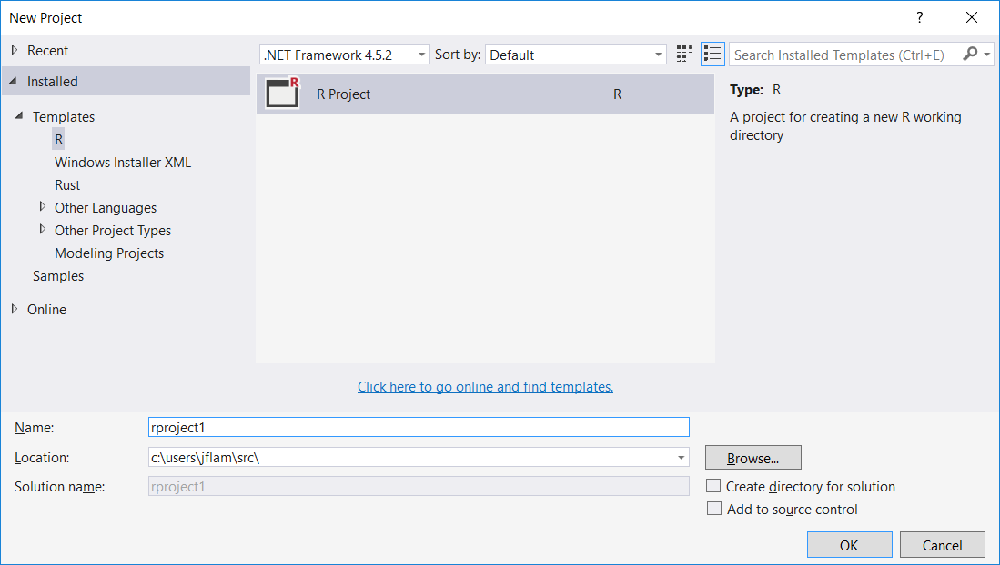

# How to start a new project using R Tools for Visual Studio

1. Start Visual Studio 2015
2. Choose **File > New > **Project...**
3. Select the R Project from the R templates.

   

4. Name the project in the **Name:** box.
5. Test that the R **Interactive** pane is working by typing in 3 + 4 and then Enter to see the answer displayed.

    

# Try some of the samples

You can also try one of our sample projects.  Just download, open and run:

[Samples documentation](getting-started-samples.md)

# Use multiple project types in Visual Studio

In Visual Studio, related files are collected into a **Project**, and related Projects are collected into a **Solution**.  

Here we see a Solution that consists of 5 separate Projects made up of C++, R, Python and SQL code.  The user has built a model using R/Azure ML, Python/scikit-learn, C++ for compute intensive work, SQL for data management, and finally a Python/Bottle project to share results via Azure:

Solutions provide a convenient place to gather and manage relevant Projects (which maybe worked on by other team members) in one logical place.

Note that there isn't currently any explicit R to C#/C++ language integration in place yet.  However there are libraries available that provide bridges between C#/R and C++/R.
