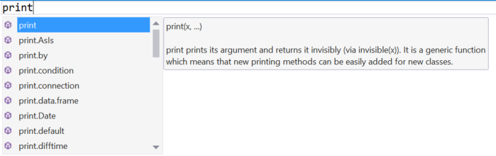
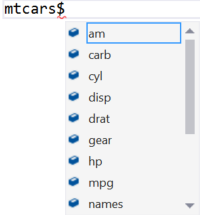
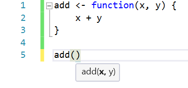
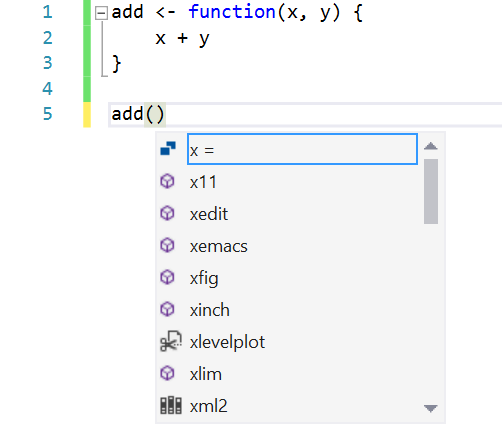
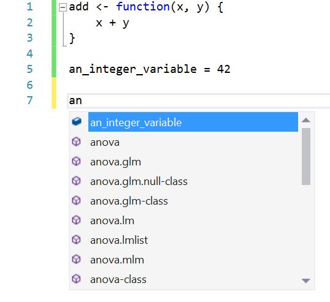
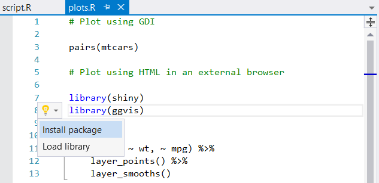

# IntelliSense

Visual Studio IntelliSense displays information about functions you can call, members of objects, function arguments, and [code snippets](code-snippets-for-r.md) directly in your view as you write code. It also displays possible completions as you type, and completes when you press the **Tab** or **Enter** keys (see [Editor options](editing-r-code-in-visual-studio.md#editor-options) for the **Advanced** tab). IntelliSense is available in both the editor and the [interactive window](interactive-repl-for-r-in-visual-studio.md).

When typing a function or other statement, IntelliSense provides an auto-completion menu filtered (case-sensitively) by what you've already entered:

Pressing **Tab** (or **Enter**, or **Space**, depending on how options are set), inserts the item selected in the dropdown. You can change the selection with the arrow keys.

IntelliSense also provides suggestions for members of R objects:

Pressing **ESC** dismisses the menu altogether. You can bring it back up with **Ctrl**+**Space**.

Typing the opening `(` for a function call inserts the closing `)` and brings up signature help as shown earlier:

Again, **ESC** dismisses the popup; for function signatures, you can bring it up again with **Ctrl**+**Shift**+**Space**.

> [!Tip]
> If parameter help obscures text underneath it, press and hold the **Ctrl** key to make the parameter help text translucent.

## IntelliSense for user-defined functions and variables

IntelliSense applies for user-defined functions in the same file, including name-parameter completion:

IntelliSense also applies for variables in the same file and the current session:

> [!Note]
> In the interactive window, IntelliSense considers only names in the current R session and ignores files in your project.

## Code suggestions

When a light bulb (called smart tag) appears in the margin, Visual Studio is suggesting that there is a shortcut available for a commonly used action. For example, hover over a line that contains a `library` statement in the editor to see a light bulb. Selecting the light bulb displays available options:

