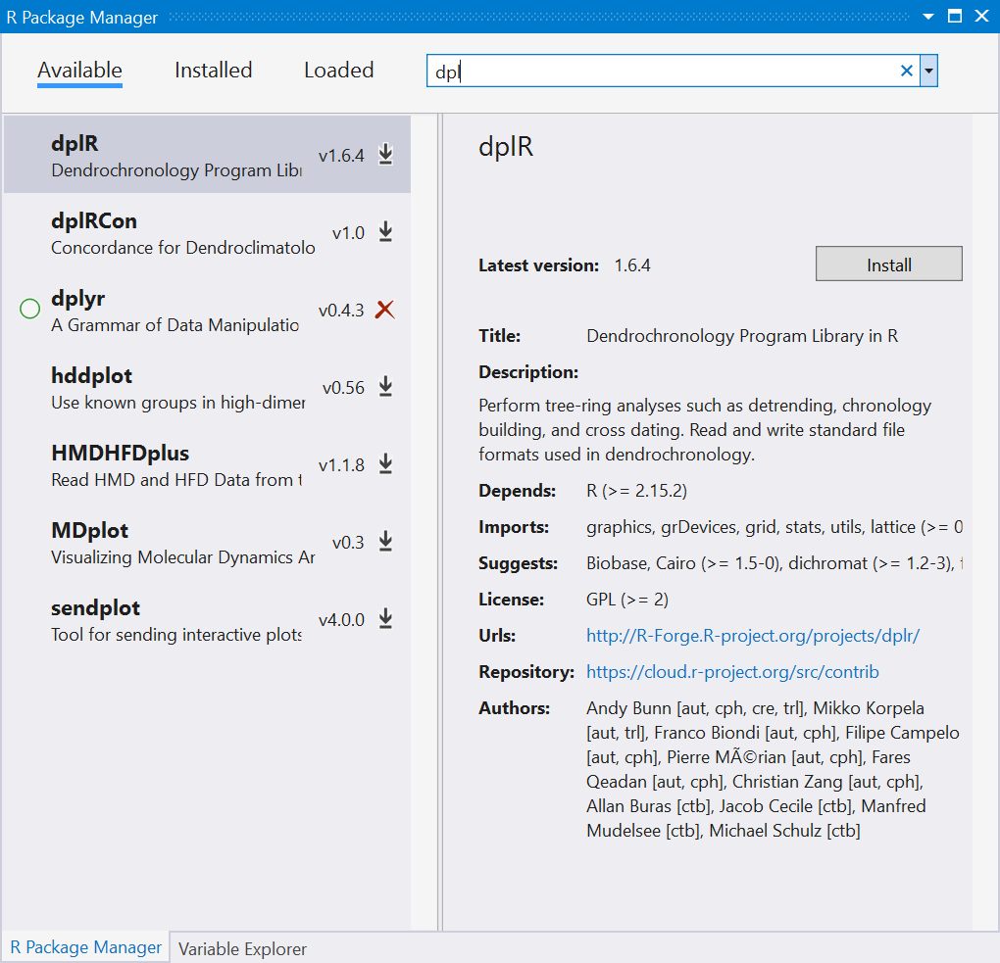
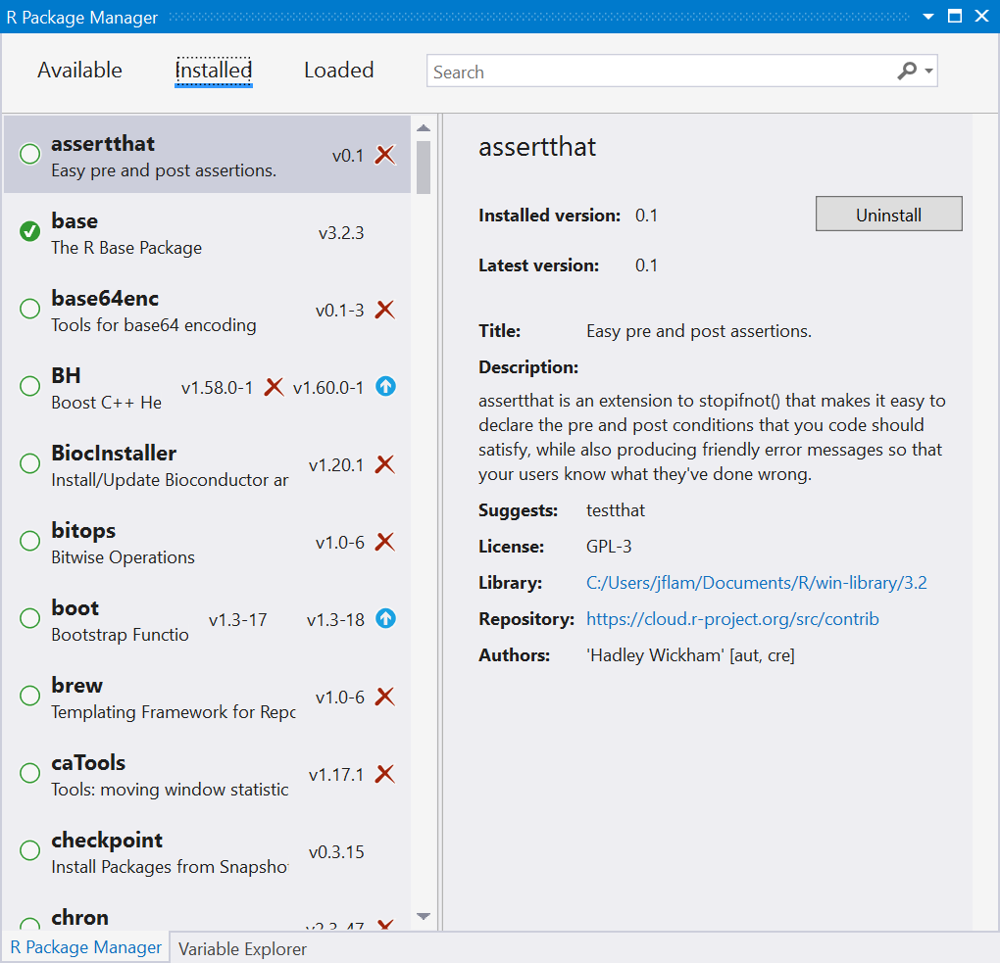
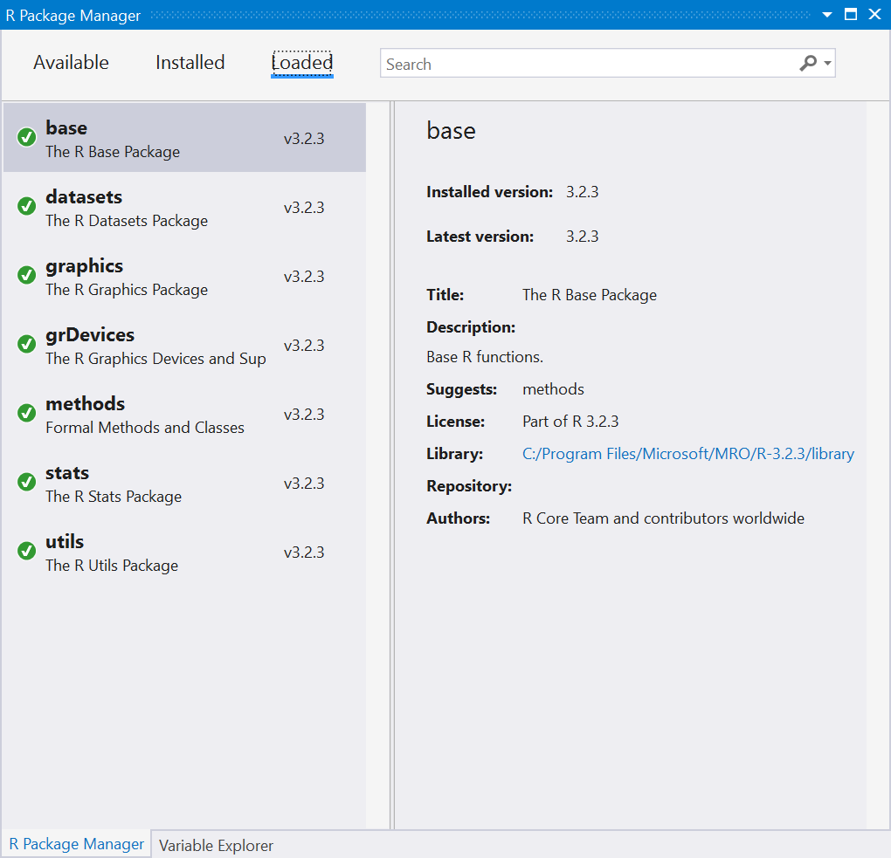

# Package manager

The R Tools for Visual Studio (RTVS) package manager is a UI for managing the R packages. To open it, select **R Tools** > **Windows** > **Packages** or pressing **Ctrl**+**7**.

The package manager has three tabs. Each tab displays a list of relevant packages on the left and specific details for the selected package on the right, including the package's version, description, license, install location, and links to other relevant information. The search box on the upper right lets you filter the list.

> [!Tip]
> The term in the search box remains in effect as you switch between tabs.

- **Available** lets you browse packages to install. If the package is already installed, the **Install** button on the right changes to **Uninstall**.

    

- **Installed** shows all installed and loaded packages. A green dot next to a package indicates that it's loaded into the R session. The red X icon in the left-hand list or the **Uninstall** button on the right can be used to uninstall the package. If a newer version of an installed package is available, a blue up arrow to the right of the package performs the update.

    

- **Loaded** displays only those packages that are loaded into the R session, all of which appear with a green dot. You can also uninstall and update packages here.

    

## Package locations

Packages are installed in the following locations:

- Core packages that are included with RTVS are installed in *C:\Program Files\Microsoft\R Client\R_SERVER\library*
- Additional packages are installed to *%userprofile%\Documents\R\win-library\3.3*
