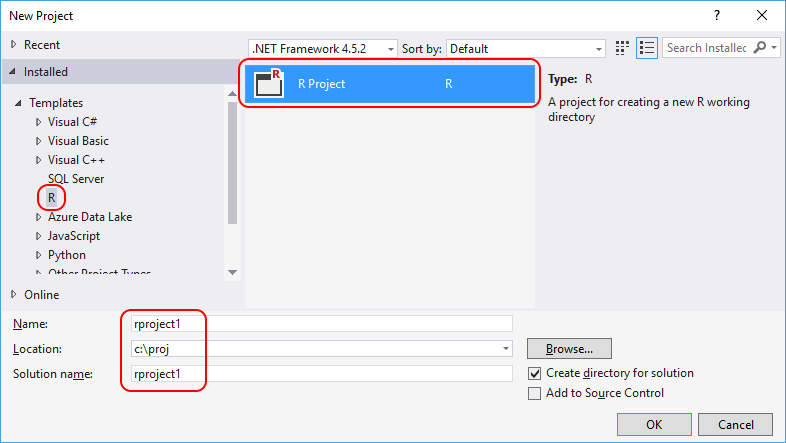
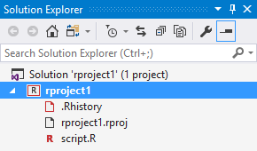
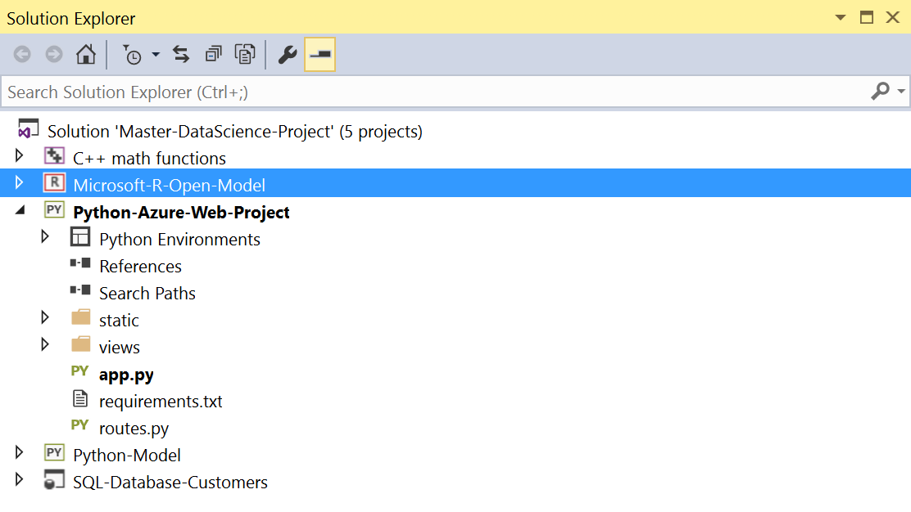

# Create R projects in Visual Studio

An R project (an *.rxproj* file) identifies all the source and content files associated with your project. It also contains build information for each file, maintains the information to integrate with source-control systems, and helps you organize your application into logical components. Workspace-related information such as the list of installed packages, however, is maintained separately in the workspace itself.

Projects are always managed within a Visual Studio *solution*, which can contain any number of projects that can reference one another. See [Use multiple project types in Visual Studio](#use-multiple-project-types-in-visual-studio).

## Creating a new R project

1. Open Visual Studio.
1. Choose **File > New > Project** (**Ctrl**+**Shift**+**N**)
1. Select "R Project" from under **Templates** > **R**, give the project a name and location, and select **OK**:

    

This command creates a project with an empty *script.R* file open in the editor. Notice also in **Solution Explorer** there are two other files in the project:

The *.Rhistory* records whatever commands you enter into the [R Interactive](interactive-repl-for-r-in-visual-studio.md) window. You can open a dedicated history window with the **R Tools** > **Windows** > **History** command. That window has a toolbar button and context menu items to clear history contents.

The *rproject.rproj* file maintains certain R-specific project settings that aren't otherwise managed by Visual Studio:

| Property | Default | Description |
| --- | --- | --- |
| Version | 1.0 | The version of R Tools for Visual Studio used to create the project. |
| RestoreWorkspace | Default | Automatically load previous Workspace variables from the `.RData` file in the project directory. |
| SaveWorkspace | Default | Save current workspace variables to the `.RData` file in the project directory when closing a project. |
| AlwaysSaveHistory | Default | Save current Interactive Window history to the `.RHistory` file in the project directory when closing a project. |
| EnableCodeIndexing | Yes | Determines whether to run a background indexing task to speed code searches. |
| UseSpacesForTab | Yes | Determines whether to insert spaces (Yes) or a Tab character (No) when the **Tab** key is pressed in the editor. |
| NumSpacesForTab | 2 | The number of spaces to insert if UseSpacesForTab is Yes. |
| Encoding | UTF-8 | The default encoding for `.R` files. |
| RnwWeave | Sweave | Package to use when weaving a Rnw file. |
| LaTeX | pdfLaTeX | Library to use when converting RMarkdown to PDF. |

### Converting a folder of files to an R project

If you have an existing folder of *.R* files that you want to manage in a project, do the following steps:

1. Create a new project in Visual Studio as in the previous section.
1. Copy your files into the project folder.
1. In the Visual Studio Solution Explorer, right-click the project, select **Add** > **Existing Item**, and browse to the files you want to add. Those files appear in your project tree after selecting **OK**.
1. To organize code into subfolders, right-click the project, select **Add** > **New Folder** first, then copy your files into that folder and add those existing items in step 3.

## Project properties

To open the project property pages, right-click the project in **Solution Explorer** and select **Properties**, or select the **Project > (project name) properties** menu item. The window that opens displays project properties:

| Tab | Property | Description |
| --- | --- | --- |
| Run | Startup file | The name of the file that is run with **Source startup file** command, **F5**, **Debug** > **Start debugging**, or **Debug** > **Start without debugging**. Right-clicking the file in the project and selecting **Set as startup R script** also sets it as the startup file. |
| | Reset R Interactive on Run | Clears all variables from the interactive window's workspace when running the project. Doing so guarantees that there's no residual workspace contents from pervious runs. |
| | Remote Project Path | Path to a remote workspace. |
| | Transfer files on run | Indicates whether the project files, subject to the filter in **Files to transfer**, are to be copied to a remote workspace with each run. |
| | Files to transfer | Filenames and wildcards indicating the specific files to copy to a remote workspace if **Transfer files on run** is selected. |
| Settings | (Settings.R file) | R project settings come from *Settings.R* or **.Settings.R* files that are located inside the project. If there is no settings file, you can add variables, save the page, and a default *Settings.R* file is created for you. You can also add settings file to the project through the **File** > **Add New Item** menu command.   Settings are stored as R code and the file can be sourced before running other modules, thus pre-populating environment with the predefined settings. |

## R-specific project commands

Visual Studio projects support a number of general commands through both the right-click menu and the **Project** menu. For details on these general capabilities, see [Solutions and projects in Visual Studio](../ide/solutions-and-projects-in-visual-studio.md). Keep in mind, however, that R Tools for Visual Studio (RTVS) adds a number of its own commands to the right-click menu for an R project and also files and folders within the project.

| Command | Description |
| --- | --- |
| Set Working Directory Here | Sets the R Interactive window's working directory to the project folder, which can also be used on any subfolder within a project. |
| Open Containing Folder | Opens Windows Explorer at the location of the selected file. |
| Add R Script | Creates and opens a new *.R* file with a default name. You can also use the **Add** > **New Item** command to create *.R* files as well as a number of other file types. See [R-specific item templates](#r-specific-item-templates). |
| Add R Markdown | Creates and opens new *.rmd* document with a default name. You can also use the **Add** > **New Item** command to create *.rmd* files as well as a number of other file types. See [R-specific item templates](#r-specific-item-templates).  |
| Publish Stored Procedures | Starts a process to publish any stored procedures contained in R scripts. See [Work with SQL Server stored procedures](integrating-sql-server-with-r.md#work-with-sql-server-stored-procedures). |

## R-specific item templates

RTVS includes a number of templates for specific file types. You access templates by right-clicking an R project and selecting **Add** > **New Item**, by selecting **Project** > **Add New Item**, or by using **File** > **New** > **File** and selecting the **R** tab. The best way to explore a template is to create a new project and insert files of each type.

> [!Note]
> The **Add** > **New Item** commands also display general file types that aren't listed in the table; with **File** > **New** > **File** those types are contained instead on the **General** tab.

| File Type | Description |
| --- | --- |
| R Script | A text file containing the same commands that can be entered on the R command line. |
| R Markdown | A file containing an [R Markdown](rmarkdown-with-r-in-visual-studio.md) document. |
| R Settings | A file that holds R application settings. |
| R Documentation | A generic R documentation file containing only name, alias, and title fields. |
| R Documentation (Function) | An R documentation file containing many fields with comments for describing a function. |
| R Documentation (Dataset) | An R documentation file containing many fields with comments for describing a dataset. |
| SQL Query | An empty *.sql* file. See [Work with SQL Server and R](integrating-sql-server-with-r.md). |
| Stored Procedure with R | An R file with child SQL Query and child stored procedure template file. See [Work with SQL Server and R](integrating-sql-server-with-r.md). |

## Use multiple project types in Visual Studio

Visual Studio Solutions provide a convenient place to gather and manage related projects in one logical place. Solutions help keep your code organized and facilitates collaboration within teams.

In the example below, the solution contains an R project with a model built using R and Azure Machine Learning, a Python/scikit-learn project, a C++ project containing modules for intensive computational work, a SQL project for data management, and a Python/Bottle project for the web site that publishes the result:

The project highlighted with boldface is the "startup" project for the solution; to change it, right-click a different project and select **Set as startup project**.

> [!Note]
> At present, there isn't any explicit R to C#/C++ language integration in place (as there is for Python, see [Create a C++ extension for Python](../python/working-with-c-cpp-python-in-visual-studio.md)).  However there are libraries available that provide C# and C++ bridges for R.

For more information on managing projects and solutions in general, see [Solutions and projects in Visual Studio](../ide/solutions-and-projects-in-visual-studio.md).
