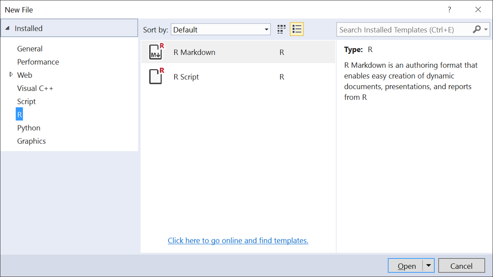
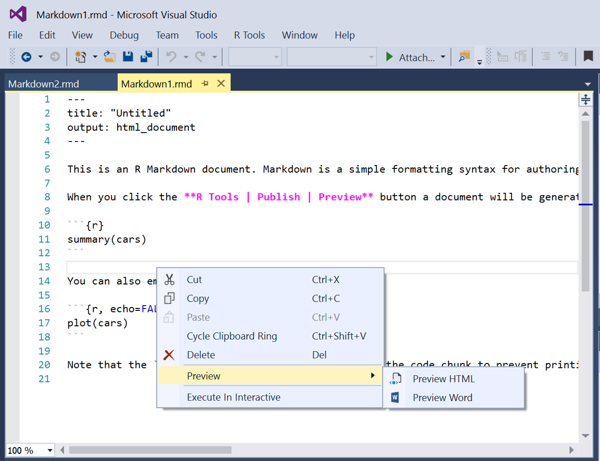

# R Markdown

To use R Markdown, you should first install pandoc. Make sure to shut down Visual Studio before installing pandoc to ensure that Visual Studio will pick up the path to the pandoc installation when you run it after the installation.

[Install Pandoc from pandoc.org](http://pandoc.org/installing.html)

You will also need to install the knitr and rmarkdown packages:


install.packages("knitr")
install.packages("rmarkdown")


Next, to create an R Markdown file, go to File/New and select R Markdown:

Once you've edited your file, you can right click and Preview into Word or HTML:

