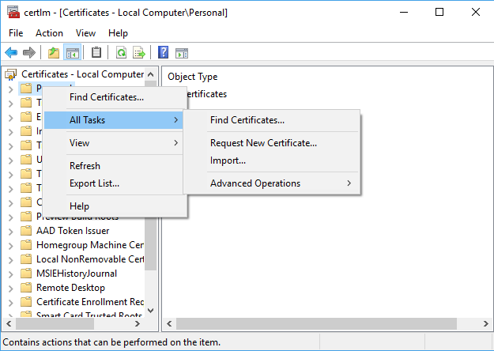
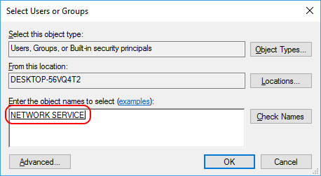

# Set up remote workspaces

This article explains how to configure a remote server with SSL and an appropriate R service. This allows R Tools for Visual Studio (RTVS) to connect to a remote workspace on that server.

## Remote computer requirements

- Windows 10, Windows Server 2016, or Windows Server 2012 R2. RTVS also requires
- [.NET Framework 4.6.1](https://www.microsoft.com/download/details.aspx?id=49981) or greater

## Install an SSL certificate

RTVS requires that all communications with a remote server happens over HTTP, which requires an SSL certificate on the server. You can use either a certificate signed by a trusted certificate authority (recommended), or a self-signed certificate. (A self-signed certificate causes RTVS to issue warnings when connected.) With either one, you then need to install it on the computer and allow access to its private key.

### Obtain a trusted certificate

A trusted certificate is issued by a certificate authority (see [certificate authorities on Wikipedia](https://en.wikipedia.org/wiki/Certificate_authority) for background). Like obtaining a government identification card, issuing a trusted certificate involves more process and possible fees, but verifies the authenticity of the request and the requestor.

The key field that needs to be in the certificate is the fully-qualified domain name of your R server computer. The certificate authority requires proof that you are authorized to create a new server for the domain to which your server belongs.

For more background, see [public key certificates](https://en.wikipedia.org/wiki/Public_key_certificate) on Wikipedia.

## Install an SSL certificate on Windows

The SSL certificate has to be installed manually on Windows. Follow the instructions below to install an SSL certificate.

### Obtain a self-signed certificate (Windows)

Skip this section if you have a trusted certificate. Compared with a certificate from a trusted authority, a self-signed certificate is like creating an identification card for yourself. This process is, of course, much simpler than working with a trusted authority, but also lacks strong authentication, meaning that an attacker can substitute their own certificate for the unsigned certificate and capture all of the traffic between the client and the server. Therefore, *self-signed certificate should be used only for testing scenarios, on a trusted network, and never in production.*

For this reason, RTVS always issues the following warning when connecting to a server with a self-signed certificate:


To issue a self-signed certificate:

1. Log on to the R server computer using an administrator account.
1. Open a new administrator PowerShell command prompt and issue the following command, replacing `"remote-machine-name"` with the fully qualified domain name of your server computer.

    ```ps
    New-SelfSignedCertificate -CertStoreLocation Cert:\LocalMachine\My -DnsName "remote-machine-name"
    ```

1. If you have never run PowerShell before on the R server computer, run the following command to enable running of commands explicitly:

    ```ps
    Set-ExecutionPolicy -ExecutionPolicy RemoteSigned
    ```

For background, see [self-signed certificates](https://en.wikipedia.org/wiki/Self-signed_certificate) on Wikipedia.

### Install the certificate

To install the certificate on the remote computer, run *certlm.msc* (the certificate manager) from a command prompt. Right-click on the **Personal** folder and select the **All Tasks** > **Import** command:



### Grant permissions to read the SSL certificate's private key

Once the certificate is imported, grant the `NETWORK SERVICE` account permissions to read the private key as described in the following instructions. `NETWORK_SERVICE` is the account used to run the R Services broker, which is the service that terminates incoming SSL connections to the server computer.

1. Run *certlm.msc* (the Certificate Manager) from an administrator command prompt.
1. Expand **Personal** > **Certificates**, right-click your certificate, and select **All Tasks** > **Manage Private Keys**.
1. Right-click on the certificate and select the **Manage Private Keys** command under **All Tasks**.
1. In the dialog that appears, select **Add** and enter `NETWORK SERVICE` as the account name:

    

1. Select **OK** twice to dismiss the dialogs and commit your changes.

## Install an SSL certificate on Ubuntu

The `rtvs-daemon` package will install a self-signed certificate by default as a part of the installation.

### Obtain a self-signed certificate (Ubuntu)

For benefits and risks of using self-signed certificate see the Windows description. The `rtvs-daemon` package generates and configures the self-signed certificate during installation. You will need to do this only if you wish to replace the auto-generated self-signed certificate.

To issue a self-signed certificate yourself:

1. SSH or login to your Linux machine.
2. Install `ssl-cert` package:

    ```sh
    sudo apt-get install ssl-cert
    ```

3. Run `make-ssl-cert` to generate the default self-signed SSL certificate:

    ```sh
    sudo make-ssl-cert generate-default-snakeoil --force-overwrite
    ```

4. Convert the generated key and PEM files to PFX. The generated PFX should be in your home folder:

    ```sh
    openssl pkcs12 -export -out ~/ssl-cert-snakeoil.pfx -inkey /etc/ssl/private/ssl-cert-snakeoil.key -in /etc/ssl/certs/ssl-cert-snakeoil.pem -password pass:SnakeOil
    ```

### Configure RTVS daemon

The SSL certificate file path (path to the PFX) must be set in */etc/rtvs/rtvsd.config.json*. Update `X509CertificateFile` and `X509CertificatePassword` with the file path and password respectively.

```json
{
  "logging": { "logFolder": "/tmp" },
  "security": {
    "allowedGroup": "",
    "X509CertificateFile": "/etc/rtvs/ssl-cert-snakeoil.pfx",
    "X509CertificatePassword": "SnakeOil"
  },
  "startup": { "name": "rtvsd" },
  "urls": "https://0.0.0.0:5444"
}
```

Save the file and restart the daemon, `sudo systemctl restart rtvsd`.

## Install R services on Windows

To run R code, the remote computer must have an R interpreter installed as follows:

1. Download and install one of the following:

   - [Microsoft R Open](https://mran.microsoft.com/open/)
   - [CRAN R for Windows](https://cran.r-project.org/bin/windows/base/)

     Both have identical functionality, but Microsoft R Open benefits from additional hardware accelerated linear algebra libraries courtesy of the [Intel Math Kernel Library](https://software.intel.com/intel-mkl).

2. Run the [R Services installer](https://aka.ms/rtvs-services) and reboot when prompted. The installer does the following:

    - Create a folder in *%PROGRAMFILES%\R Tools for Visual Studio\1.0\\* and copy all the required binaries.
    - Install `RHostBrokerService` and `RUserProfileService` and configure to start automatically.
    - Configure the `seclogon` service to start automatically.
    - Add *Microsoft.R.Host.exe* and *Microsoft.R.Host.Broker.exe* to the firewall inbound rules on the default port 5444.

R services start automatically when the computer reboots:

- **R Host Broker Service** handles all HTTPS traffic between Visual Studio and process where the R code runs on the computer.
- **R User Profile Service** is a privileged component that handles Windows user profile creation. The service is called when a new user first logs on to the R server computer.

You can see these services in the services management console (*compmgmt.msc*).

## Install R Services on Linux

To run R code, the remote computer must have an R interpreter installed as follows:

1. Download and install one of the following:

   - [Microsoft R Open](https://mran.microsoft.com/open/)
   - [CRAN R for Windows](https://cran.r-project.org/bin/linux/ubuntu/)

     Both have identical functionality, but Microsoft R Open benefits from additional hardware accelerated linear algebra libraries courtesy of the [Intel Math Kernel Library](https://software.intel.com/intel-mkl).

2. Follow the instructions on [Remote R Service for Linux](setting-up-remote-r-service-on-linux.md), which covers physical Ubuntu computers, Azure Ubuntu VMs, Windows Subsystem for Linux (WSL), and Docker containers, including those running on Azure Container Repository.

## Configure R services

With R services running on the remote computer, you also need to create user accounts, set firewall rules, configure Azure networking, and configure the SSL certificate.

1. User accounts: Create accounts for each user that accesses the remote computer. You can create either standard (non-privileged) local user accounts, or you can join your R server computer to your domain and add the appropriate security groups to the `Users` security group.

1. Firewall rules: By default, the `R Host Broker` listens on TCP port 5444. Therefore, ensure that there are Windows firewall rules enabled for both inbound and outbound traffic (outbound is needed for installing packages and similar scenarios).  The R services installer sets these rules automatically for the built-in Windows firewall. If you're using a third-party firewall, however, open port 5444 for `R Host Broker` manually.

1. Azure configuration: If your remote computer is a virtual machine on Azure, open port 5444 for incoming traffic within Azure networking as well, which is independent of the Windows firewall. For details, see [Filter network traffic with network security group](/azure/virtual-network/virtual-networks-nsg) in the Azure documentation.

1. Tell the R Host Broker which SSL certificate to load: If you're installing the certificate on an Intranet server, it is likely that the fully-qualified domain name of your server is the same as its NETBIOS name. In this case, there is nothing that you need to do, as this is the default certificate that is loaded.

    However, if you are installing your certificate on an Internet-facing server (such as an Azure VM), use the fully-qualified domain name (FQDN) of your server because the FQDN of an Internet-facing server is never the same as its NETBIOS name.

    To use the FQDN, navigate to where R Services is installed (*%PROGRAM FILES%\R Remote Service for Visual Studio\1.0* by default), open the *Microsoft.R.Host.Broker.Config.json* file in a text editor, and replace its contents with the following, assigning CN to whatever your server's FQDN, such as `foo.westus.cloudapp.azure.com`:

    ```json
    {
      "server.urls": "https://0.0.0.0:5444",
      "security": {
        "X509CertificateName": "CN=your-server-fully-qualified-domain-name"
      }
    }
    ```

    Save the file and restart the computer to apply changes.

## Troubleshooting

**Q. The R server computer is not responding, what do I do?**

Try to ping the remote computer from the command line: `ping remote-machine-name`. If the ping fails, make sure the computer is running.

**Q. The R interactive window says the remote computer is on, but why is the service not running?**

There are three possible reasons:

- [.NET Framework 4.6.1](https://www.microsoft.com/download/details.aspx?id=49981) or greater is not installed on the computer.
- Firewall rules for `Microsoft.R.Host.Broker` and `Microsoft.R.Host` aren't enabled for both incoming and outgoing connections on port 5444.
- An SSL certificate with `CN=<remote-machine-name>` was not installed.

Restart the computer after making any of the above changes. Then make sure that `RHostBrokerService` and `RUserProfileService` are running through either Task Manager (services tab) or *services.msc*.

**Q. Why does the R interactive window say "401 Access denied" while connecting to the R server?**

There are two possible reasons:

- It is highly likely that the `NETWORK SERVICE` account does not have access to the private key of the SSL certificate. Follow the earlier instructions to grant the `NETWORK SERVICE` access to the private key.
- Make sure that `seclogon` service is running. Use *services.msc* to configure `seclogon` to start automatically.

**Q. Why does the R interactive window say "404 Not found" while connecting to the R server?**

This error is probably due to missing Visual C++ redistributable libraries. Check the R interactive window to see if there is a message regarding missing library (DLL). Then check that the VS 2015 redistributable is installed, and that you have R installed as well.

**Q. I can't access internet/resource from the R interactive window, what do I do?**

Ensure that the firewall rules for `Microsoft.R.Host.Broker` and `Microsoft.R.Host` allow outbound access on port 5444. Restart the computer after applying changes.

**Q. I've tried all these solutions, and it still doesn't work. Now what?**

Look in the log files in *C:\Windows\ServiceProfiles\NetworkService\AppData\Local\Temp*. This folder contains separate log files for each instance of the R Broker Service that was run. A new log file is created whenever the service restarts. Check the most recent log file for clues about what might be going wrong.
