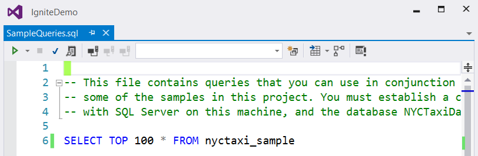
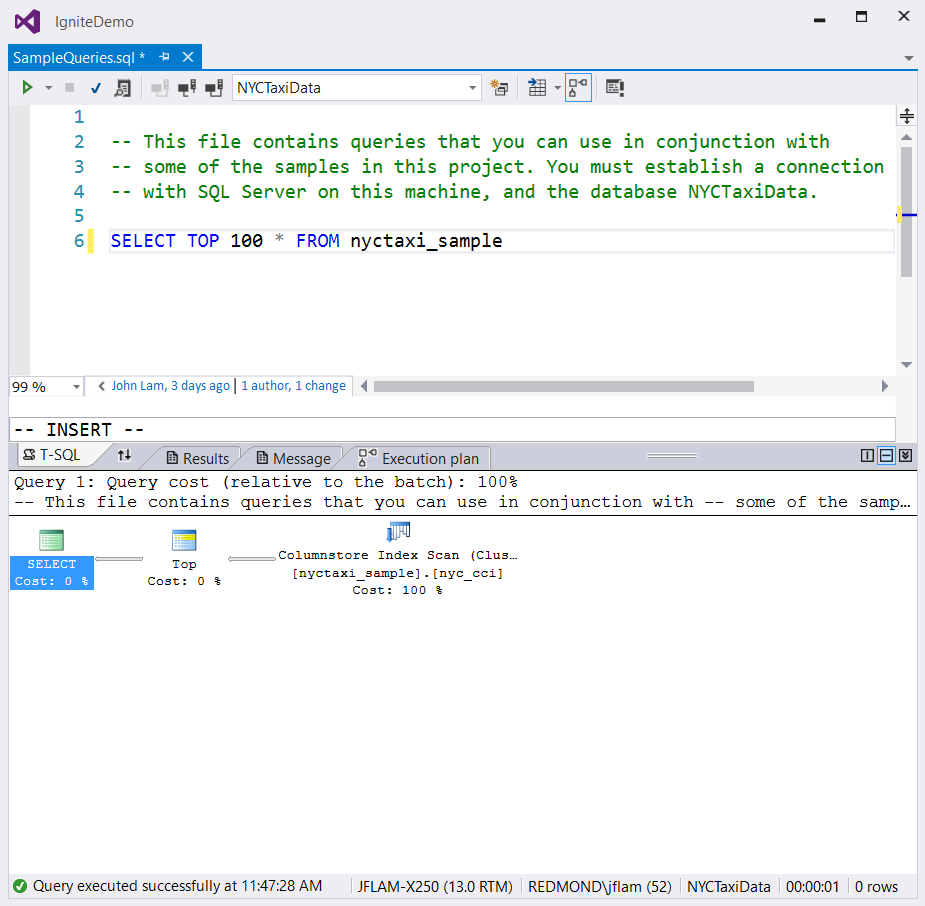
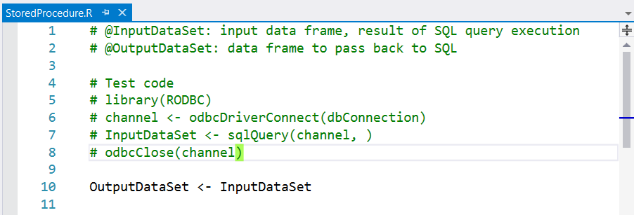
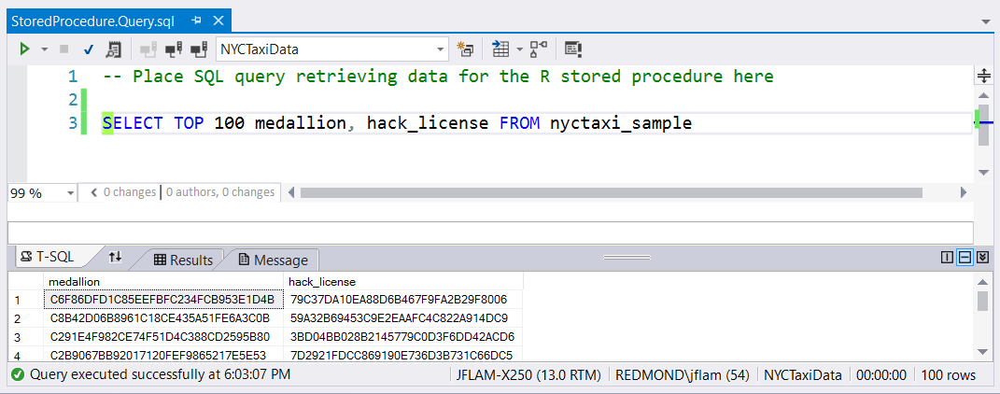
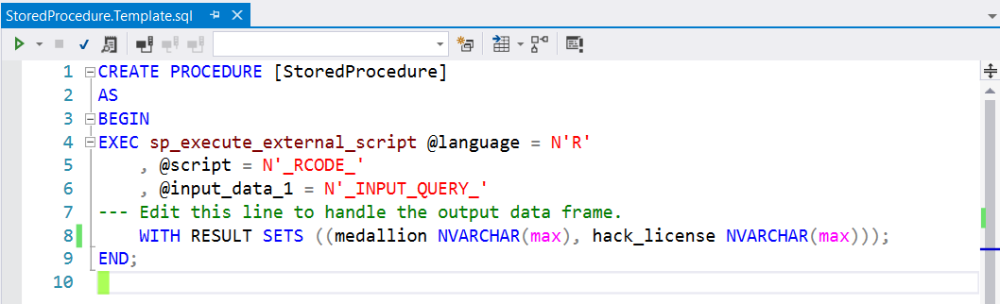
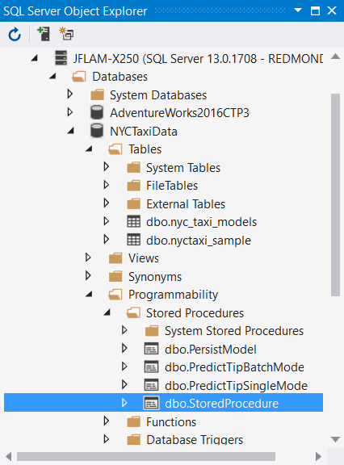

# SQL Server Integration

SQL databases are a major source of data for data scientists. RTVS makes it easier to work with SQL data by integrating with the excellent support for SQL Server that is available to Visual Studio users. Since Visual Studio is modular, you will need to first download the [SQL Server Data Tools](https://msdn.microsoft.com/library/mt204009.aspx) package before you can use the R and SQL integration features described in this page.

Here's a quick 3 minute highlight video of some of the features that are described in this document:

<iframe width="560" height="315" src="https://www.youtube.com/embed/n4AYr0QIwdQ" frameborder="0" allowfullscreen></iframe>

## Support for creating and running SQL Queries

SQL statements are typically written interactively, by gradually refining the query until the correct results are returned. To make it easier to work with SQL Server, RTVS lets you add SQL queries to your existing projects. This lets you work in a separate SQL-only file, focusing only on your query and the results it generates until you end up with the query that you want.

Adding a new SQL query file is easy: just right-click on your project in Solution Explorer, and select SQL Query from the Add New Item command. This creates a file that will contain your new SQL query.

The file is opened in an editor window that lets you compose your SQL query. Here's a SQL editor window with a query entered already:

Before the editor can provide you with IntelliSense, or execute your query, you must first tell the editor what database to connect that editor window to. You can do this by clicking on the Connect button in the toolbar window, or by attempting to execute your query. Queries can be executed by pressing Ctrl-Shift-E to run the entire file, or by selecting a range of text and pressing Ctrl-Shift-E.

If the SQL editor needs to establish a connection to the database, it will pop up this dialog:

In the dialog, you must choose the Server and the Database on the server that you want to connect to. Clicking on the Connect button will either establish a connection to the server, or report any errors that were encountered. Once a connection has been established, you can see the results of your query, as well as get full IntelliSense for elements within your query (e.g., table names or column names if you have specified the table name already in your query).

There are many other features available within the Transact-SQL editor. For example, you can display the execution query plan for your query, which can greatly help you diagnose why a query is running slowly:

For more details on the many features of the T-SQL editor, see the [T-SQL Editor Documentation on MSDN](https://msdn.microsoft.com/library/hh272706(v=vs.103).aspx).

## Working with SQL Server Stored Procedures

A new feature in SQL Server 2016, [SQL Server R Services](https://msdn.microsoft.com/library/mt604845.aspx), lets you embed and run R code from a T-SQL stored procedure. R code can now execute on the SQL Server machine, operate on data returned from a SQL query, and generate a SQL result set that can be processed by further SQL or returned to the client. However, this feature requires combining SQL code and R code together inside of a single SQL statement, a process that is unwieldy and error-prone, since it involves copying and pasting functional R code into your SQL code.

We've added a number of features in RTVS to improve the inner loop of the experience of writing your R and SQL code. Collectively, they let you write, test and debug your SQL code and your R code _independently_. Here's a quick 6 minute video that shows you the SQL R Stored Procedure workflow in RTVS:

<iframe width="560" height="315" src="https://www.youtube.com/embed/dFKIT2OitWQ" frameborder="0" allowfullscreen></iframe>

RTVS has a number of features that together greatly simplify this process. To understand how this works, let's break down RTVS features into several categories, and walk through each one in turn:

1. Add a database connection to your project
1. Add a SQL stored procedure file to your project
1. Write and test your SQL stored procedure within your project
1. Publish your SQL stored procedure to your database

### Adding a database connection to your project

RTVS makes it much easier for you to add a database connection string to your project. From the R Tools menu run the Data > Add Database Connection command. This brings up the Connection Properties Dialog. This lets you select from a number of key options:

1. The name of the data source, which is the database driver (SQL Server)
1. The name of the server to connect to (the local machine)
1. The authentication mode used in the connection (Windows / integrated authentication which uses the logged in user's credentials to make the connection)
1. The name of the database on the server to connect to (NYCTaxiData)

You can click on the Test Connection button to verify that you can successfully connect to the database. If you have connectivity problems reaching the database server or permissions problem accessing the database, you will see those error messages when you click on this button.

Finally, click OK to generate the database connection string. RTVS will create a new file, `settings.R`, that contains the database connection string in a variable called `dbConnection`. This file is automatically sourced (run) by RTVS, so immediately after you have created the connection you can start using it from your R scripts:

### Adding a SQL stored procedure file to your project

RTVS has an item template for a SQL Stored Procedure. You can add one to your project by right-clicking on your project in Solution Explorer, and running the Add > New Item command from the context menu. Select SQL R Stored Procedure from the list of templates, and name your new stored procedure `StoredProcedure.sql`. RTVS will create three files on your behalf:

1. `StoredProcedure.R` is where you write the R code that you want to execute in your SQL stored procedure.
1. `StoredProcedure.Query.sql` is where you write the SQL code that you want to execute in your SQL stored procedure.
1. `StoredProcedure.Template.sql` is the generated template file that will combine your SQL query and your R code.

In Solution Explorer, you see these three files as a single node called `StoredProcedure.R`. Click on the chevron to the left of the filename to see all three files:

`StoredProcedure.R` is the file where you write and test the R code that you want to run inside your SQL Stored Procedure. In the generated code, your R code will be passed an R dataframe called `InputDataSet`. The output of your R code will be written to from R dataframe called `OutputDataSet`. Our generated code simply assigns OutputDataSet to InputDataset. The names of these dataframes are controlled by the `@input_data_1_name` and `@output_data_1_name` parameters in the call to the `sp_execute_external_script` system stored procedure.

For more details on the design of this calling convention and some examples of its usage, see the SQL Server documentation on the [sp_execute_external_script](https://msdn.microsoft.com/library/mt604368.aspx) system stored procedure.

When you write and test your R code, you will want to test it using data from SQL. We generate a small test script in the comments of the `StoredProcedure.R` file that uses the [RODBC package](https://cran.r-project.org/web/packages/RODBC/index.html) to transmit a SQL statement to SQL Server, run it, and retrieve its result set as an R dataframe. You can uncomment the test code to interactively write your R code against the result set that you got from SQL Server.

`StoredProcedure.Query.sql` is the file where you write and test the SQL query that generates the data for `InputDataSet`. Since this is a `.sql` file, you have all of the T-SQL editing / execution features available to you, as described in the section above on Creating and Running SQL query. Once you are happy with your SQL code, you can integrate it with your R code in `StoredProcedure.R`. 

RTVS makes integrating SQL into R code easier by letting you reference the `.sql` file that contains your SQL code from your R code. Ordinarily you would write some R code that would open the file containing the SQL, read it into a string, and then pass it to the RODBC package to send to SQL Server. RTVS lets you drag your `.sql` file onto the editor that has `StoredProcedure.R` open and it will insert the code that reads the SQL file into a string. Try it yourself; you should see something that looks like the highlighted code when you are done:

Now you can interactively write your R code that manipulates the `InputDataSet` dataframe until you are happy with it. Remember that you can always just select the R code that you run interactively in the editor and send it to the R Interactive window by pressing Ctrl-Enter.

`StoredProcedure.Template.sql` is the file that contains the *template* for generating your SQL Stored Procedure. The `_RCODE_` placeholder will be replaced by the contents of the `StoredProcedure.R` file. The `_INPUT_QUERY_` placeholder will be replaced by the contents of the `StoredProcedure.Query.sql` file. Finally, you will need to describe the _schema_ of the result set that is returned from the Stored Procedure by editing the `WITH RESULT SETS` clause. Here you will need to identify the columns from the `OutputDataSet` dataframe that you want to return to the caller of the stored procedure. 

For example, if you had a query that looked like this:

You will use the following `WITH RESULT SETS` clause to specify the data types of the return values:

Finally, when you are ready to publish your completed stored procedure to SQL Server, you can run the Data > Publish With Options command from the R Tools menu. Here, you will specify that you want to publish to the database, and RTVS will build and publish your new stored procedure to SQL Server:

If you have the SQL Server Object Explorer open in Visual Studio, you will see your published stored procedure in the Programmability / Stored Procedures folder of your database:

You can even directly execute it from the Object Explorer by right-clicking on it and running the Execute Procedure command, or by calling it interactively from a `.sql` query window.
