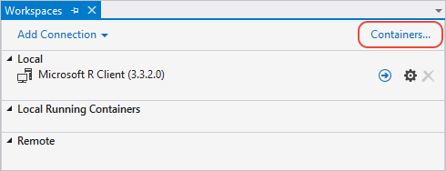
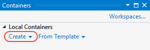
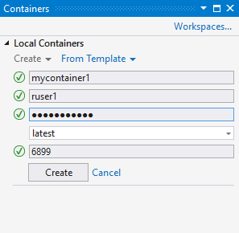
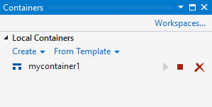
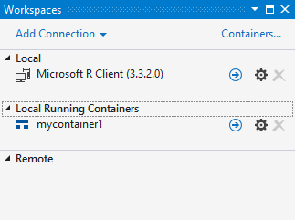
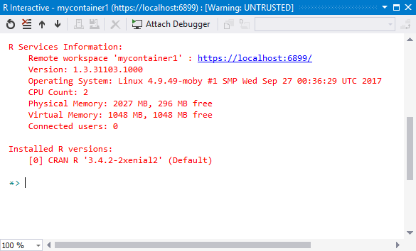

# Use Docker containers with R Tools for Visual Studio

The R Tools for Visual Studio (RTVS) version 1.3+, alongside an installation of [Docker for Windows](https://www.docker.com/docker-windows), supports working with Docker containers.

## Create a container

1. Select the **Containers** button on the right-hand corner of the **Workspaces** window (**R Tools** > **Windows** > **Workspaces**). The window informs you if you don't have Docker for Windows installed and provides a link for the download. Installing Docker may require a computer restart.

    

1. In the **Containers** window, select **Create**:

    

1. Complete the required information in the dialog and select **Create**. The credentials you enter are also used to create an account on Linux, with which you sign in later.

    

1. It may take some time for RTVS to build the image. The **Output** window in Visual Studio shows progress, but may appear to not be doing much during lengthy image downloads; be prepared to be patient. Once the image is built, RTVS starts the container and it appears in the **Container** window. The controls to the right stop, remove, or restart the container.

    

## Connect to a container

1. The **Local Running Containers** section of the **Workspaces** window displays containers running the RTVS daemon on port 5444. (See [Remote R Server for Linux](setting-up-remote-r-service-on-linux.md) for details on how the daemon is configured.)

    

1. To connect to a container, double-click the container name or select the forward arrow button to its right. When connected, you see an **R Interactive** window (see [Work with the R Interactive window](interactive-repl-for-r-in-visual-studio.md)):

    

## Use custom-built images

RTVS detects and allows management of containers created using custom-built images, such as the microsoft/rtvs image described in the docker file below. The base image used here has rtvs-daemon, R 3.4.2, and common R packages pre-installed. **Note**: change the username and password shown here as needed.

```docker
FROM mcr.microsoft.com/rtvs:1.3-ub1604-r3.4.2
RUN useradd --create-home ruser1
RUN echo "ruser1:foobar" | chpasswd

#Install additional R packages. You may have to install OS dependencies, see package info or error messages during build.
#RUN Rscript --vanilla -e "install.packages(c('AzureML','wordcloud'), repos = 'http://cran.us.r-project.org');"
```

Use the following command to build the image, changing the container name (the `--name` argument) as desired:

```bash
docker build -t my-rtvs-image:latest .
docker run -p 6056:5444 --name my-rtvs-container my-rtvs-image:latest rtvsd
```

The `-p 6056:5444` argument maps port 6056 to internal port 5444, which RTVS uses to detect rtvs-daemon. Any container that exposes container port 5444 is listed in the **Workspaces** window. You can then use the **Workspaces** window to connect to a container using `<<unix>>\ruser1` as the username and "foobar" as the password, unless you specified different credentials in the docker file.
