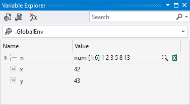
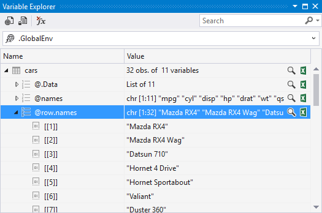
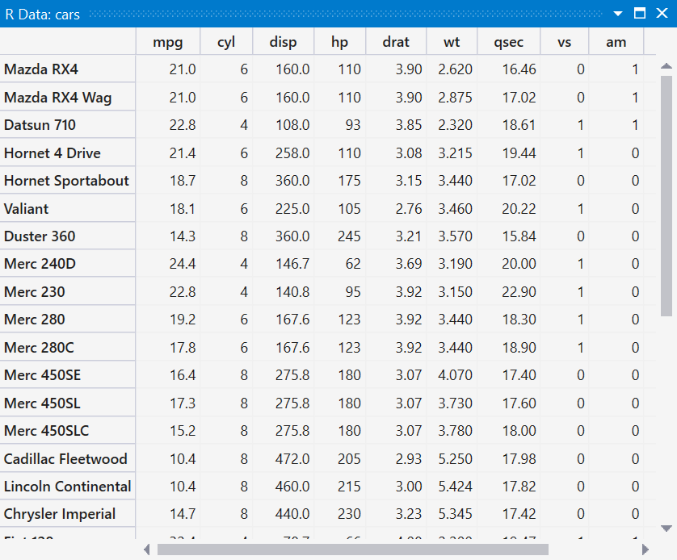
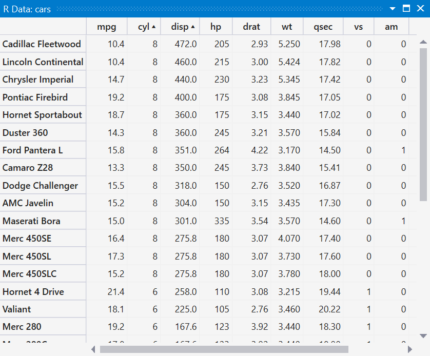
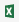
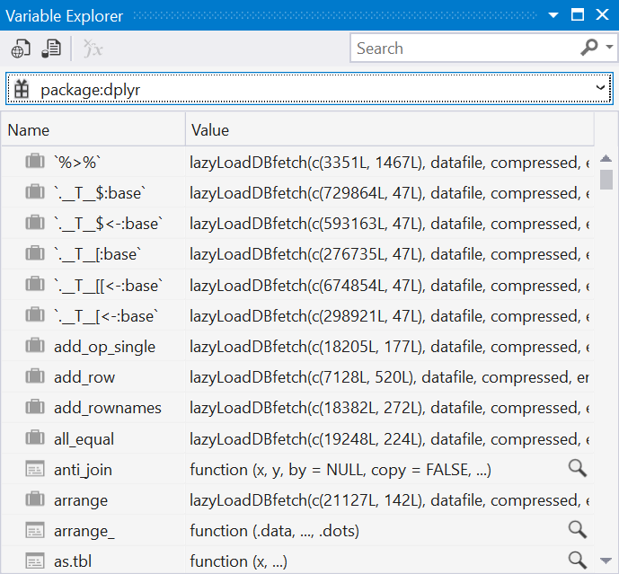
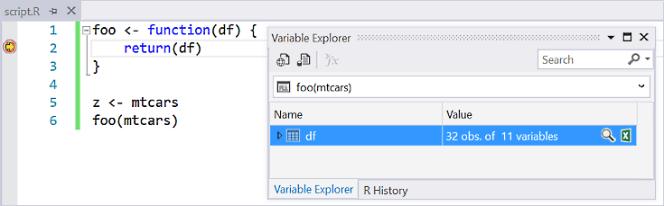
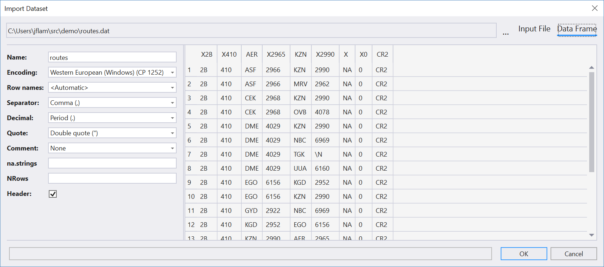

# Variable Explorer

The **Variable Explorer** window, opened using **R Tools** > **Windows** > **Variable Explorer** (or **Ctrl**+**8** if you've used **R Tools** > **Data Science Settings**), shows all variables at a given scope in the current R session. For example, if you open the **Variable Explorer** and enter the following lines in the [interactive window](interactive-repl-for-r-in-visual-studio.md):

```R
x <- 42
y <- 43
n <- c(1,2,3,5,8,13)
```

The **Variable Explorer** window then appears as follows:



If you have a more complex R data frame defined in the session, you can navigate into the data. For example, after running `cars <- mtcars` you can navigate through the dataset by expanding the different nodes in the **Variable Explorer**:



To delete variables, right-click and select **Delete**, or select the variable and press the **Delete** key.

You can also search for an observation in a data frame using incremental search. First, expand the nodes in the data frame that you want to search, then enter search terms in the search box.

## Details (table) view

Because data is often tabular, you can view any complex data type as a separate table by selecting the magnifying glass icon or right-clicking and selecting **Show Details**.



Clicking on a column heading sorts the data by column (alternating between ascending and descending). Holding down **Shift** and clicking on additional columns adds those columns to the sorting as well. Clicking a column without **Shift** returns to single column sorting.

The sequence in which you click the column headings determines the order in which the sorting is performed. For example, **Shift**+**click** the **cyl** column, then **Shift**+**click** the **mpg** column twice to sort the list for ascending cylinders and descending miles-per-gallon:



Because **Variable Explorer** and the table views are in separate Visual Studio windows, you can arrange them however you like for side-by-side work. See [Customize window layouts in Visual Studio](../ide/customizing-window-layouts-in-visual-studio.md) for general instructions.

## Open in Excel (or other CSV-capable application)

For further manipulation and analysis, it's often useful to export session variables to CSV. Exporting is done with the small Excel icon () next to each node in the **Variable Explorer**, or by right-clicking an item and selecting **Open in CSV App**. Selecting the icon writes the data to a new CSV file in the *%userprofile%\Documents\RTVS_CSV_Exports* folder and then launches that file, which opens it in whatever application is associated with the *.csv* extension.

## Scopes

By default the **Variable Explorer** opens to the global scope. You can switch to a package scope by selecting a package from the drop-down at the top of the window.



You can also switch to a function scope when stopped at a breakpoint in the debugger (note that **Variable Explorer** does not automatically switch to the function scope of the code being debugged):



**Variable Explorer** automatically changes function scope as you step through code in the debugger, such as showing local variables in a function.

## Import data into Variable Explorer

Two commands on the **Variable Explorer** toolbar, which are also available through the **R Tools** > **Data** menu, import external CSV datasets into your R session:  **Import Dataset into R Session from Web URL** and **Import Dataset into R Session from Text File**.

Once you've identified the CSV file to import, Visual Studio displays an **Import Dataset** dialog in which you have options to control how that data file is parsed (that is, what the field separator is and how to handle quotes). You can also see a preview of the imported data frame and the original data file:


