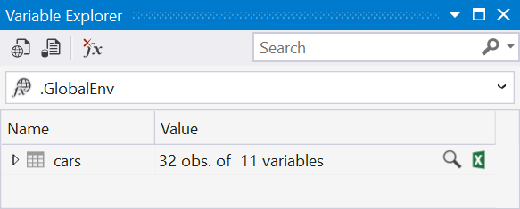
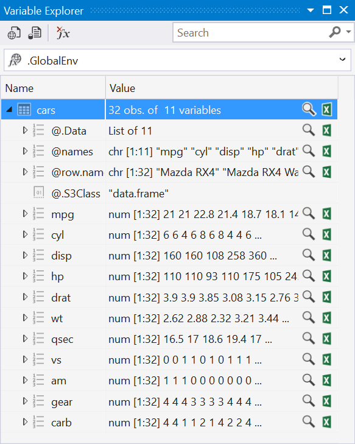
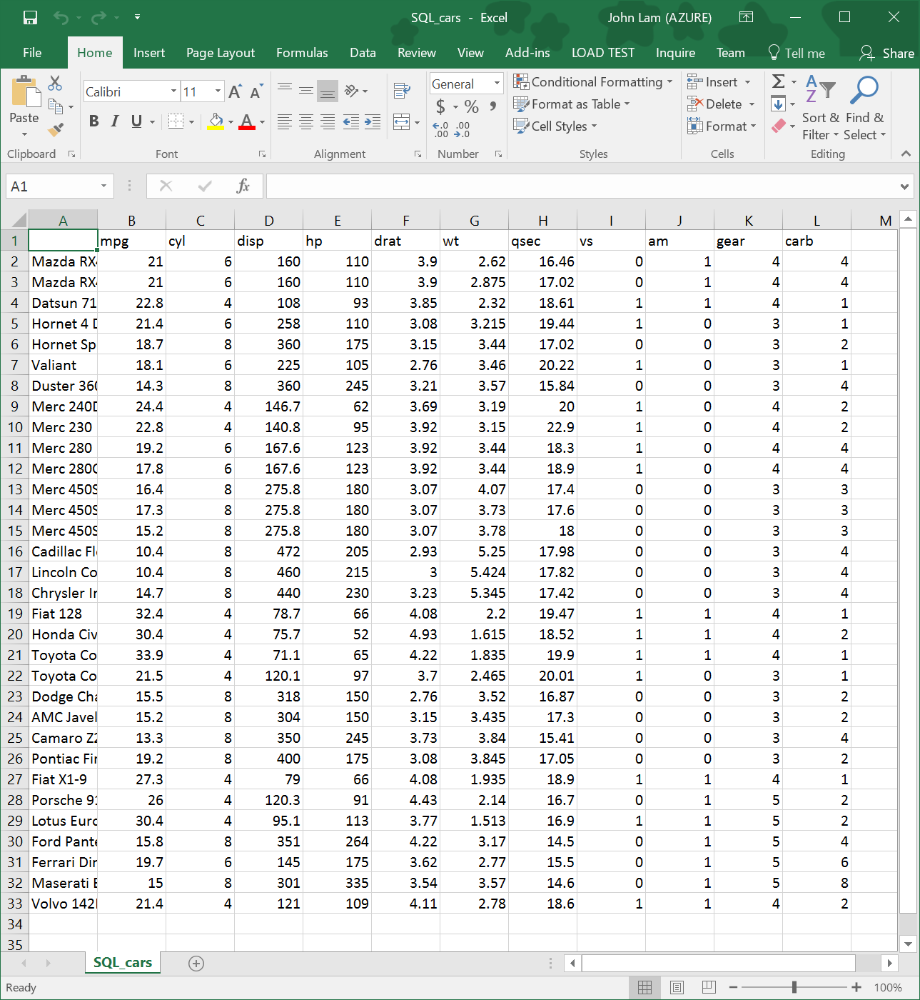
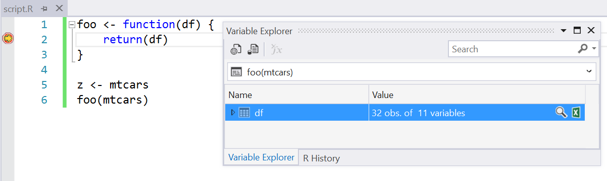
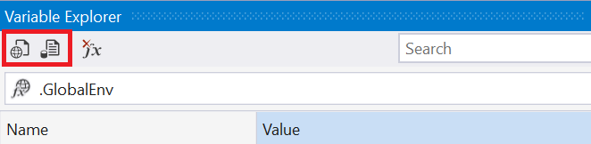

# Variable Explorer

The Variable Explorer provides a list of all variables at global scope from the REPL. So, if in the REPL you executed: 

```r
x <- 42
y <- 43
n <- c(1,2,3,5,8,13)
```
 
The variable explorer will display the following data:


If you have a more complex R data frame defined in the REPL, you can drill into the data. If you execute these commands:
 
```r
cars <- mtcars
```

You will see this view in the Variable Explorer:


 
Next we click on the chevron to drill into the data:



We can drill as deep as the data is nested within the data frame:
 


You can delete variables from your R session directly from the variable explorer. Just right click on the variable that you want to remove from your R session and select the Delete command. Or you can just select the variable that you want to remove and press the DELETE key.


If you want to search for an observation in a data frame, we have an incremental search over all observations in a data frame. Note that you must first expand the data frame in Variable Explorer for this to work. 


## Export to Excel

While the data table viewer is a great tool, sometimes you want to be able to take your data frame and *export* it to Excel. You can easily do this by clicking on the small Excel icon to the variable explorer. When you click on it, it will take your data frame and export it to a new Excel Workbook:



We do this by writing a new CSV file containing the contents of the dataframe to the `%USERPROFILE%\Documents\RTVS_CSV_Exports` directory.

## Scopes 

We now let you pick different *scopes* for the variables in the variable explorer; previously you could only examine variables at global scope. Now, with package level scope, we give you a view over all of the variables (including functions, which are just functions bound to variables) defined within a package:


If you are stopped at a breakpoint in the debugger, you can use the Variable Explorer to inspect runtime variables in your program. You can inspect complex variables such as data frames, and even export them to Excel. All you need to do is change the scope of the Variable Explorer to the current function that you are stopped at (it won't do this automatically for you). In the example below, I have set the Variable Explorer's scope to the `foo` function where the debugger is currently stopped on a breakpoint. You can inspect the `df` data frame
variable directly in the Variable Explorer, or even send it to Excel to snapshot the current state of the data frame.



When you are debugging, variable explorer also recognizes the current execution scope (i.e., when you are debugging code within a function). Here, local variables that you define within that function can now be inspected using variable explorer. In the picture below, you can see that the current execution scope is within a function called `renderUI`, and that there are two local variables defined at the current execution point: `country_data` and `max_destinations`:


We support viewing variables defined inside of private named scopes as well (i.e., variables defined within a package). For example, here are the variables defined in the Shiny package:


## Importing data into Variable Explorer

Another way to bring data sets into your project is to use the Import Dataset command in the Variable Explorer. Click either the Import from Web or Import from File toolbar button to specify the location of the CSV file that you want to import:



Once you've specified the location of the file, you will see the Import Dataset dialog box which gives you options that control how that data file is parsed. You can even see a preview of the imported data frame and the original data file.


