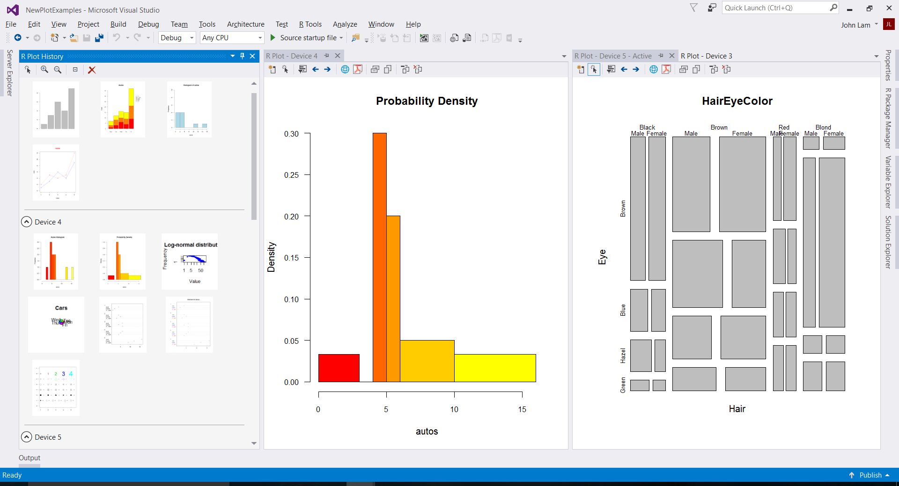
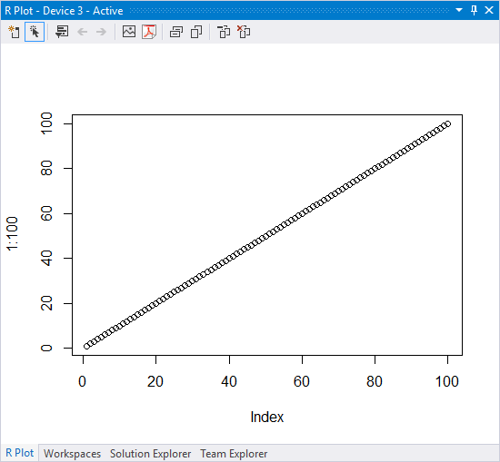
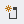
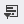
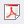
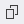
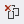
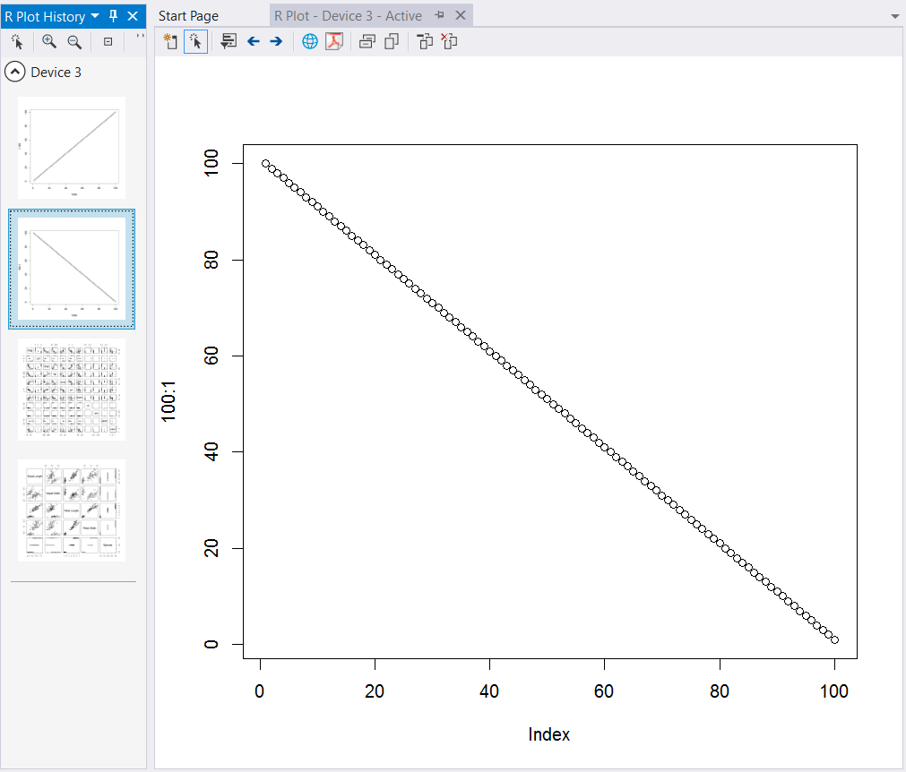

# Create visual data plots with R

Plotting is a key part of a data scientist's workflow. In R Tools for Visual Studio (RTVS), all plotting activity centers around one or more plot windows, which are designed to improve your productivity with this key activity.

:::row:::
    :::column:::
        
    :::column-end:::
    :::column:::
        [Watch a video (youtube.com)](https://www.youtube.com/watch?v=ZTbKmz5RSgY) on plotting with R (2m 02s).
    :::column-end:::
:::row-end:::

## The plot window

A plot window holds a series of plots, where each plot is generated by a `plot` command. For example, using `plot(1:100)` creates a new plot window if one isn't already available:

Technically speaking, R `plot` commands render their output to an R graphics device; a plot window renders the contents of an R graphics device, which is why each plot window is given a device number.

Plot windows are independent of Visual Studio projects, and remain open as you load and close projects.

Generating a plot uses the "active" plot window, saving any previous plot it the plot history (see [Plot history](#plot-history)). For example, enter `plot(100:1)` and the first plot is replaced with a downward line.

Like all other Visual Studio windows. the plot window supports customized layouts (see [Customize window layouts in Visual Studio](../ide/customizing-window-layouts-in-visual-studio.md). Plot windows can be docked at different locations within the Visual Studio frame, resized within that frame, or pulled out of the frame entirely for independent resizing.

Resizing a plot window always re-renders the plot to provide the best quality image. You typically want to resize a plot before exporting the plot to a file or to the clipboard using the commands described in the next section.

## Plot window commands

The plot window's toolbar holds applicable commands, most of which are also available through the **R Tools** > **Plots** menu.

| Button | Command | Description |
| --- | --- | --- |
|  | New plot window | Creates a separate plot window with its own history. See [Multiple plot windows](#multiple-plot-windows). |
|  | Activate plot window | Sets the current plot window as the active window, so that subsequent `plot` commands are rendered to that window. See [Multiple plot windows](#multiple-plot-windows). See [Multiple plot windows](#multiple-plot-windows). |
|  | Plot history window | Opens a window with all the plots in the history shown as thumbnails. See [Plot history](#plot-history). |
|  | Previous/Next Plot |  Navigates to the previous or next plot in the history. You can also navigate the history with Ctrl+Alt+F11 (Previous) and Ctrl+Alt+F12 (Next). See [Plot history](#plot-history). |
| | Save As Image | Prompts for a filename and saves the current plot (the window contents, at the window size) to an image file. Available formats are `.png`, `.jpg`, `.bmp`, and `.tif`. |
| | Save As PDF | Saves the current plot to a PDF file, using the current window size. The plot will re-render if the PDF is scaled. |
| | Copy As Bitmap | Copies the plot to the clipboard as a raster bitmap, using the current window size. |
| | Copy As Metafile | Copies the plot to the clipboard as a [Windows metafile](https://en.wikipedia.org/wiki/Windows_Metafile) (Wikipedia). |
| | Remove Plot | Removes the current plot from the history. |
|  | Clear All Plots | Removes all plots from the history (prompts for confirmation). |

## Multiple plot windows

Because data scientists often work with many plots from many different datasets, RTVS lets you create as many independent plot windows. You can then arrange those windows however you like within the Visual Studio frame or outside that frame altogether. (See [Customize window layouts in Visual Studio](../ide/customizing-window-layouts-in-visual-studio.md) for general information on docking and resizing windows.)

You create a new plot window using the toolbar button or **R Tools** > **Plots** > **New Plot Window**. The new plot window becomes the *active* window, which is where new plots are rendered. To change the active window, switch to it and select the **Activate Plot Window** toolbar button or **R Tools** > **Plots** > **Activate Plot Window**.

Plots, too, are independent objects, which means you can copy or move them between plot windows using either drag-and-drop with the mouse, or by using the **Copy**, **Cut**, and **Paste** commands on the right-click context and **Edit** menus.

The default behavior for drag-and-drop is copy; to move, drag-and-drop while pressing the **Shift** key.

## Plot history

Plot commands are maintained in a plot history for each window, ensuring that all your plotting within a session is preserved. To navigate the history, use the arrow buttons on the plot window toolbar, or **Ctrl**+**Alt**+**F11** and **Ctrl**+**Alt**+**F12**. You can also remove single plots or clear all plots from the window again using toolbar buttons or the **R Tools** > **Plots** menu commands.

To see the entire collection of plots, open the plot history window using the toolbar button or **R Tools** > **Plots** > **Plot History Window**.
The history gives you a list of thumbnails for the plots that have been displayed in that window, grouped by the different plot windows (or devices). Using the zoom buttons on the toolbar changes the size of the thumbnails.

To open a plot in its associated window, double-click that plot, select it, and then select the **Show Plot** toolbar button. Alternatively, right-click the plot and select **Show Plot**. You can also select an individual plot and copy, cut, or delete from the context or **Edit** menus.

The lifetime of your plot history across all windows is bound to the lifetime of your interactive R session. If you reset your R session, or exit and restart Visual Studio, your plot history is reset.

## Programmatically manipulate plot windows

You can programmatically manipulate plot windows from R code, using device numbers to identify specific plot windows.

- `dev.list()`: List all of the graphics devices within the current R session.
- `dev.new()`: Create a new graphics device (a new plot window).
- `dev.set(<device number>)`: Set the active graphics device.
- `dev.off()`: Delete the active device.
