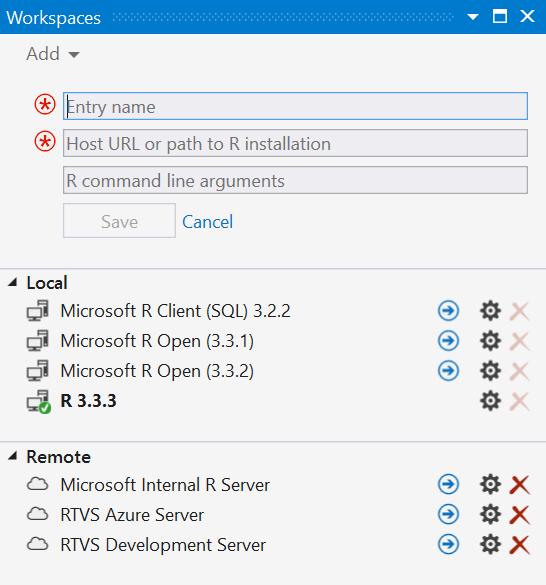
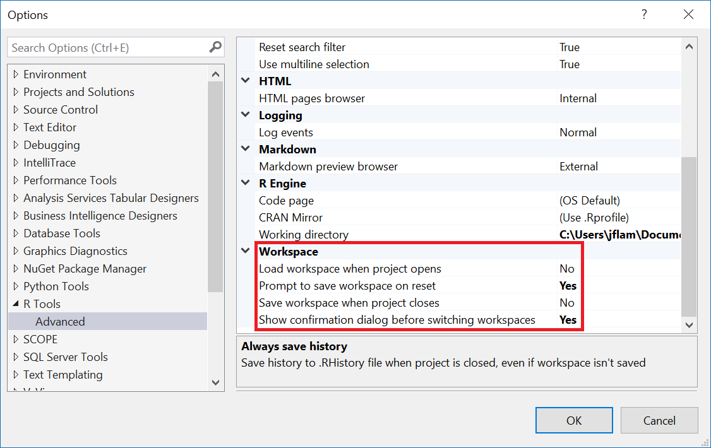
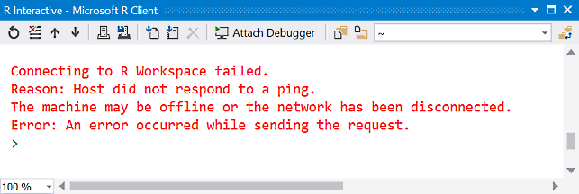
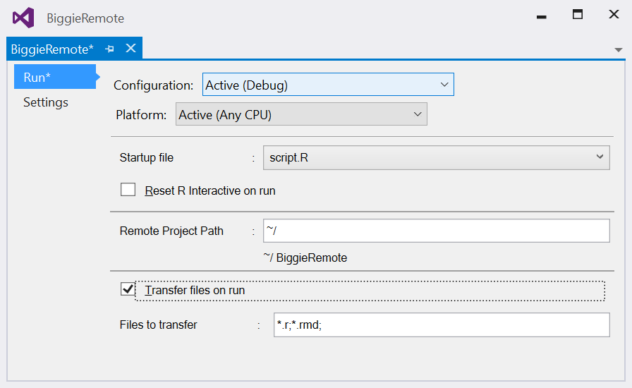

## Workspaces

Workspaces is a feature in RTVS that lets you control *where* your R code runs. The Workspaces tool window lets you choose between two types of places where your code can run: Local and Remote. 

### Local Workspaces

Local workspaces shows you the set of all R interpreters that you have installed on your computer. Local workspaces are auto-detected by RTVS when you launch Visual Studio, or you can add your own local workspaces manually if you have installed them in non-standard ways.

RTVS will do its best to auto-detect all of the versions R that you have installed, and does so by looking through the registry when Visual Studio starts up. This is the registry key that RTVS uses to find locally installed R interpreters:

`HKEY_LOCAL_MACHINE\Software\R-Core\`

It is important to understand that this check is only done at Visual Studio startup; if you install a new R interpreter while Visual Studio is running, you will need to restart Visual Studio to detect your newly installed R interpreter.

In the event that you installed R through some non-standard way (i.e., by not running an installer), you can manually create a new local R Workspace by clicking on the Add button in the Workspaces window. Enter a name for your new Workspace, the path to the R root directory (i.e., the directory that contains the `bin` directory where your interpreter is located), and any optional command line parameters that you would like to pass to your R interpreter when RTVS starts it up.

If you want to change an existing Workspace entry, you can always click on the wheel icon next to the Workspace, and change its name, the path (or URI in the case of remote Workspaces), and its command line parameters.

### Remote Workspaces

Remote workspaces let you connect to an R session on a remote computer. Typically, that remote computer is setup by your administrator, or you can [setup a remote Workspace yourself](workspaces-remote.md).

Remote workspaces are identified by a URI. That URI *must use the HTTPS protocol* to ensure the privacy and the integrity of the code that you are sending to the remote computer, and the results that are returned from the remote computer. RTVS will refuse to connect to a remote computer that does not support the HTTPS protocol.

Remote workspaces are *not* auto-detected by RTVS; you must create them manually.

### Switching between Workspaces

The active Workspace that RTVS is bound to is clearly indicated by a green icon next to the name of the Workspace. In most cases, when you start RTVS, you should always see a green icon next to a Workspace. By default, we will always bind to the last local Workspace that you had open in a previous RTVS session.

All you need to do to switch between Workspaces is click on the right arrow icon of the Workspace that you would like to switch to. This will immediately terminate your current Workspace (but it will prompt whether you want to save your current session before you exit), before switching to the new Workspace. 

The dialog boxes that warn you that you are switching workspaces, or prompting you to save your existing session before switching workspaces are *configurable*. Under the **R Tools > Options** dialog, you will find options for enabling or disabling these dialog boxes.

Because it is possible that the Workspace that you want to switch to is not available (i.e., you have uninstalled it, or in the case of a remote Workspace the computer is not reachable) you may wind up in a state where *no workspace is bound to your RTVS project*. You will realize this right away if you try to type a command into the REPL and it reports that no R interpreter is available to service your request. To fix this problem, simply select another Workspace from the list available, or in the unlikely event that *no local or remote workspaces are available*, you will need to install another R Interpreter.

### Switching to a Remote Workspace

When you connect to a Remote Workspace, you will need credentials to log on; this is usually provided by the person who setup the Remote Workspace computer. The first time you connect to the Remote Workspace, RTVS will prompt you for those credentials. RTVS will store those credentials on your behalf using the [Windows Credential Locker](https://technet.microsoft.com/library/jj554668(v=ws.11).aspx),
which is a service provided by the operating system to securely store your credentials. The next time you connect to that Remote Workspace, RTVS will use your cached credentials to log into the Remote Workspace, effectively giving you a single sign-on experience.

RTVS transmits those credentials to the Remote Workspace via the HTTPS protocol. This guarantees that your credentials (and subsequent code and the results of running that code) are not viewed or tampered with while in transit. However, depending on how your system administrator set up the computer running your Remote Workspace, you may be presented with this dialog box when you connect:

What this means is that your system administrator used a *self-signed certificate* to enable the HTTPS protocol on the remote machine. It could also mean that the remote machine has been compromised by an attacker. The certificate is a document that is presented to RTVS by the machine that you are trying to connect to. The certificate contains a field that identifies the URI of that machine, and RTVS checks to make sure that those two values match exactly.

However, in this case, the administrator (or the attacker) made their own certificate with the URI of the machine embedded within it. This is analogous to you making your own passport. RTVS doesn't know who your administrator is (or who the attacker is), and doesn't trust them. However, if your administrator had obtained a certificate from an issuer that RTVS trusts (and that list of trusted issuers is [provided by the operating system](https://technet.microsoft.com/library/cc751157.aspx)), then that means that RTVS will trust certificates issued by that issuer as well. In that case you won't see the dialog box warning you of an untrusted certificate. It is *strongly recommended* that you use certificates signed by a trusted issuer for any production deployments of Remote Workspaces.

### Directories on Local and Remote machines

By default, when you start a new R interpreter, your current working directory is your user profile `Documents` directory. This is also true when you connect to a Remote Workspace. However, in this case keep in mind that you are now looking at the `Documents` directory on the remote machine. We have automatically created a new user profile directory for you when you first logged onto that machine. Each time that you re-connect to the same Remote Workspace you will be directed to the same location, and the contents of that directory will be unchanged across connections.

This is important because it is likely to not be the same path as where your local files are stored. For example, imagine that I stored my `TestProject` files here on my local machine under `c:\users\jflam\src\TestProject`, but on the remote machine (and assuming I am using the same login name), I'm going to be in `c:\users\jflam\Documents`.

What this means is that if you have any absolute paths in your R scripts, your code will likely not work as you might expect, unless you take care to ensure that your remote files are stored in exactly the same paths as on your local machine. A smart move would be to ensure that any file paths are relative paths in your project (e.g., `.\otherfile.dat` or `..\peer\otherfile.dat`). 

One last thing about remote workspaces: since your files will be persisted across connections to the remote workspace, there may be times where you want to make sure that all of your files are removed from that workspace. You can do this using the **R Tools > Session > Delete Profile** command. This will delete your entire user profile from the remote machine. The next time you log into that machine (or clicking Reset in the current interactive window), RTVS will recreate your user profile.

### Projects and Remote Workspaces

Here's a helpful mental model to help you understand how Projects and Remote Workspaces interact. The computer running RTVS always has the latest files in the project. The Remote Workspace computer is effectively a `temp` directory that will hold the files to run your project, as well as any output that your code generates. While writing your code you will either explicitly or implicitly copy files to the Remote Workspace `temp` directory in the course of your work.

When you open a project (or, more typically a solution) using Visual Studio, the assumption is that the project and all of its associated files *reside on the same machine as Visual Studio*. This is a key design decision in Visual Studio, which RTVS depends on for its project system, and it is unlikely to change anytime soon. 

When you connect to a Remote Workspace using the Workspaces Window, we do nothing to copy those files there on your behalf. You must explicitly tell RTVS to copy a file, or the project, to the remote machine.

Understanding this is key to not being surprised by the behavior of RTVS when working with Remote Workspaces. For example, if you want to `source` a file by typing the `source` command into the R Interactive Window, two conditions must be true:

1. The latest copy of the R file that you want to source must be present on the remote machine
1. The current working directory of the remote R interpreter (which you can set via the `setwd()` function) must be the same as the directory that contains the latest copy of the R file, or you have passed the correct path from your current working directory to the location of that R file.

So, how do you copy a files to the remote machine? You can right click on a file in Solution Explorer, and run the `Send to Remote` command from the context menu. You can also right click on the project in Solution Explorer and run the `Send to Remote` command. This will copy the entire project to the server, including creating a directory with the same name as the project to contain the files. You can also press F5 to run the project, and we will do a `Send to Remote` on the project before we start running the startup file for your project.

When copying *projects* to the remote machine, it's important to understand that we apply a filter to the files being copied (this filter is not applied when you copy a single file). By default we only copy `.R`, `.Rmd`, `.sql`, `.md`, and `.cpp` files to the server. You can customize the filter by adding additional expressions to the filter properties in the R Project Properties dialog. We do this to avoid inadvertently copying large data files to the server each time you want to run the project. Today we don't try to do any clever optimizations when copying; we will just copy files to the server, with the side effect of overwriting any file on the server that has the same name.

You can always copy individual *files* to the remote machine by right-clicking on the file in Solution Explorer and running the `Send to Remote` command from the context menu.

You even have the option of disabling auto-copying of files in the project to the server if you want to manually control the copying process yourself. 

If your R script generates files on the server, you can copy those files back to the client using the `rtvs::fetch_file` function. This function accepts, at a minimum, the remote path to the file that you want to copy to your machine, and optionally the path on your machine where you want that file to be copied to. If you don't specify a path, the file will be copied into your `%USERPROFILE%\Downloads` directory.

If you invoke an R command through an explicit Visual Studio command, we will ensure that files get copied to the remote machine. For example, right-clicking on a file in Solution Explorer and running the Source Selected File(s) command will copy the files to the remote workspace before sourcing them. Similarly, when you press F5 to debug your project; RTVS will copy files to the remote workspace before attaching the debugger and running your program. Since we cannot reliably intercept all R functions, calling functions such as `source()` or `runApp()` (for Shiny applications) from the Interactive Window will **not** copy any files from your computer to the remote workspace.

### The long term goal of Local and Remote Workspaces

The promise of Local and Remote Workspaces is this: anything you can do locally, you can also do remotely and with a comparable user experience. However, Remote Workspaces is currently in Preview, and there are a number of known issues in the implementation. 

Clearly, this is not an ideal solution, but it was one that let us ship a Preview release to you earlier to get feedback on the overall Remote Workspaces feature. We are working on a better implementation of the file sync problem for a future release and welcome your ideas and feedback about how to make that a better experience for you.