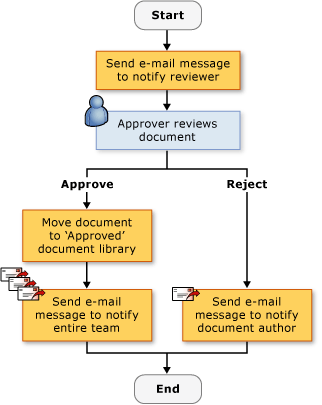
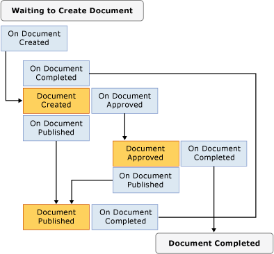

# Creating SharePoint Workflow Solutions
  [!INCLUDE[vsprvs](../sharepoint/includes/vsprvs-md.md)] provides tools to help you create custom workflows that manage the life cycle of documents and list items in a SharePoint Web site. Items provided include a designer, a set of activity controls, and the necessary assembly references. [!INCLUDE[vsprvs](../sharepoint/includes/vsprvs-md.md)] also includes the **SharePoint Customization Wizard**, to help create and configure the workflows.  
  
 For the list of prerequisites for creating SharePoint projects in [!INCLUDE[vsprvs](../sharepoint/includes/vsprvs-md.md)], see [Requirements for Developing SharePoint Solutions](../sharepoint/requirements-for-developing-sharepoint-solutions.md). For more information about SharePoint, see [Microsoft SharePoint Products and Technologies](http://go.microsoft.com/fwlink/?LinkId=178470).  
  
## Workflows in SharePoint  
 When you add a workflow to a SharePoint library or list, you enforce a business process on all items in the library or list. A workflow describes the actions that the system or users must perform on each item, such as sending the item to be edited and then reviewed. These actions, known as *activities*, are the building blocks of the workflow.  
  
 You can create SharePoint workflows in [!INCLUDE[vsprvs](../sharepoint/includes/vsprvs-md.md)] and deploy them to a SharePoint Web site. After a workflow is deployed to SharePoint, you associate it with a library or list. It can then be started automatically, by a process, or manually, by a user. For more information about workflow operation, see [Using workflows to manage processes](http://go.microsoft.com/fwlink/?LinkId=79757).  
  
## Creating Custom SharePoint Workflows  
 Two SharePoint workflow projects are available to you in [!INCLUDE[vsprvs](../sharepoint/includes/vsprvs-md.md)]: **Sequential Workflow** and **State Machine Workflow**.  
  
 A *sequential workflow* represents a series of steps. The steps are performed one after another until the last activity is completed. Sequential workflows are always strictly sequential in their execution. Because they can receive external events, and include parallel logic flows, the exact order of execution may vary. The following illustration shows an example of a sequential workflow.  
  
   
  
 A *state machine workflow* represents a set of states, transitions, and actions. The steps in a state machine workflow execute asynchronously. This means that they are not necessarily performed one after another, but instead are triggered by actions and states. One state is assigned as the start state, and then, based on an event, a transition is made to another state. The state machine can have a final state that determines the end of the workflow. The following diagram shows an example of a state machine workflow.  
  
   
  
 For more information about workflow types, see [Workflow Types](http://go.microsoft.com/fwlink/?LinkId=178995).  
  
### Using the Wizard  
 When you create a SharePoint workflow project in [!INCLUDE[vsprvs](../sharepoint/includes/vsprvs-md.md)], you first specify its settings in the **SharePoint Customization Wizard**. The wizard uses these settings to create a project in **Solution Explorer**. This project contains a code file, several files that are used to deploy the workflow, and references to assemblies that are required to create a custom SharePoint workflow.  
  
 After you create the workflow, you can modify its properties in the Properties window. Although most workflow properties can be changed directly in the Properties window, some require you to click an ellipsis button () to change their values. This button restarts the **SharePoint Customization Wizard**. After you make the property value changes, choose the **Finish** button to finalize them.  
  
> [!NOTE]  
>  The **Workflow Type** property is read-only and cannot be changed. If you want to change the workflow type, you must create another workflow.  
  
## Designing a SharePoint Workflow  
 After you define all the steps in the business process, use the [!INCLUDE[vsprvs](../sharepoint/includes/vsprvs-md.md)] workflow designer to design the SharePoint workflow. To open the designer, double-click Workflow1.cs or Workflow1.vb in **Solution Explorer**, or open the shortcut menu for either of those files and then choose **Open**.  
  
### Activities  
 To design a workflow, add activities from the **Toolbox** to a *workflow schedule* on the designer. A workflow schedule contains the sequence of activities in the order that they should be performed.  
  
 There are two types of activities:  
  
-   *Simple activities* perform a single unit of work, such as "delay for 1 day" or "start Web service."  
  
-   *Composite activities* contain other activities; for example, a conditional activity might contain two branches.  
  
 Both types of activities are available in the **Toolbox**.  
  
 Activities can have properties, methods, and events. Use the **Properties** window to set the properties of an activity.  
  
 You can also create a custom activity. For more information, see [Walkthrough: Create a Custom Site Workflow Activity](../sharepoint/walkthrough-create-a-custom-site-workflow-activity.md).  
  
 Activities are organized in the following tabs in the **Toolbox**:  
  
-   **SharePoint Workflow**  
  
-   **Windows Workflow v3.0**  
  
-   **Windows Workflow v3.5**  
  
 Not all core workflow activities are supported by SharePoint. For more information, see [Workflow Activities for Windows SharePoint Services Overview](http://go.microsoft.com/fwlink/?LinkID=156094).  
  
#### SharePoint Workflow Activities  
 The **SharePoint Workflow** tabs contain specialized activities for use in [!INCLUDE[wss_14_long](../sharepoint/includes/wss-14-long-md.md)]. These activities simplify and streamline the development of document life cycle workflows. For more information about the activities listed in the **SharePoint Workflow** tab, see [Workflow Activities for Windows SharePoint Services Overview](http://go.microsoft.com/fwlink/?LinkID=156094).  
  
#### Windows Workflow Activities  
 The **Windows Workflow** tabs contain activities that are provided by the [!INCLUDE[TLA#tla_workflow](../sharepoint/includes/tlasharptla-workflow-md.md)]. You can use these activities to create workflow schedules for any kind of Windows workflow application.  
  
 For more information about the activities listed in the **Windows Workflows** tab, see [Windows Workflow Foundation Activities](http://go.microsoft.com/fwlink/?LinkID=156096). For more information about the Windows Workflow Foundation, see [Windows Workflow Foundation Overview](http://go.microsoft.com/fwlink/?LinkID=128632).  
  
### Working with Activities in the Designer  
 Your workflow schedule can contain a combination of Windows Workflow activities and SharePoint Workflow activities.  
  
 The designer displays visual cues to help you position and configure activities correctly. When you drag or copy an activity onto the workflow schedule, the designer displays green plus-sign (+) icons that show you valid locations for that activity in the workflow. You cannot position an activity in a location where it would not be valid. For example, you cannot position a Send activity as the first activity in a Listen activity branch. For more information, see [SharePoint Designer Developer Center](http://go.microsoft.com/fwlink/?LinkId=178476).  
  
## Collecting Information During the Workflow  
 You might want to gather information from users at predefined times in the workflow. You can collect information by using forms or item properties.  
  
### Forms  
 Forms are like dialog boxes that contain questions and provide ways for users to give answers.  
  
 There are four types of forms that can be used in a workflow:  
  
-   Association  
  
-   Initiation  
  
-   Modification  
  
-   Task  
  
 Of these, [!INCLUDE[vsprvs](../sharepoint/includes/vsprvs-md.md)] includes item templates for association and initiation forms. An example of an *association form* is one that lets the administrator installing the workflow enter parameters that relate to the workflow, such as a spending limit for an expense workflow. An example of an *initiation form* is one that lets the user of an expense workflow enter the amount that they spent into the workflow. For more information about these types of forms, see [SharePoint Project and Project Item Templates](../sharepoint/sharepoint-project-and-project-item-templates.md).  
  
### Item Properties  
 You can also collect information from users by using the properties of an item in the SharePoint library or list. The main code file (Workflow1.cs or Workflow1.vb) declares an instance of the Microsoft.SharePoint.Workflow.SPWorkflowActivationProperties.WorkflowProperties class named `workflowProperties`. Use the `workflowProperties` object to access the properties of the library or list in code. For an example, see [Walkthrough: Creating and Debugging a SharePoint Workflow Solution](../sharepoint/walkthrough-creating-and-debugging-a-sharepoint-workflow-solution.md).  
  
## Debugging a SharePoint Workflow Template  
 You can debug a SharePoint workflow project the same as you debug other [!INCLUDE[vsprvs](../sharepoint/includes/vsprvs-md.md)] Web-based projects. When you start the [!INCLUDE[vsprvs](../sharepoint/includes/vsprvs-md.md)] debugger, [!INCLUDE[vsprvs](../sharepoint/includes/vsprvs-md.md)] uses the settings that you specify in the **SharePoint Customization Wizard** to open the appropriate SharePoint Web site and automatically associate the workflow template with the appropriate library or list. [!INCLUDE[vsprvs](../sharepoint/includes/vsprvs-md.md)] also attaches the [!INCLUDE[vsprvs](../sharepoint/includes/vsprvs-md.md)] debugger to the [!INCLUDE[wss_14_long](../sharepoint/includes/wss-14-long-md.md)] process named w3wp.exe.  
  
 To test the workflow, you must start it manually. For more information, see the section "Debugging Workflows" in [Debugging SharePoint Solutions](../sharepoint/debugging-sharepoint-solutions.md). For more information about [!INCLUDE[vsprvs](../sharepoint/includes/vsprvs-md.md)] Web application debugging, see [Debugging Web Applications and Script](/visualstudio/debugger/debugging-web-applications-and-script).  
  
## Deploying a SharePoint Workflow Template  
 [!INCLUDE[vsprvs](../sharepoint/includes/vsprvs-md.md)] SharePoint workflow projects deploy just like other [!INCLUDE[vsprvs](../sharepoint/includes/vsprvs-md.md)] SharePoint projects. For more information, see [Packaging and Deploying SharePoint Solutions](../sharepoint/packaging-and-deploying-sharepoint-solutions.md).  
  
## Importing Globally Reusable Workflows  
 In addition to creating site-specific reusable workflows, SharePoint Designer enables you to create *globally reusable workflows*, which are workflows that can be used by any SharePoint site. The Import Reusable Workflow project in [!INCLUDE[vsprvs](../sharepoint/includes/vsprvs-md.md)] currently does not import globally reusable workflows. However, you can either use SharePoint Designer to convert a globally reusable workflow into a reusable workflow, or import the workflow as an unconverted declarative workflow. For more information, see [Importing Items from an Existing SharePoint Site](../sharepoint/importing-items-from-an-existing-sharepoint-site.md).  
  
## Related Topics  
  
|Title|Description|  
|-----------|-----------------|  
|[Walkthrough: Creating and Debugging a SharePoint Workflow Solution](../sharepoint/walkthrough-creating-and-debugging-a-sharepoint-workflow-solution.md)|Leads you step-by-step through creating and debugging a simple [!INCLUDE[vsprvs](../sharepoint/includes/vsprvs-md.md)] workflow.|  
|[Walkthrough: Creating a Workflow with Association and Initiation Forms](../sharepoint/walkthrough-creating-a-workflow-with-association-and-initiation-forms.md)|Leads you step-by-step to creating a more full-featured [!INCLUDE[vsprvs](../sharepoint/includes/vsprvs-md.md)] workflow complete with Association and Initiation forms.|  
|[Walkthrough: Add an Application Page to a Workflow](../sharepoint/walkthrough-add-an-application-page-to-a-workflow.md)|Builds on the topic [Walkthrough: Creating a Workflow with Association and Initiation Forms](../sharepoint/walkthrough-creating-a-workflow-with-association-and-initiation-forms.md) by adding an additional .aspx application page that reports on data entered into the workflow.|  
|[Walkthrough: Create a Custom Site Workflow Activity](../sharepoint/walkthrough-create-a-custom-site-workflow-activity.md)|Demonstrates how to perform two key tasks: create a site-level workflow, and create a custom workflow activity.|  
|[Walkthrough: Import a SharePoint Designer Reusable Workflow into Visual Studio](../sharepoint/walkthrough-import-a-sharepoint-designer-reusable-workflow-into-visual-studio.md)|Demonstrates how to import reusable declarative workflows created in SharePoint Designer 2010 into a [!INCLUDE[vsprvs](../sharepoint/includes/vsprvs-md.md)] SharePoint project.|  
  
## See Also  
 [Developing SharePoint Solutions](../sharepoint/developing-sharepoint-solutions.md)   
 [Building and Debugging SharePoint Solutions](../sharepoint/building-and-debugging-sharepoint-solutions.md)   
 [Creating Application Pages for SharePoint](../sharepoint/creating-application-pages-for-sharepoint.md)  
  
  