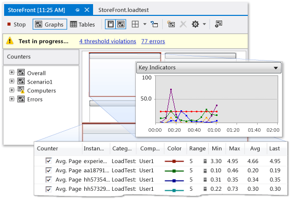

# Profile the performance of SharePoint applications

If your SharePoint applications are performing slowly or inefficiently, you can use the profiling features in Visual Studio to identify problematic code and other elements. By using the load testing feature, you can determine how a SharePoint application performs under stress, such as when many users access the application simultaneously. By running web performance tests, you can measure how the application performs on the web. By using coded UI tests, you can verify whether the whole SharePoint application, including its user interface, functions correctly. When you use these tests together, they can help you identify performance issues before you deploy your application.

## Profile tools overview

Profiling refers to the process of observing and recording the performance behavior of your application as it runs. By profiling your application, you can uncover problems such as bottlenecks, inefficient code, and memory allocation issues, which cause applications to run slowly or use too much memory. For example, you can use profiling to identify hotspots in your code, which are segments of code that are frequently called and can slow down the overall performance of your application. After you identify hotspots, you can often optimize or eliminate them.

You can use several profiling tools in the integrated development environment (IDE) to identify and locate these kinds of performance issues. These tools work the same way for SharePoint projects as they do for other kinds of Visual Studio projects. The Profiling Tools Performance Wizard leads you through the creation of a performance session that uses the tests that you specify. A performance session is a set of configuration data that's used for collecting performance information from an application, along with the results of one or more profiling runs. Performance sessions are stored in your project folder, and you can view them in **Performance Explorer**. For more information, see [Understanding Performance Collection Methods](../profiling/understanding-performance-collection-methods.md).

After you create and run a profile analysis on your application, a report provides details about its performance. This report can include items such as a graph of CPU usage over time, a hierarchical function call stack, or a call tree. The exact contents of the report can vary, depending on the type of test that you run, such as sampling or instrumentation. For more information, see [Profiling Tools Report Overview](../profiling/performance-report-overview.md).

## Performance session process

To profile an application, you start by using the Profiling Tools Performance Wizard to create a performance session. On the menu bar, choose **Analyze**, **Launch Performance Wizard**. As you complete the wizard, you enter the required information for your performance session, such as the profile method that you want and the application that you want to profile. For more information, see [How to: Profile a Web Site or Web Application Using the Performance Wizard](../profiling/how-to-collect-performance-data-for-a-web-site.md). As an alternative, you can use command-line options to set up and run a performance session. For more information, see [Using the Profiling Tools From the Command-Line](../profiling/using-the-profiling-tools-from-the-command-line.md). If you want to configure every aspect of a performance session manually, see [How to: Manually Create Performance Sessions with the Profiling Tools](../profiling/how-to-manually-create-performance-sessions.md). You can also create a performance session from a unit test by, in the **Test Results** window, opening the shortcut menu for the unit test and then choosing **Create Performance Session**.

After you set up a performance session, the session configuration is saved, the server is configured to provide profiling data, and the application runs. As you use the application, performance data is written to a log file. Performance sessions are listed in **Performance Explorer** under the **Targets** folder. After a performance session finishes, its report appears in the **Reports** folder in **Performance Explorer**. To display the report, open it in **Performance Explorer**. To view or configure the properties of a performance session, open its shortcut menu in **Performance Explorer**, and then choose **Properties**. For more information about specific properties of a performance session, see [Configuring Performance Sessions for Profiling Tools](../profiling/configuring-performance-sessions.md). For information about how to interpret the results of a performance session, see [Analyzing Profiling Tools Data](../profiling/analyzing-performance-tools-data.md).

## Stress test

You can analyze the stress performance of your applications by creating load tests and web performance tests in Visual Studio. When you create a load test in Visual Studio, you specify a combination of factors, called a scenario, to test your application against. These factors include load pattern, test mix model, test mix, network mix, and web browser mix. Load test scenarios can include both unit tests and web performance tests.

Figure 1: Load testing results example

Web performance tests simulate how an end user might interact with a SharePoint application. You can create web performance tests by recording HTTP requests in a browser session or by using the **Web Performance Test Recorder**. The web requests appear in the **Web Performance Test Editor** after the browser session is finished. You can then debug the results in the **Web Performance Test Results Viewer**. You can also manually build web performance tests by using the **Web Performance Test Editor**.

## Test user interfaces

Coded UI tests automatically drive your SharePoint application through its user interface (UI). These tests cover the UI controls, such as buttons and menus, to verify that they function correctly. This kind of testing is particularly useful if validation or other logic is performed in the UI, such as in a web page. You can also use coded UI tests to automate manual tests. You creating coded UI tests for your SharePoint applications in the same way as you create tests for other types of applications. For more information, see [Testing SharePoint 2010 Applications with Coded UI Tests](/previous-versions/visualstudio/visual-studio-2015/test/testing-sharepoint-2010-applications-with-coded-ui-tests?preserve-view=true&view=vs-2015).

## Related topics

|Title|Description|
|-----------|-----------------|
|[Walkthrough: Profile a SharePoint application](../sharepoint/walkthrough-profiling-a-sharepoint-application.md)|Demonstrates how to perform a sampling profile analysis on a SharePoint application.|
|[Performance test your app before release](/azure/devops/test/load-test/run-performance-tests-app-before-release?view=vsts&preserve-view=true)|Describes how to create load tests, which help you stress test SharePoint applications.|
|[Unit Test Your Code](../test/unit-test-your-code.md)|Describes how to find logic errors in your code by using unit tests.|
|[Testing SharePoint 2010 Applications with Coded UI Tests](/previous-versions/visualstudio/visual-studio-2015/test/testing-sharepoint-2010-applications-with-coded-ui-tests?preserve-view=true&view=vs-2015)|Describes how to test the user interface of your SharePoint applications.|

## Related content

- [Build and debug SharePoint solutions](../sharepoint/building-and-debugging-sharepoint-solutions.md)
- [Improve Code Quality](../test/improve-code-quality.md)
