# Add a data source to a web performance test

Bind data to provide different values to the same test, for example, to provide different values to your form post parameters.

[!INCLUDE [web-load-test-deprecated](includes/web-load-test-deprecated.md)]


We’re going to use a sample ASP.NET app. It has three *.aspx* pages – the default page, a Red page, and a Blue page. The default page has a radio control to choose either red or blue and a submit button. The other two *.aspx* pages are very simple. One has a label named Red and the other has a label named Blue. When you choose submit on the default page, we display one of the other pages. You can download the [ColorWebApp](https://code.msdn.microsoft.com/Sample-ColorWebApp-76ff7506) sample, or just follow along with your own web app.


Your solution should also include a web performance test that browses through the pages of the web application.

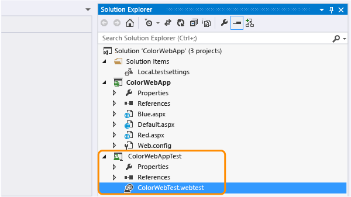

## Create a SQL database

::: moniker range="vs-2017"

1. If you don’t have Visual Studio Enterprise, you can download it from the [Visual Studio Downloads](https://visualstudio.microsoft.com/vs/older-downloads/?utm_medium=microsoft&utm_source=docs.microsoft.com&utm_campaign=vs+2017+download) page.

2. Create a SQL database.

     

3. Create a database project.

     

4. Add a table to the database project.

     

5. Add fields to the table.

     

6. Publish the database project.

     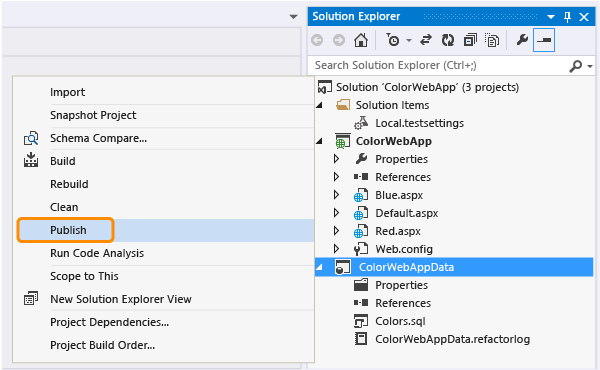

7. Add data to the fields.

     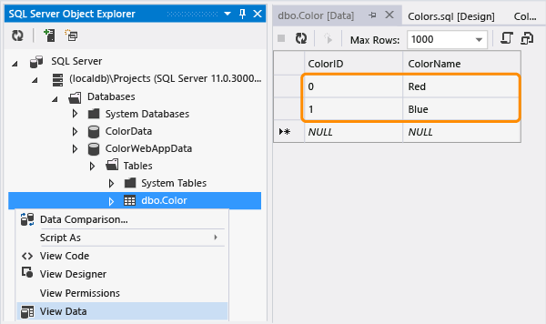

::: moniker-end

::: moniker range="vs-2019"

1. If you don’t have Visual Studio Enterprise, you can download it from the [Visual Studio Downloads](https://visualstudio.microsoft.com/downloads) page.

2. Create a SQL database.

     

3. Create a database project.

     

4. Add a table to the database project.

     

5. Add fields to the table.

     

6. Publish the database project.

     

7. Add data to the fields.

     

::: moniker-end

## Add the data source

1. Add a data source.

     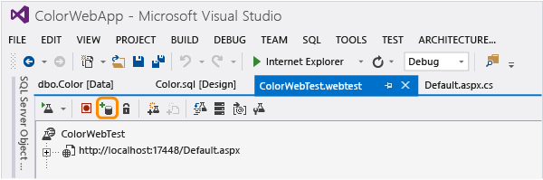

2. Choose the type of data source and name it.

     

3. Create a connection.

     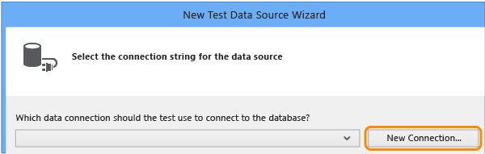

     Enter the connection details.

     

4. Select the table that you want to use for your test.

     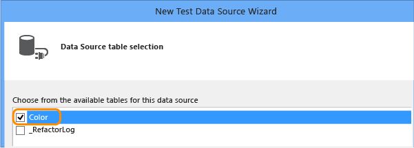

     The table is bound to the test.

     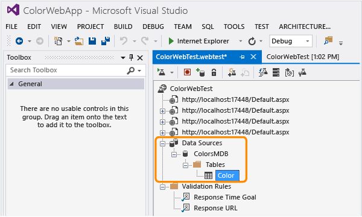

5. Save the test.

## Bind the data

1. Bind the **ColorName** field.

     

2. Open the *Local.testsettings* file in **Solution Explorer** and select the **One run per data source row** option.

     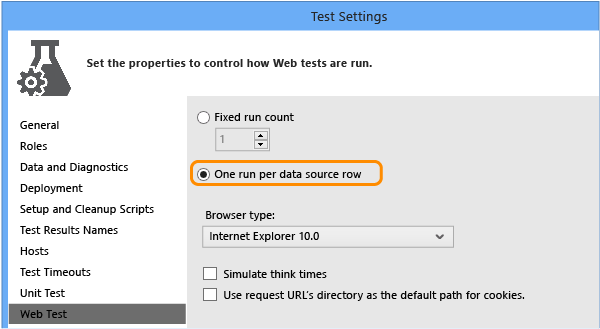

3. Save the web performance test.

## Run the test with the data

1. Run the test.

     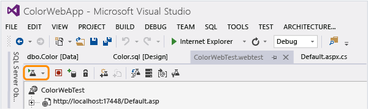

     The two runs are displayed for each data row. Run 1 sends a request for the page *Red.aspx*, and Run 2 sends a request for the page *Blue.aspx*.

     

     When you bind to a data source, you could violate the default response URL rule. In this case, the error in Run 2 is caused by the rule which expects the *Red.aspx* page from the original test recording, but the data binding now directs it to the *Blue.aspx* page.

2. Correct the validation error by deleting the **Response URL** validation rule and running the test again.

     

     The web performance test now passes using data binding.

     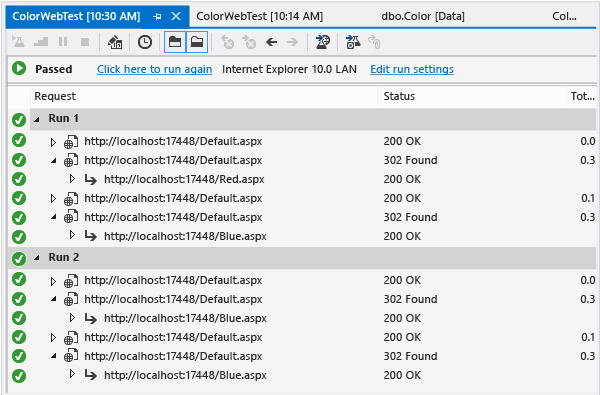

## Q & A

### Q: What databases can I use as a data source?

**A:** You can use the following:

- Microsoft SQL Azure.

- Any version of Microsoft SQL Server 2005 or later.

- Microsoft SQL Server database file (including SQL Express).

- Microsoft ODBC.

- Microsoft Access file using the .NET Framework provider for OLE DB.

- Oracle 7.3, 8i, 9i, or 10g.

### Q: How do I use a comma separated value (CSV) text file as a data source?

**A:** Here's how:

1. Create a folder to organize your projects database artifacts and add an item.

     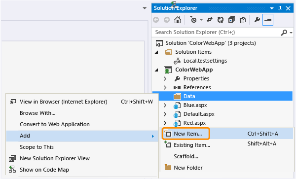

2. Create a text file.

     

3. Edit the text file and add the following:

    ```text
    ColorId, ColorName
    0,Red
    1,Blue
    ```

4. Use the steps in [Add the data source](#add-the-data-source), but choose CSV file as your data source.

     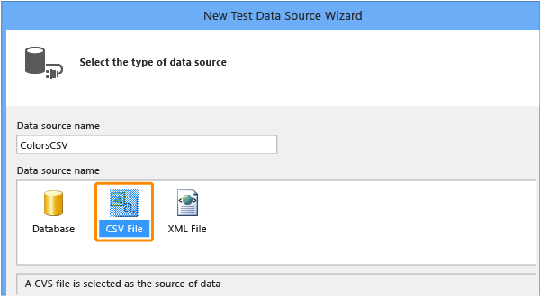

### Q: What if my existing CSV file does not contain column headers?

**A:** If you can’t add column headers, you can use a schema description file to treat the CSV file as a database.

1. Add a new text file named *schema.ini*.

     

2. Edit the *schema.ini* file to add the information that describes the structure of your data. For example, a schema file describing the CSV file might look like this:

    ```text
    [testdata.csv]
    ColNameHeader=False
    ```

3. Add a data source to the test.

     

4. If you’re using a *schema.ini* file, choose **Database** (not CSV file) as the data source and name it.

     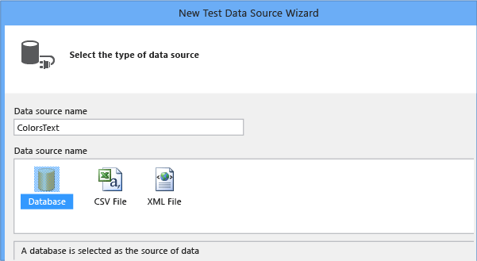

5. Create a new connection.

     

6. Select the .NET Framework Data Provider for OLE DB.

     

7. Choose **Advanced**.

     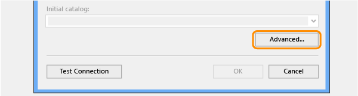

8. For the Provider property, select Microsoft.Jet.OLEDB.4.0, and then set **Extended Properties** to Text;HDR=NO.

     

9. Type the name of the folder that contains the schema file and test your connection.

     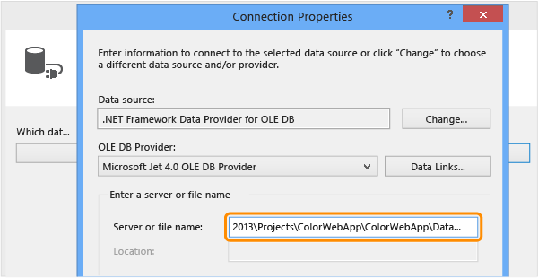

10. Select the CSV file that you want to use.

     

     After you finish, the CSV file appears as a table.

     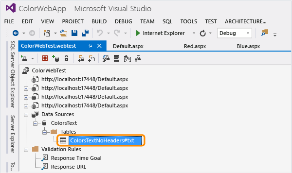

### Q: How do I use an XML file as a data source?

**A:** Yes.

1. Create a folder to organize your projects database artifacts and add an item.

     

2. Create an XML file.

     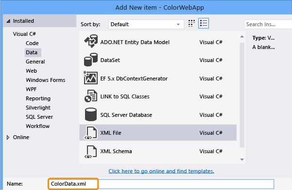

3. Edit the XML file and add your data:

    ```xml
    <?xml version="1.0" encoding="utf-8" ?>
    <ColorData>
        <Color>
            <ColorId>0</ColorId>
            <ColorName>Red</ColorName>
        </Color>
        <Color>
            <ColorId>1</ColorId>
            <ColorName>Blue</ColorName>
        </Color>
    </ColorData>
    ```

4. Use the steps in [Add the data source](#add-the-data-source), but choose XML file as your data source.

     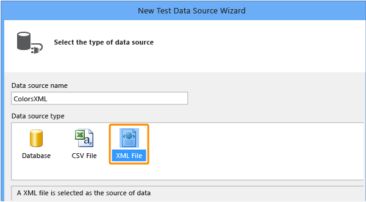

### Q: Can I add data binding to a web service request that uses SOAP?

**A:** Yes, you must change the SOAP XML manually.

1. Choose the web service request in the request tree and in the Properties window, choose the ellipsis (…) in the String Body property.

     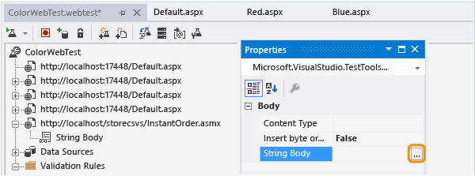

2. Replace values in the SOAP body with data-bound values by using the following syntax:

    ```xml
    {{DataSourceName.TableName.ColumnName}}
    ```

    For example, if you have the following code:

    ```xml
    <?xml version="1.0" encoding="utf-8"?>
    <soap:Envelope xmlns:xsi="http://www.w3.org/2001/XMLSchema-instance" xmlns:xsd="http://www.w3.org/2001/XMLSchema" xmlns:soap="http://schemas.xmlsoap.org/soap/envelope/">
        <soap:Body>
            <CheckStatus xmlns="http://tempuri.org/">
                <userName>string</userName> <password>string</password> <orderID>int</orderID>
            </CheckStatus>
        </soap:Body>
    </soap:Envelope>
    ```

    You can change it to this:

    ```xml
    <?xml version="1.0" encoding="utf-8"?>
    <soap:Envelope xmlns:xsi="http://www.w3.org/2001/XMLSchema-instance" xmlns:xsd="http://www.w3.org/2001/XMLSchema" xmlns:soap="http://schemas.xmlsoap.org/soap/envelope/">
        <soap:Body>
            <CheckStatus xmlns="http://tempuri.org/">
                <userName>{{DataSourceName.Users.Name}}</userName> <password>{{DataSourceName.Users.Password}}</password> <orderID>{{DataSourceName.Orders.OrderID}}</orderID>
            </CheckStatus>
        </soap:Body>
    </soap:Envelope>
    ```

3. Save the test.