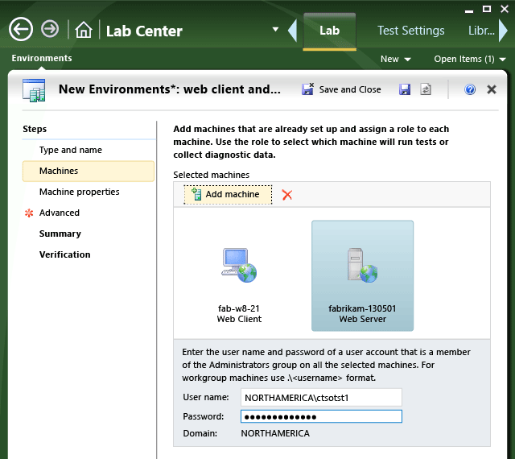

# Automate a test case in Microsoft Test Manager
To automate a test case, link it to a coded test method. You can link any unit test, coded UI test, or generic test to a test case. You’ll want to link a test method that performs the test described by the test case. Typically these are integration tests.  
  
 The results of automated and manual tests appear together. If the test cases are linked to backlog items, stories, or other requirements, you can review the test results by requirement.  
  
1.  [Link test cases to test methods](#linkGen)  
  
    -   [Link a single test case to a test method](#link)  
  
    -   [Create test cases from an assembly of test methods](#assembly)  
  
2.  [Set the test plan to use your build](#TestPlan)  
  
3.  [Create a lab environment and settings to run the tests](#AddEnvironment)  
  
4.  [Run automated tests](#RunTest)  
  
5.  [View and analyze the test results](#ViewTest)  
  
##   Link test cases to test methods  
 You can make links one at a time, or you can generate test cases from an assembly of test classes.  
  
###   Link a single test case to a test method  
  
1.  Using Visual Studio, create or choose a test method. It can be an ordinary test method, a coded UI test, ordered test, or a generic test method.  
  
     Check the method into Team Foundation Server.  
  
     Keep the solution open in Visual Studio.  
  
2.  Open the test case in Visual Studio.  
  
       
  
3.  Associate the test method with your test case.  
  
       
  
     If you want to change or delete the association later, choose **Remove Association**.  
  
 We don’t recommend linking load tests or web tests to test cases.  
  
###   Create test cases from an assembly of tests methods  
  
1.  Open a Developer Command Prompt, and change directory to the output director of your Visual Studio solution.  
  
     **cd MySolution\MyProject\bin\Debug**  
  
2.  To import all the test methods from the solution:  
  
     **tcm testcase /collection:** *CollectionUrl* **/teamproject:** *MyProject* **/import /storage:** *MyAssembly* **.dll  /category:"** *MyIntegrationTestCategory* **"**  
  
     The category parameter is optional but recommended. You only want to create test cases from integration or system tests, which you can mark by using the [&#91;TestCategory ("category")&#93;](../test/defining-test-categories-to-group-your-tests.md) attribute.  
  
3.  In the Test hub in the web portal or in Microsoft Test Manager, use **Add Existing** to add the test cases to a test suite.  
  
##   Set Your Test Plan to Use Your Build  
 Provide the build location so that the test method can be found.  
  
1.  In [!INCLUDE[TCMext](../codequality/includes/tcmext_md.md)], choose **Testing Center**, **Plan**, **Properties**.  
  
2.  Under **Builds**, set **Filter for builds**. You can set the [build definition and quality attribute](../Topic/Build%20the%20application.md) of the builds you want to choose from.  
  
3.  Choose **Modify** to assign a build to the test plan. You can compare your current build with a build you plan to take. The associated items list shows the changes to work items between the builds. You can then assign the latest build to take and use for testing with this plan. For more information, see [What development has been done since a previous build?](../test/what-development-has-been-done-since-a-previous-build-.md).  
  
 **I’m not using Team Foundation Build to build my application and tests. How can I run automated lab tests?**  
 Create a build definition that contains just the location where your assemblies are shared. Then create a fake instance of this build from the developer command prompt:  
  
 **TfsCreateBuild.exe /collection:http://tfsservername:8080/tfs/collectionname /project: projectname /builddefinition:"MyBuildDefinition" /buildnumber:"FakeBuild_1.0"**  
  
 Specify the build definition in your test plan.  
  
##   Create a Lab Environment and Settings to Run Your Tests  
 To run your automated tests tests using [!INCLUDE[TCMext](../codequality/includes/tcmext_md.md)], you must use a lab environment. It must have roles for each of the client and server machines used in your tests. (If you’ve used lab environments for manual tests, notice that automated tests must have a machine for the client role.)  
  
1.  Create or choose either a [standard lab environment](../test/standard-lab-environments.md) or an [SCVMM lab environment](../test/scvmm--virtual--environments.md).  
  
     If you create a new environment, choose a machine for each role.  
  
       
  
     If you’re planning to run coded UI tests, configure it on the **Advanced** page of the wizard. This sets the test agent to run as a user. You have to supply a user name under which the agent will run.  
  
     We recommend that you use a different user account than the [lab service account](../test/configure-the-lab-service-account.md) used by the test controller.  
  
       
  
2.  Set the test plan to use your environment for automated tests.  
  
       
  
3.  If you want to collect more than the basic diagnostic data from the test machines, create a test settings file.  
  
       
  
     In the test settings wizard, choose the data you want to collect for each machine.  
  
       
  
##   Run the Automated Test  
 Start automated tests the same way you do manual tests.  
  
 In Microsoft Test Manager, choose **Testing Center**, **Test**. Then select a test suite or an individual test and choose **Run**.  
  
 If you want to run a test in a different environment or with different test settings, choose **Run with Options**.  
  
 If you want to run an automated test manually, choose **Run with Options**.  
  
 If you have multiple build configurations, the test assemblies to run the automated tests are searched for recursively from the root directory of the build drop folder. If it is important which assemblies are selected when you run your automated tests, you should use **Run with options** to specify the build configuration.  
  
##   View and Update the Test Results  
  
1.  In [!INCLUDE[TCMext](../codequality/includes/tcmext_md.md)], choose **Testing Center**, **Test**, **Analyze Test Runs**.  
  
2.  Double-click a test run to open it and view the details. You can:  
  
    -   Update the title of the test run to reflect the outcome.  
  
    -   Choose **Resolution** to indicate a reason, if the test failed.  
  
    -   Add comments.  
  
    -   View the details of an individual test.  
  
    -   Create a bug.  
  
## Q & A  
 **Q: Can I generate the test method from a manual run of the test case?**  
 **A:** Yes. [Use UI Automation To Test Your Code](../codequality/use-ui-automation-to-test-your-code.md)  
  
 **Q: Can I automate deploying the code to a lab environment?**  
 Yes. [Automated build-deploy-test workflows](../test/automated-build-deploy-test-workflows.md)  
  
 **Q: I want my automated test to repeat with different data. Do I use the same test parameters that the manual version of the test case uses?**  
 **A:** To make the automated test iterate over different data, write that into the code of the test method.  
  
 [Test parameters](../test/repeat-a-test-with-different-data.md) are only used with the manual version of the test. They aren’t visible to the automated test code.  
  
 **Q: Can I use vNext builds to run automated tests in lab environments?**  
 **A:** Currently only XAML builds are supported with automated testing. Microsoft Test Manager does not support                    [Team Foundation 2015 build](https://www.visualstudio.com/docs/build/overview) (also called Build vNext). Microsoft Test Manager will allow you to associate a vNext build with your Test Plan, but when you try to trigger an automated test using a lab environment, your test run will fail and the error log will show you the following message - which may be misleading.  
  
 **The build directory of the test run either does not exist or access permission is required**  
  
   
  
 You can run automated tests in the new Build system using the Run Functional Tests task as described in        [this blog post](https://blogs.msdn.microsoft.com/visualstudioalm/2016/03/31/executing-automated-tests-in-build-vnext-using-test-plan-test-suites/).