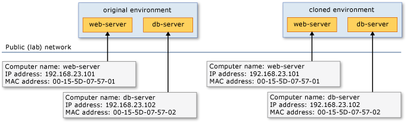

# Cloning Virtual Machines through Network Isolation
Virtual lab management is an emerging area in software development lifecycles. Visual Studio Lab Management is a product in Visual Studio that brings virtual lab management to developers and testers. By using Visual Studio Lab Management, development teams can leverage virtualization technology in their development and test labs to compose complex multi-tier environments from virtual machines. They can then deploy application builds and run tests on those environments.  
  
 One of the motivations for using virtualization in development and test labs is that you can create identical copies, or *clones*, of deployed virtual machines by copying just a few files. Cloning is useful in many scenarios. For example, a developer who needs a copy of a tester’s environment to reproduce an issue can create a clone of that environment. In a test team, each individual tester can clone a copy of an environment and then coordinate his or her testing efforts with the rest of the team. Cloning saves time for both developers and testers because they do not have to repeatedly install the operating systems and other software in each environment that they create.  
  
 **Requirements**  
  
-   Visual Studio Enterprise, [!INCLUDE[vstsTestEssLong](../test/includes/vststestesslong_md.md)]  
  
 Even though it is easy to clone a virtual environment, there are consequences of cloning that you have to consider. Machines in a cloned environment have the same computer names as the machines in the original environment. In some cases, they could even have the same IP addresses and MAC addresses. This could result either in one of the clones losing network connectivity, or network traffic that is targeted for one clone reaching the other instead. Eventually, an unintended consequence could be that you deploy an application to a particular clone and conduct tests on another clone.  
  
> [!NOTE]
>  You can only use network isolation with SCVMM environments. This feature is not available to standard environments.  
  
 Visual Studio Lab Management solves these problems and facilitates safe cloning of virtual environments through a technology called *network isolation*. This topic discusses how network isolation works and compares cloning with and without network isolation. The first example describes the various forms of conflicts that can occur between clones in the absence of network isolation. Subsequent examples examine multiple solutions to prevent conflicts by using Visual Studio Lab Management.  
  
## Network Conflicts  
 The Figure 1 shows a typical virtual environment you could create using Lab Management. This environment, called original environment, has two virtual machines: web-server and db-server. These machines serve the role of web and database servers respectively in a 3-tier web application. In this example, we assume that a member of a development team created this environment and deployed the latest build of their web application to it. We also assume that a snapshot called latest build has been taken on this environment after the build was deployed. A snapshot is a point-in-time state of the environment. You can restore to and resume execution from this saved state at any time. The figure shows the computer names, IP addresses, and MAC addresses of the two virtual machines in the original environment.  
  
   
Original environment  
  
 The Figure 2 shows a cloned environment in addition to the original. After cloning, when both the environments are started, the following types of network conflicts could occur:  
  
1.  Computer name conflicts  
  
2.  IP address conflicts  
  
3.  MAC address conflicts  
  
   
Original and cloned environments on a common network  
  
 The exact result of each of these conflicts depends on several factors: the operating system in the virtual machines, the networking infrastructure in the lab, and so forth. In the Figure 2, we assumed that a static IP address and a static MAC address have been configured in each virtual machine of the original environment. Therefore, when the environment was cloned, the cloned virtual machines had the same IP and MAC addresses.  
  
### Computer name conflicts  
 A computer name is a friendly name assigned by a user to identify a machine in a network. Two protocols are typically used to resolve a computer name to its IP address: NetBIOS and Domain Name Server (DNS). When two machines that have the same computer name are started on the same network segment, NetBIOS detects the name conflict and warns the user. Normally, NetBIOS can detect conflicts only if the machines are on the same network segment. If the machines are not on the same network segment or if the warnings are ignored, the next level of conflicts occurs in DNS. DNS is a central repository for machines to register their names. When two machines that have the same computer name attempt to register in DNS, the second machine might override the entry created by the first computer. In this case, the first machine that starts is not reachable through name resolution.  
  
 There are simple ways to avoid or fix computer name conflicts. Instead of creating identical copies of environments, you can customize each clone as you create it by using a mechanism called sysprep. Sysprep is part of the Windows operating systems. When you use sysprep to clone environments, each virtual machine of the environment gets a unique computer name, IP address, and MAC address that are different from those in the original environment. However, the clones are not identical any more.  
  
 The impact of having a unique computer name in each clone,  whether that is done through sysprep or through manual intervention of the user to avoid conflicts, depends on software that is installed in the virtual machine. To understand this, look at the example. When the application was deployed on the environment, a **web.config** file would have been created on the web server. In this file, we have configured the computer name **db-server** as part of the connection string. A snippet of that file is shown here:  
  
```  
<?xml version="1.0"?>  
<configuration>  
  <appSettings>  
    <add key="ConnectionString"   
      value="Persist Security Info=True;User ID=dbuser;    
        Password=password;Initial Catalog=Store;Data Source=db-server"/>  
  </appSettings>  
</configuration>  
```  
  
 When we change the computer name of the database server in the cloned environment, we also have to manually change the **web.config** file as follows to use the new name (**db-server2** is the new computer name given to the virtual machine in the cloned environment).  
  
```  
<?xml version="1.0"?>  
<configuration>  
  <appSettings>  
    <add key="ConnectionString"   
      value="Persist Security Info=True;User ID=dbuser;    
        Password=password;Initial Catalog=Store;Data Source=db-server2"/>  
  </appSettings>  
</configuration>  
```  
  
 In addition, SQL Server requires additional steps when its computer name is changed. A snippet of SQL scripts to accomplish this is shown here:  
  
```  
sp_dropserver db-server  
sp_addserver db-server2, local  
GO  
```  
  
 The previous example shows how an application has to be reconfigured if computer names are changed. Understandably, this procedure is dependent on the application. If an application writes the computer name into entries in a database, those entries need to be changed in a similar manner. In some cases, you might have to reinstall an application when the computer name changes. Performing such reconfigurations and reinstallations is clearly what we wanted to avoid in the first place through the use of cloning. This necessitates a more robust application-independent solution that can safely allow multiple clones to co-exist without computer name conflicts.  
  
### IP address conflicts  
 An Internet Protocol (IP) address is used for machines to communicate with each other over a TCP network. IP addresses are assigned either statically or dynamically by a DHCP server on the network. Each connected network interface in a machine has an IP address. If a virtual machine that is  configured with a static IP address is cloned and then placed on the same network as the original virtual machine, then there is an IP address conflict, in addition to a computer name conflict. You can manually fix this conflict by changing the IP address of one of the clones. Once again, the impact of changing the IP address depends on how the static IP address is used by the applications that are  installed on virtual machines.  
  
 When you start to clone a virtual machine that is configured with a dynamic IP address, there is a network conflict for a short period of time. Soon after the first virtual machine is cloned, the second virtual machine to connect to the network detects this conflict and corrects itself by renewing its IP address. A similar short period of conflict exists every time the cloned environment is restored to a snapshot that was taken in the original environment. These periods of conflict are usually not long enough to affect the application.  
  
### MAC address conflicts  
 A Media Access Control (MAC) address is an address that is assigned to each network interface in a machine. In the case of physical machines, it is assigned to each network interface by the card’s manufacturer. In the case of virtual machines, there are two ways to assign MAC addresses: static or dynamic MAC. You can specify a specific MAC address to use for a network interface of a virtual machine. This is called static MAC. Or, you can let the hypervisor assign a MAC address dynamically. This is called dynamic MAC. Dynamic MAC addresses are assigned by Hyper-V from a pool of MAC addresses every time a virtual machine is started. Each host has a scheme to generate MAC addresses so that they do not conflict with the virtual machines on another host.  
  
 If static MAC addresses are used for virtual machines in the original environment, then virtual machines in the cloned environment will have the same MAC addresses. This promptly results in MAC conflicts. Duplicate MAC addresses are harder to detect because they are not always reported by machines. Even when they are reported, such messages are logged in Windows Event Viewer. To an end user, there are two possible consequences of duplicate MAC addresses.  One consequence is loss of network connectivity on one or both clones.  Another consequence is that network packets addressed to one machine can reach the other machine instead. When an original machine and its clone have the same MAC addresses, their IP addresses are also the same. Even when DHCP is used to obtain dynamic IP addresses, the DHCP server will assign them the same IP addresses as their MAC addresses are identical.  
  
 To some degree, you can avoid MAC conflicts by using dynamic MAC addresses. However, when the cloned environment is restored to a snapshot that was taken in the original environment, the entire state of those virtual machines is rolled back including the MAC addresses. This once again results in MAC conflicts and the same problems described previously exist until the cloned virtual machine is restarted. Restarting the cloned environment causes the hypervisor to release and renew the MAC addresses with values from its own range.  
  
 Detection and resolution of the forms of conflicts we just described, and then manually fixing the OS/application to continue to work after the resolution, is significant, time consuming, and error prone for frequent users of virtual lab management. In many cases, changing any of these parameters changes the virtual environment enough to cause the loss of a bug reproduction or a similar problem with the production environment. The principle of installing the application one time into a virtual environment and worry-free cloning of that environment to create multiple identical copies requires a more sophisticated approach than ordinary users can be expected to do.  
  
## Network Isolation  
 Two requirements have been identified so far. The first requirement is that virtual machines in a cloned environment must have the same computer names, IP addresses, and MAC addresses as those in the original environment. But, at the same time, these clones have to be independently addressable from outside the environment. This is required, for instance, for someone to connect to each of the clones from their desktops, for an application to deployed on a specific clone, or for a test to be run on a specific clone. This leads to the second requirement, which is  that the virtual machines in a cloned environment must also have unique computer names, IP addresses, and MAC addresses that are different from those in the original environment. The logical way to accomplish both of these requirements is for each virtual machine to have two interfaces: a private interface for which the computer name, IP address, and MAC address are same in every clone; and a public interface for which these values are unique in every clone.  
  
 To prevent network conflicts for the private interfaces, they have to be connected to a private network in each clone. A private network is a virtual network that is limited to only the virtual machines within an environment. Because this network is not exposed beyond the boundaries of an environment, there is no possibility of conflicts even if the same computer names, IP addresses, and MAC addresses are used in another clone. For accessibility from outside the environment, all the public interfaces have to be connected to a common public network. The public network or lab network is the network on which virtual machines of environments can interact with clients and other machines in lab.  
  
 The Figure 3 shows how private and public interfaces address network conflicts.  
  
   
  
### Network isolation in Visual Studio Lab Management  
 Visual Studio Lab Management implements network isolation for SCVMM environments by introducing two network interfaces in each virtual machine. One of these network interfaces is a private interface connected to a private network, and the other is a public interface connected to the public network.  
  
 The Lab Management software, together with an agent installed on each virtual machine, ensures that the original environment and cloned environment can coexist without conflicts.  
  
#### Private interfaces on private network  
 The following description is a summary of how computer names, IP addresses, and MAC addresses are assigned to private interfaces of an environment.  
  
 **Computer names:** Computer names on the private network are resolved through NetBIOS and do not require any additional handling by Lab Management software. Applications that are configured to work with NetBIOS computer names will work as expected in every clone. In our example, web-server computer refers to the db-server computer using its name. These names are the same in original and cloned environments. Therefore, the web.config file does not have to be changed in cloned environment.  
  
 Because there is no DNS server on the private network, we need to address the situation when fully qualified domain names (FQDNs) are used by virtual machines to refer to each other instead of NetBIOS names. For example, if the web.config file referred to db-server as db-server.lab.contoso.com, then resolution of that name to an IP address would not be possible without DNS on the private network. To solve this, the lab agent running on the virtual machine adds entries that correspond to the other virtual machines of the same environment in the hosts file. The hosts file is another way of indicating to the operating system that a name has to be resolved to a particular IP address. In our example, the hosts file on web-server will have the following entry:  
  
 `192.168.23.2    db-server.lab.contoso.com`  
  
 **IP addresses:** A static IP address from 192.168.23.1 - 255 range is assigned to private network interface of each virtual machine. For example, the web-server’s private interface gets 192.168.23.1 and the db-server’s private interface gets 192.168.23.2. Lab Management ensures that the web-server and db-servers get the same static IP addresses in every clone. Therefore, even if the web.config file on the web-server is configured with the db-server’s IP address, it does not have to be reconfigured in the cloned environment. In any environment that is configured with network isolation, the private interfaces get IP addresses from this same range, starting with 192.168.23.1. The maximum number of addresses needed in this range is the same as the maximum number of virtual machines in an environment. Because this set of IP addresses is not routable from outside the private network, it is safe to use a pre-defined range as long as the same range is not used on the public network.  
  
 **MAC addresses:** A random static MAC address is assigned to the private network interface of each virtual machine in a network isolated environment. In our example, the private interface in original web-server is given a MAC address such as 00-15-5D-07-57-01. Lab Management ensures that this web-server gets the same MAC address in the cloned environment as well. Because this set of MAC addresses are not routable from outside the private network, it is safe to use a random address as long as they are not within the range of what the hypervisor uses on that host.  
  
#### Public interfaces on public network  
 The following description is a summary of how computer names, IP addresses, and MAC addresses are assigned to public interfaces of an environment.  
  
 **Computer names:** We do not want NetBIOS to resolve computer names on the public network, because doing so would result in a computer name conflict. To prevent this, Lab Management disables NetBIOS broadcasts on the public interface of each virtual machine. Similar to NetBIOS, we do not want the virtual machines to register their NetBIOS computer names in DNS. Lab Management disables DNS registration as well for every public interface. In the absence of NetBIOS and default DNS registration, we still want virtual machines to have unique names that can be used on public network. Lab Management generates a unique alias name on behalf of each virtual machine and registers that as an 'A' record in DNS. In our example, the web-server in original environment could be registered using a unique alias name that resembles VSLM-195ea870-34d87df83883add23-47ab86ff.lab.contoso.com. The same web-server in the cloned environment is registered using a different name that could resemble VSLM-87ead667a-8787adde877919aaa-2001874d0.lab.contoso.com.  
  
 **IP addresses:** The public network interface on every virtual machine is configured to obtain dynamic IP address from a DHCP server. This ensures that virtual machines in original and cloned environments have unique IP addresses. For example, the web-server in original environment could get an IP address of 172.52.20.140 and the same web-server in cloned environment could get an IP address of 172.52.20.205.  
  
 **MAC addresses:** To prevent MAC conflicts, the public network interface on every virtual machine could be configured to obtain dynamic MAC addresses from hypervisor. This would ensure that the web-server machine in our example gets a different MAC address in original and cloned environments. However, as described earlier, when a cloned environment is restored to a snapshot taken in the original environment, the MAC and IP address of the cloned virtual machine assume the same values as the original. For example, when the cloned environment is restored to latest build snapshot, the IP address of the web-server becomes 10.86.51.61 (see the Figure 3), which is the same value as in the original environment. The same happens with MAC address as well. While the IP address conflict is temporary until is renewed by DHCP, the MAC conflict exists until the virtual machines are restarted. Because of this limitation, using dynamically assigned MAC addresses from hypervisor for public interfaces is not a feasible solution.  
  
 To address this, Lab Management uses its own pool of MAC addresses. Unique MAC addresses from this pool are assigned to public interfaces of virtual machines. Whenever the cloned environment is restored to a snapshot, Lab Management changes the MAC addresses automatically to prevent conflicts. To understand how this works, consider that the MAC address of web-server in original environment is 1D-D8-B7-1C-00-05 and that the MAC address of web-server in cloned environment is 1D-D8-B7-1C-00-07. When the cloned environment is restored to a snapshot taken in original environment, the MAC address of web-server becomes 1D-D8-B7-1C-00-05 momentarily. Lab Management changes this back to 1D-D8-B7-1C-00-07 to prevent the network conflict.  
  
#### Typical interactions with network isolation  
 Next, we will discuss what happens when two virtual machines within the environment communicate with each other:  
  
1.  Web-server uses NetBIOS or hosts file to resolve the computer name "**db-server**" to the IP address of **db-server**’s private interface (192.168.23.2).  
  
2.  Web-server communicates with **db-server** at this IP address.  
  
 When a client outside the environment has to communicate with the web-server in a cloned environment, the following process is followed:  
  
1.  Client queries the Lab Management software to obtain the unique alias name of web-server in cloned environment.  
  
2.  Lab Management software responds with the unique alias name.  
  
3.  DNS server resolves the unique alias name to IP address of web-server’s public interface (10.86.51.63).  
  
4.  Client communicates with the web-server at this IP address.  
  
### Alternative approaches for network isolation  
 Using two interfaces is not the only approach for network isolation. A very similar approach is to use a bi-directional NAT. NAT is a common approach for creating a private network of devices that need to communicate with devices on a public network. Even though the communication in a typical NAT must always originate from the private network, bi-directional NAT (or 2-way NAT) takes this a step forward and allows communication initiated by machines on the private network or by those on the public network.  
  
 To realize network isolation using this approach, a 2-way NAT server has to be introduced in the environment. This is usually done by adding a special virtual machine to the environment that just fulfills the role of a bi-directional NAT server. When a network isolated environment is created, the public and private IP addresses of the virtual machines are assigned in the same way as in the two interfaces approach. However, instead of assigning the public IP address to a network interface in the virtual machine, the mappings are stored in a NAT table on the 2-way NAT server.  
  
   
  
 The steps for two virtual machines within the environment to communicate with each other using a 2-way NAT approach are exactly the same as they are in two interfaces approach:  
  
1.  Web-server uses NetBIOS or hosts file to resolve the computer name **db-server** to the IP address of **db-server**’s private interface (192.168.23.2).  
  
2.  Web-server communicates with **db-server** at this IP address.  
  
 The steps when a client outside the environment has to communicate with the web-server in cloned environment are slightly different and are as follows:  
  
1.  By implementing the NAT approach, client queries Lab Management software to obtain the unique alias name of web-server in cloned environment. (Visual Studio Lab Management does not implement the NAT approach).  
  
2.  Lab Management software responds with the unique alias name.  
  
3.  DNS server resolves the unique alias name to public IP address of web-server (10.86.51.63).  
  
4.  This IP address actually maps to an interface on 2-way NAT server. Client communicates with the 2-way NAT server while assuming that it is communicating with web-server.  
  
5.  NAT server retrieves the mappings stored in its configuration tables and translates the public IP address (10.86.51.63) to private IP address (192.168.23.1).  
  
6.  NAT server forwards the message from client on the private network to 192.168.23.1, which is the IP address of the web-server.  
  
 The benefit of this approach over the two interfaces approach is that the virtual machines in the environment do not have to be modified in any manner. There is no need to introduce an additional network interface in each virtual machine. Introducing an additional network interface into a virtual machine can cause some applications to break.  
  
 Another benefit of this approach is that the entire logic for achieving network isolation is encapsulated into the extra virtual machine. There is no need to have an agent in each of the other virtual machines. Routing all the packets through the extra virtual machine also provides an additional control point for supporting more advanced features of network isolation such as:  
  
-   **Out-only fencing:** Does not allow network packets initiated by clients outside the environment to reach virtual machines within the environment.  
  
-   **Out-only with specific port exceptions:** Does not allow network packets initiated by clients outside the environment to reach virtual machines within the environment unless they are targeted to a specific port.  
  
 These features can easily be implemented in the 2-way NAT approach by introducing a firewall on the NAT server.The primary drawback of the 2-way NAT approach is that some applications do not work across NAT. For instance DCOM and .NET remoting protocols, which are commonly used in Windows applications, do not work when the client and server are separated by a NAT server. It is for this reason that Visual Studio Lab Management uses the dual interfaces approach. Another drawback of the 2-way NAT approach is that it requires an additional virtual machine in each environment, which introduces additional overhead during creation or other operations on virtual environments.  
  
## Other Conflicts  
 So far, we have described how computer name, IP address, and MAC address conflicts can be addressed through network isolation. When environments are cloned, there are other forms of conflicts that could occur as well. Whenever there is dependency on an external component that is outside the virtual environment, there is a potential for a conflict when that environment is cloned. In this section, we look at two common cases, where such conflicts could occur.  
  
### Active Directory Conflicts  
 It is common for Windows machines and applications to rely on Active Directory (AD) either for directory services or for user authentication and authorization. Managing Windows machines centrally using AD group policies is a very common practice. Using our example, let’s suppose that the web-server and db-server in the original environment are joined to a domain managed by an AD. The AD is hosted outside the environment. When we clone this environment, we now have two identical clones of web-server; however, there is only one entry in the AD. This is clearly undesirable and can lead to several problems. For example, if one of the web-server clones is disjoined from the domain by a user action, the other clone is disjoined as well. Changes made in one environment unintentionally affect the other environment.  
  
 To prevent Active Directory conflicts, an AD server has to be hosted on a virtual machine within the environment. The AD server should not have any trust relationships with other directories outside the environment.  
  
 There are some additional considerations for setting up an AD within a network isolated environment. First, the AD virtual machine should not be connected to the public network. In the two interfaces approach, this means that the AD virtual machine should not have a public interface. In the 2-way NAT approach, this means that the NAT table should not have a mapping for the AD virtual machine.  
  
 Second, because the AD is in an independent forest, there must be a DNS server within the environment. Other virtual machines in the environment must use this DNS server on the private network for proper communication with the AD. As an example, a virtual machine might not be able to join the domain in the private AD unless the DNS server setting is correctly configured on the private interface.  
  
 When you configure an environment to include an AD virtual machine, Visual Studio Lab Management automates disconnecting an AD from the public network and configuring private interfaces of virtual machines with DNS settings.  
  
 There might be situations in which it is not possible to host an AD within the environment. For example, this could happen when the application under development has to use a corporate AD for integration with other existing corporate applications. There is no known solution to enable safe cloning of environments when the machines are joined to a domain outside the environment.  
  
### Database Conflicts  
 Another common usage of virtual environments involves hosting the application’s database outside the environment. Typically, this is done when the database is large enough and when it is not practical to clone the database with every environment. This could also happen when the application under development is a simple web client that interacts with a database that is hosted elsewhere. In such cases, when two identical clones interact with the database, the database server is unable to distinguish the identity of the two clients.  
  
### Summary  
 The ability to create identical clones of virtual environments is essential for several scenarios in virtual lab management. However, when identical clones are created, there are computer name, IP address, and MAC address conflicts. Simple techniques, such as changing computer names or IP addresses, to fix these conflicts usually require reconfiguration or reinstallation of the application, and effectively defeat the intention of creating identical clones. Network isolation addresses this problem by allowing you to create and run two clones simultaneously.  
  
## Next Steps  
 **Plan you SCVMM environment:** Learn about when to use the different options for SCVMM environments, such as using running virtual machines, stored virtual machines, templates, stored environments, and network isolation. See [Guidance for Creating and Managing SCVMM Environments](../test/guidance-for-creating-and-managing-scvmm-environments.md).  
  
 **Create a Network isolated environment:** Use this topic if you are ready to create a network isolated environment. See [Creating and using a network isolated environment](../test/creating-and-using-a-network-isolated-environment.md).  
  
## See Also  
 [Automate system tests](../test/automate-system-tests.md)