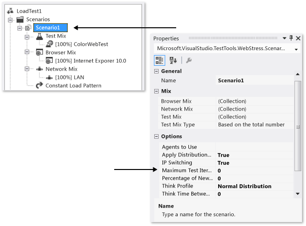

# Configure test iterations in a load test scenario

To configure test iteration settings, edit a load test scenario using the Load Test Editor and the **Properties** window. By default, a load test scenario is set up without specifying maximum test iterations. You have the option to configure the maximum number of iterations in the scenario and how long to pause between them.

[!INCLUDE [web-load-test-deprecated](includes/web-load-test-deprecated.md)]

## Specify the maximum test iterations for a scenario

You can specify the maximum number of times that you want your tests to run for a scenario by using the Load Test Editor to change the **Maximum Test Iterations** property in the **Properties** window.

The **Maximum Test Iterations** property controls the maximum number of test iterations to run for the scenario. Just as for the **Test Iterations** property in the load test run settings, this is the maximum across all users on all agents, not a per user setting.

> [!NOTE]
> For a full list of the load test scenario properties and their descriptions, see [Load test scenario properties](../test/load-test-scenario-properties.md).

For sequential test mix, one iteration is one pass through all the tests in the mix. For all other test mixes, each test execution counts as an iteration. For more information, see [About the mix control](../test/edit-the-test-mix-to-specify-which-web-browsers-types-in-a-load-test-scenario.md).

If the load test is a duration-based load test, and the duration expires before the iteration count is complete, the test will still stop. If the test is iteration-based, and the test iterations are met before scenario iterations, the test will stop. The duration is configured by using the **Run Duration** property in the **Properties** window associated with a run setting in a load test.

When the scenario iteration count is met, the scenario will stop running, but any other active scenarios will continue to run.

> [!NOTE]
> A related property is the **Unique** property on a web test data source, which moves sequentially through the data, row-by-row, but only one time for each record. For more information, see [Add a data source to a web performance test](../test/add-a-data-source-to-a-web-performance-test.md).

The **Maximum Test Iterations** property is useful for a variety of situations. Some load testers prefer to conduct iteration-based testing, whereas other load testers prefer to conduct duration-based testing.

### To specify the maximum test iterations

1. Open a load test.

2. The Load Test Editor appears. The load test tree is displayed.

3. In the load test trees **Scenarios** folder, choose the scenario node for which you want to specify the maximum number of test iterations.

4. On the **View** menu, select **Properties Window**.

     The categories and properties of the scenario are displayed in the **Properties** window.

5. In the text box for the **Maximum Test Iterations** property, type a value that indicates the maximum number of tests to run for the scenario when the load test is run.

    > [!NOTE]
    > Using a value of 0 for the **Maximum Test Iterations** property specifies no maximum iterations.

6. After you have finished changing the property, choose **Save** on the **File** menu. You can then run your load test by using the new **Maximum Test Iterations** value.

## Specify think times between test iterations for a scenario

The **Think Time Between Test Iterations** property is set using the **Properties** window while editing load test scenario properties in the Load Test Editor.

The **Think Time Between Test Iterations** property is used to specify the amount of seconds to wait before starting a test iteration.

> [!NOTE]
> For a complete list of the load test scenario properties and their descriptions, see [Load test scenario properties](../test/load-test-scenario-properties.md).

### To specify the think time between test iterations

1. Open a load test.

     The **Load Test Editor** appears. The load test tree is displayed.

2. In the load test trees **Scenarios** folder, choose the scenario node you want to specify think time for.

3. On the **View** menu, select **Properties Window**.

     The scenario's categories and properties are displayed in the **Properties** window.

4. In the value for **Think Time Between Test Iterations** property, enter a number representing the number of seconds to wait before starting the next test iteration.

5. After you have finished changing the property, choose **Save** on the **File** menu. You can then run your load test using the new **Think Time Between Test Iterations** value.

## See also

- [Editing load test scenarios](../test/edit-load-test-scenarios.md)
- [Configure test agents and test controllers for load tests](../test/configure-test-agents-and-controllers-for-load-tests.md)
- [Load test scenario properties](../test/load-test-scenario-properties.md)
- [Edit think times to simulate website human interaction delays](../test/edit-think-times-in-load-test-scenarios.md)
