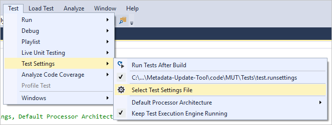
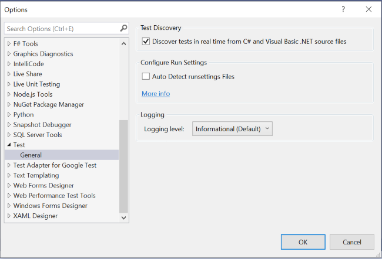
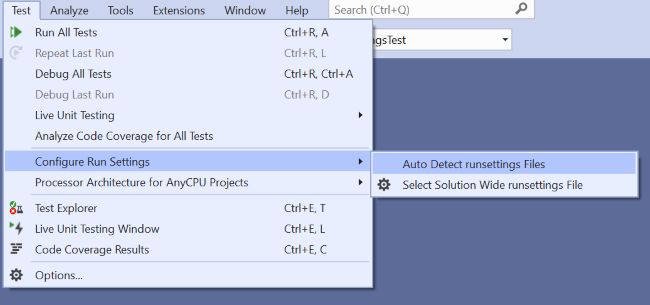
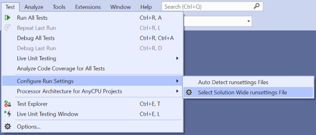

# Configure unit tests by using a *.runsettings* file

Unit tests in Visual Studio can be configured by using a *.runsettings* file. For example, you can change the .NET version on which the tests are run, the directory for the test results, or the data that's collected during a test run.

Run settings files are optional. If you don't require any special configuration, you don't need a *.runsettings* file. A common use of a *.runsettings* file is to customize [code coverage analysis](../test/customizing-code-coverage-analysis.md).

## Specify a run settings file

Run settings files can be used to configure tests that are run from the [command line](vstest-console-options.md), in the IDE, or in a [build workflow](/azure/devops/pipelines/test/getting-started-with-continuous-testing?view=vsts) using Azure Test Plans or Team Foundation Server (TFS).

### IDE

::: moniker range="vs-2017"

To specify a run settings file in the IDE, select **Test** > **Test Settings** > **Select Test Settings File**, and then select the *.runsettings* file.



The file appears on the Test Settings menu, and you can select or deselect it. While selected, the run settings file applies whenever you select **Analyze Code Coverage**.

::: moniker-end

::: moniker range=">=vs-2019"

#### Visual Studio 2019 version 16.3 and earlier

To specify a run settings file in the IDE, select **Test** > **Select Settings File**. Browse to and select the *.runsettings* file.


The file appears on the Test menu, and you can select or deselect it. While selected, the run settings file applies whenever you select **Analyze Code Coverage**.

#### Visual Studio 2019 version 16.4 and later

There are three ways of specifying a run settings file in Visual Studio 2019 version 16.4 and later:

- Add a build property to a project through either the project file or a Directory.Build.props file. The run settings file for a project is specified by the property **RunSettingsFilePath**. 

    - Project-level run settings is currently supported in C#, VB, C++, and F# projects.
    - A file specified for a project overrides any other run settings file specified in the solution.

    Example of specifying a *.runsettings* file for a project:
    
    ```xml
    <Project Sdk="Microsoft.NET.Sdk">
      <PropertyGroup>
        <RunSettingsFilePath>$(SolutionDir)\example.runsettings</RunSettingsFilePath>
      </PropertyGroup>
      ...
    </Project>
    ```

- Place a run settings file named ".runsettings" at the root of your solution.

  If auto detection of run settings files is enabled, the settings in this file are applied across all tests run. You can turn on auto detection of runsettings files from two places:
  
    - **Tools** > **Options** > **Test** > **Auto Detect runsettings Files**

      
      
    - **Test** > **Configure Run Settings** > **Auto Detect runsettings Files**
    
      

- In the IDE, select **Test** > **Configure Run Settings** > **Select Solution Wide runsettings File**, and then select the *.runsettings* file.

   
      
   - This file overrides the ".runsettings" file at the root of the solution, if it exists, and is applied across all tests run.  
   - This file selection only persists locally. 

::: moniker-end

### Command line

To run tests from the command line, use *vstest.console.exe*, and specify the settings file by using the **/Settings** parameter.

1. Launch the Visual Studio Developer Command Prompt:

   ::: moniker range="vs-2017"

   On the Windows **Start** menu, choose **Visual Studio 2017** > **Developer Command Prompt for VS 2017**.

   ::: moniker-end

   ::: moniker range=">=vs-2019"

   On the Windows **Start** menu, choose **Visual Studio 2019** > **Developer Command Prompt for VS 2019**.

   ::: moniker-end

2. Enter a command similar to:

   ```cmd
   vstest.console.exe MyTestAssembly.dll /EnableCodeCoverage /Settings:CodeCoverage.runsettings
   ```

   or

   ```cmd
   vstest.console.exe --settings:test.runsettings test.dll
   ```

For more information, see [VSTest.Console.exe command-line options](vstest-console-options.md).

## Customize tests

To customize your tests using a *.runsettings* file, follow these steps:

1. Add an XML file to your Visual Studio solution and save it as *test.runsettings*.

   > [!TIP]
   > The file name doesn't matter, as long as you use the extension *.runsettings*.

2. Replace the file contents with the XML from the example that follows, and customize it as needed.

::: moniker range="vs-2017"

3. On the **Test** menu, choose **Test Settings** > **Select Test Settings File**. Browse to the *.runsettings* file you created, and then select **OK**.

::: moniker-end

::: moniker range=">=vs-2019"

3. To select the run settings file, choose **Test** > **Select Settings File**. Browse to the *.runsettings* file you created, and then select **OK**.

::: moniker-end

   > [!TIP]
   > You can create more than one *.runsettings* file in your solution and select one as the active test settings file as needed.

## Example *.runsettings* file

The following XML shows the contents of a typical *.runsettings* file. Each element of the file is optional because it has a default value.

```xml
<?xml version="1.0" encoding="utf-8"?>
<RunSettings>
  <!-- Configurations that affect the Test Framework -->
  <RunConfiguration>
    <MaxCpuCount>1</MaxCpuCount>
    <!-- Path relative to directory that contains .runsettings file-->
    <ResultsDirectory>.\TestResults</ResultsDirectory>

    <!-- x86 or x64 -->
    <!-- You can also change it from the Test menu; choose "Processor Architecture for AnyCPU Projects" -->
    <TargetPlatform>x86</TargetPlatform>

    <!-- Framework35 | [Framework40] | Framework45 -->
    <TargetFrameworkVersion>Framework40</TargetFrameworkVersion>

    <!-- Path to Test Adapters -->
    <TestAdaptersPaths>%SystemDrive%\Temp\foo;%SystemDrive%\Temp\bar</TestAdaptersPaths>

    <!-- TestSessionTimeout was introduced in Visual Studio 2017 version 15.5 -->
    <!-- Specify timeout in milliseconds. A valid value should be greater than 0 -->
    <TestSessionTimeout>10000</TestSessionTimeout>
  </RunConfiguration>

  <!-- Configurations for data collectors -->
  <DataCollectionRunSettings>
    <DataCollectors>
      <DataCollector friendlyName="Code Coverage" uri="datacollector://Microsoft/CodeCoverage/2.0" assemblyQualifiedName="Microsoft.VisualStudio.Coverage.DynamicCoverageDataCollector, Microsoft.VisualStudio.TraceCollector, Version=11.0.0.0, Culture=neutral, PublicKeyToken=b03f5f7f11d50a3a">
        <Configuration>
          <CodeCoverage>
            <ModulePaths>
              <Exclude>
                <ModulePath>.*CPPUnitTestFramework.*</ModulePath>
              </Exclude>
            </ModulePaths>

            <!-- We recommend you do not change the following values: -->
            <UseVerifiableInstrumentation>True</UseVerifiableInstrumentation>
            <AllowLowIntegrityProcesses>True</AllowLowIntegrityProcesses>
            <CollectFromChildProcesses>True</CollectFromChildProcesses>
            <CollectAspDotNet>False</CollectAspDotNet>

          </CodeCoverage>
        </Configuration>
      </DataCollector>

      <DataCollector uri="datacollector://microsoft/VideoRecorder/1.0" assemblyQualifiedName="Microsoft.VisualStudio.TestTools.DataCollection.VideoRecorder.VideoRecorderDataCollector, Microsoft.VisualStudio.TestTools.DataCollection.VideoRecorder, Version=15.0.0.0, Culture=neutral, PublicKeyToken=b03f5f7f11d50a3a" friendlyName="Screen and Voice Recorder">
        <!--Video data collector was introduced in Visual Studio 2017 version 15.5 -->
        <Configuration>
          <!-- Set "sendRecordedMediaForPassedTestCase" to "false" to add video attachments to failed tests only -->
          <MediaRecorder sendRecordedMediaForPassedTestCase="true"  xmlns="">           ​
            <ScreenCaptureVideo bitRate="512" frameRate="2" quality="20" />​
          </MediaRecorder>​
        </Configuration>
      </DataCollector>
    </DataCollectors>
  </DataCollectionRunSettings>

  <!-- Parameters used by tests at run time -->
  <TestRunParameters>
    <Parameter name="webAppUrl" value="http://localhost" />
    <Parameter name="webAppUserName" value="Admin" />
    <Parameter name="webAppPassword" value="Password" />
  </TestRunParameters>

  <!-- Adapter Specific sections -->

  <!-- MSTest adapter -->
  <MSTest>
    <MapInconclusiveToFailed>True</MapInconclusiveToFailed>
    <CaptureTraceOutput>false</CaptureTraceOutput>
    <DeleteDeploymentDirectoryAfterTestRunIsComplete>False</DeleteDeploymentDirectoryAfterTestRunIsComplete>
    <DeploymentEnabled>False</DeploymentEnabled>
    <AssemblyResolution>
      <Directory path="D:\myfolder\bin\" includeSubDirectories="false"/>
    </AssemblyResolution>
  </MSTest>

</RunSettings>
```

## Elements of a *.runsettings* file

The sections that follow detail the elements of a *.runsettings* file.

### Run configuration

```xml
<RunConfiguration>
    <MaxCpuCount>1</MaxCpuCount>
    <ResultsDirectory>.\TestResults</ResultsDirectory>
    <TargetPlatform>x86</TargetPlatform>
    <TargetFrameworkVersion>Framework40</TargetFrameworkVersion>
    <TestAdaptersPaths>%SystemDrive%\Temp\foo;%SystemDrive%\Temp\bar</TestAdaptersPaths>
    <TestSessionTimeout>10000</TestSessionTimeout>
</RunConfiguration>
```

The **RunConfiguration** element can include the following elements:

|Node|Default|Values|
|-|-|-|
|**ResultsDirectory**||The directory where test results are placed.|
|**TargetFrameworkVersion**|Framework40|`FrameworkCore10` for .NET Core sources, `FrameworkUap10` for UWP-based sources, `Framework45` for .NET Framework 4.5 and higher, `Framework40` for .NET Framework 4.0, and `Framework35` for .NET Framework 3.5.<br /><br />This setting specifies the version of the unit test framework used to discover and execute the tests. It can be different from the version of the .NET platform that you specify in the build properties of the unit test project.<br /><br />If you omit the `TargetFrameworkVersion` element from the *.runsettings* file, the platform automatically determines the framework version based on the built binaries.|
|**TargetPlatform**|x86|x86, x64|
|**TreatTestAdapterErrorsAsWarnings**|false|false, true|
|**TestAdaptersPaths**||One or more paths to the directory where the TestAdapters are located|
|**MaxCpuCount**|1|This setting controls the degree of parallel test execution when running unit tests using available cores on the machine. The test execution engine starts as a distinct process on each available core, and gives each core a container with tests to run. A container can be an assembly, DLL, or relevant artifact. The test container is the scheduling unit. In each container, the tests are run according to the test framework. If there are many containers, then as processes finish executing the tests in a container, they're given the next available container.<br /><br />MaxCpuCount can be:<br /><br />n, where 1 <= n <= number of cores: up to n processes are launched<br /><br />n, where n = any other value: the number of processes launched can be up to the number of available cores|
|**TestSessionTimeout**||Allows users to terminate a test session when it exceeds a given timeout. Setting a timeout ensures that resources are well consumed and test sessions are constrained to a set time. The setting is available in **Visual Studio 2017 version 15.5** and later.|

### Diagnostic data adapters (data collectors)

The **DataCollectors** element specifies settings of diagnostic data adapters. Diagnostic data adapters gather additional information about the environment and the application under test. Each adapter has default settings, and you only have to provide settings if you don't want to use the defaults.

#### Code coverage adapter

```xml
<CodeCoverage>
    <ModulePaths>
        <Exclude>
            <ModulePath>.*CPPUnitTestFramework.*</ModulePath>
        </Exclude>
    </ModulePaths>

    <UseVerifiableInstrumentation>True</UseVerifiableInstrumentation>
    <AllowLowIntegrityProcesses>True</AllowLowIntegrityProcesses>
    <CollectFromChildProcesses>True</CollectFromChildProcesses>
    <CollectAspDotNet>False</CollectAspDotNet>
</CodeCoverage>
```

The code coverage data collector creates a log of which parts of the application code have been exercised in the test. For more information about customizing the settings for code coverage, see [Customize code coverage analysis](../test/customizing-code-coverage-analysis.md).

#### Video data collector

The video data collector captures a screen recording when tests are run. This recording is useful for troubleshooting UI tests. The video data collector is available in **Visual Studio 2017 version 15.5** and later.

To customize any other type of diagnostic data adapters, use a [test settings file](../test/collect-diagnostic-information-using-test-settings.md).

### TestRunParameters

```xml
<TestRunParameters>
    <Parameter name="webAppUrl" value="http://localhost" />
    <Parameter name="docsUrl" value="https://docs.microsoft.com" />
</TestRunParameters>
```

Test run parameters provide a way to define variables and values that are available to the tests at run time. Access the parameters using the <xref:Microsoft.VisualStudio.TestTools.UnitTesting.TestContext.Properties%2A?displayProperty=nameWithType> property:

```csharp
[TestMethod]
public void HomePageTest()
{
    string appURL = TestContext.Properties["webAppUrl"];
}
```

To use test run parameters, add a private <xref:Microsoft.VisualStudio.TestTools.UnitTesting.TestContext> field and a public <xref:Microsoft.VisualStudio.TestTools.UnitTesting.TestContext> property to your test class.

### MSTest run settings

```xml
<MSTest>
    <MapInconclusiveToFailed>True</MapInconclusiveToFailed>
    <CaptureTraceOutput>false</CaptureTraceOutput>
    <DeleteDeploymentDirectoryAfterTestRunIsComplete>False</DeleteDeploymentDirectoryAfterTestRunIsComplete>
    <DeploymentEnabled>False</DeploymentEnabled>
    <AssemblyResolution>
      <Directory Path="D:\myfolder\bin\" includeSubDirectories="false"/>
    </AssemblyResolution>
</MSTest>
```

These settings are specific to the test adapter that runs test methods that have the <xref:Microsoft.VisualStudio.TestTools.UnitTesting.TestMethodAttribute> attribute.

|Configuration|Default|Values|
|-|-|-|
|**ForcedLegacyMode**|false|In Visual Studio 2012, the MSTest adapter was optimized to make it faster and more scalable. Some behavior, such as the order in which tests are run, might not be exactly as it was in previous editions of Visual Studio. Set this value to **true** to use the older test adapter.<br /><br />For example, you might use this setting if you have an *app.config* file specified for a unit test.<br /><br />We recommend that you consider refactoring your tests to allow you to use the newer adapter.|
|**IgnoreTestImpact**|false|The test impact feature prioritizes tests that are affected by recent changes, when run in MSTest or from Microsoft Test Manager. This setting deactivates the feature. For more information, see [Which tests should be run since a previous build](https://msdn.microsoft.com/library/dd286589).|
|**SettingsFile**||You can specify a test settings file to use with the MSTest adapter here. You can also specify a test settings file [from the settings menu](#ide).<br /><br />If you specify this value, you must also set the **ForcedlegacyMode** to **true**.<br /><br />`<ForcedLegacyMode>true</ForcedLegacyMode>`|
|**KeepExecutorAliveAfterLegacyRun**|false|After a test run is completed, MSTest is shut down. Any process that is launched as part of the test is also killed. If you want to keep the test executor alive, set the value to **true**. For example, you could use this setting to keep the browser running between coded UI tests.|
|**DeploymentEnabled**|true|If you set the value to **false**, deployment items that you've specified in your test method aren't copied to the deployment directory.|
|**CaptureTraceOutput**|true|You can write to the debug trace from your test method using <xref:System.Diagnostics.Trace.WriteLine%2A?displayProperty=nameWithType>.|
|**DeleteDeploymentDirectoryAfterTestRunIsComplete**|true|To retain the deployment directory after a test run, set this value to **false**.|
|**MapInconclusiveToFailed**|false|If a test completes with an inconclusive status, it is mapped to the skipped status in **Test Explorer**. If you want inconclusive tests to be shown as failed, set the value to **true**.|
|**InProcMode**|false|If you want your tests to be run in the same process as the MSTest adapter, set this value to **true**. This setting provides a minor performance gain. But if a test exits with an exception, the remaining tests don't run.|
|**AssemblyResolution**|false|You can specify paths to additional assemblies when finding and running unit tests. For example, use these paths for dependency assemblies that aren't in the same directory as the test assembly. To specify a path, use a **Directory Path** element. Paths can include environment variables.<br /><br />`<AssemblyResolution>  <Directory Path="D:\myfolder\bin\" includeSubDirectories="false"/> </AssemblyResolution>`|

## See also

- [Configure a test run](https://github.com/microsoft/vstest-docs/blob/master/docs/configure.md)
- [Customize code coverage analysis](../test/customizing-code-coverage-analysis.md)
- [Visual Studio test task (Azure Test Plans)](/azure/devops/pipelines/tasks/test/vstest?view=vsts)
