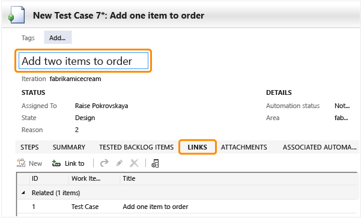
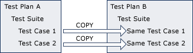
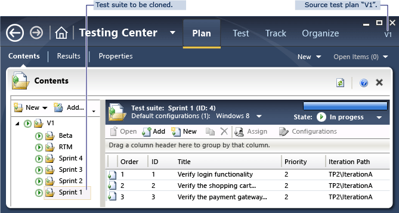
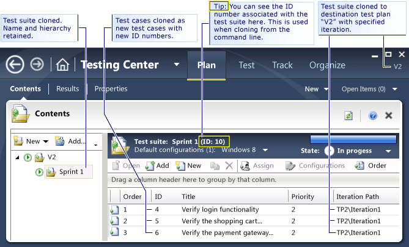

# Copying and cloning test suites and test cases
There are several ways to duplicate test suites and test cases when you are [planning tests](../test/planning-manual-tests-using-the-web-portal.md) in [!INCLUDE[vstsTfsExt](../test/includes/vststfsext_md.md)] (TFS).  
  
 It’s important to understand that a test suite or plan contains a set of *references* to test cases. If you delete the suite, or if you delete a test case from every suite, the test case still exists as a work item in Team Foundation, and you can find it with a query.  
  
## Copying and cloning in Microsoft Test Manager  
 All these procedures are performed in Microsoft Test Manager. Choose **Testing Center**, **Plan**, **Contents**. (You can also [clone from the command line](#tcm).)  
  
###  <a name="referenceTest"></a> Reference the same tests in different suites  
 Copy and paste test cases in order to use the same tests in different suites and plans. For example, you could have a quick suite that uses a subset of the tests in a more exhaustive suite.  
  
1.  Copy a test case with CTRL+C.  
  
2.  Select a different suite or plan and paste with CTRL+V.  
  
     (If you don’t select a different suite, nothing happens when you paste, because each suite can only have one reference to any test case.)  
  
 If you edit the test case in one suite, you’ll see the changes when you look at the test case in the other suite.  
  
 If you delete a test case from a suite, you’re only deleting it from that suite. If you delete it from every suite, the test case is still in Team Foundation, and you can find it with a work item query.  
  
###  <a name="cloneTest"></a> Clone and edit a test case  
 Use this to author a new test case that is similar to an existing one.  
  
1.  Right click a test case and choose **Create copy**.  
  
       
  
     The new test case opens.  
  
2.  Edit the new test. You must at least change its title. Under **Links**, you might want to delete the link to the old test case.  
  
       
  
 The two tests can subsequently be edited independently of each other.  
  
###  <a name="shallowCopyPlan"></a> Copy suites from another plan or suite  
 When you’re creating the test plan for a new sprint, you often want to repeat some of the tests from the previous sprints, to make sure that the functionality you already implemented is still working.  
  
   
  
1.  Create the test plan for the new sprint.  
  
2.  Select the destination suite or plan and then get the suites you want to copy.  
  
       
  
     The test suite and any suites it contains are copied, but they contain references to the same test cases. The source and destination test plans share the same test cases.  
  
 After the copy, you can add or remove test cases from either plan without affecting the other; however, if you edit a shared test case, the changes will impact both test plans.  
  
### Clone a test plan and its test cases  
 Cloning is useful if you want to branch your application into two versions: after copying, the tests for the two versions can be changed without affecting each other.  
  
   
  
1.  On the context menu for the old test plan, choose **Clone plan**.  
  
2.  In the dialog, select the suites you want to copy and set the new area and iteration paths.  
  
       
  
     Check **Clone Requirements** if you want to make new user stories or requirements that you will maintain separately. For example:  
  
    -   If you plan to merge the two branches eventually, you’ll want to keep the same requirements for functionality that has already been implemented and tested. Don’t check Clone Requirements.  
  
    -   If you plan to diverge into two similar but separate applications, you might want to change the user stories of one without changing the stories of the other. Check Clone Requirements to create an independent set of requirements for the new test cases.  
  
3.  [Update any query-based suites](../test_notintoc/organizing-test-cases-using-test-suites.md) that you copied to use the new area and iteration paths.  
  
4.  [Specify a build in the destination test plan](../test/automate-a-test-case-in-microsoft-test-manager.md) if you have cloned automated test cases.  
  
####  <a name="CopyingCloningTestSuitesWhatGetsCloned"></a> What Gets Cloned?  
 When you clone a test suite, the following objects are copied from the source test plan to the destination test plan:  
  
|Test plan object|Copied|Notes|  
|----------------------|------------|-----------|  
|Test case||Each new test case retains its shared steps.<br /><br /> A link is made between the source and new test cases.<br /><br /> The new test cases do not have test runs, bugs, test results, and build information.|  
|Shared steps referenced by cloned test cases|||  
|Test suite||The following data is retained:<br /><br /> -   Names and hierarchical structure of the test suites<br />-   Order of the test cases<br />-   Assigned testers<br />-   Configurations|  
|Action Recordings linked from a cloned test case|||  
|Links and Attachments|||  
|Test configuration||The test configuration is reapplied in the destination test plan.|  
|Test settings||The test setting for the destination test plan is applied.|  
|Test results|||  
|Test runs and exploratory test sessions||Because test runs are applicable only to the source test plan, they are not copied.|  
|Requirements-based suites|<br /><br /> Without `/clonerequirements`|Requirements-based test suites are converted to static test suites in the destination test plan. Cloned test cases will be referenced under this static test suite.<br /><br /> Cloned test cases do not include links to their original requirements work items.|  
|Requirements-based suites|<br /><br /> with `/clonerequirements`|Copied and linked to a new copy of the requirement work item.|  
|Requirements work items (product backlog items or user stories)|with `/clonerequirements`|Requirements work items that are associated with a cloned requirements-based suite are cloned.|  
|Bug work items<br /><br /> with `/clonerequirements`|with `/clonerequirements`|Cloned in a team project that uses the Scrum process template, or any project in which the Bug work item type is in the Requirements [work item category](../Topic/Use%20categories%20to%20group%20work%20item%20types.md).<br /><br /> In other projects, bugs are not cloned.|  
  
#### Example test suite cloned by using tcm.exe  
   
Source Test Plan  
  
   
Destination Test Plan  
  
####  <a name="tcm"></a> Clone test suites from the command line  
 Tcm.exe can be used to copy test suites. Open a command prompt and change directory to **%VS110COMNTOOLS%..\IDE**.  
  
 Open the Developer Command Prompt. Alternatively, use a standard command prompt and change directory to **%VS110COMNTOOLS%..\IDE**. Use tcm.exe:  
  
```ms-dos  
cd %VS110COMNTOOLS%..\IDE  
  
tcm suites /clone       
   /collection:http://Server:8080/tfs/Collection   
   /teamproject:"TeamProject"  
   [/destinationteamproject: "DestinationProject"]  
   /suiteid:sourceId   
   /destinationsuiteid:targetId   
   [/clonerequirements]   
   [/overridefield:"field name"="new value"] [/overridefield:"field 2"="value 2" ...]]   
```  
  
 Parameters:  
  
-   *Server, Collection, TeamProject:* The names of your team foundation server, team project collection, and team project.  
  
-   `destinationTeamProject`: Specify this if the destination test suite is in a different team project. It must be in the same team project collection. You must specify override field values for `"Iteration Path"` and `"Area Path"`.  
  
-   `suiteId` and `destinationSuiteId`: The ID of the suite to be copied, and the ID of the suite into which the new copy will be added. If you want to copy a whole test plan, use the ID of the suite at the root of the test plan.  
  
     The ID of a suite is displayed in the details pane when you select it in the test plan.  
  
     You can also get a list of suites by using `tcm suites /list`.  
  
-   `/clonerequirements`: Clone requirements work items that are attached to requirements-based test suites. If you omit this parameter, requirements-based test suites are converted to static suites.  
  
-   `/overridefield:"field name"="new value"`: Change the value of a field in each cloned work item. You can use multiple occurrences of this parameter to change as many fields as you want.  
  
 Examples:  
  
```  
tcm suites /clone /collection:http://tfs.fabrikam.com:8080/tfs/DefaultCollection  
   /teamproject:IceCream /destinationteamproject:ToyStore  
   /clonerequirements  
   /suiteid:234 /destinationsuiteid:567   
   /overridefield:"Iteration Path"="ToyStore\sprint3"  
   /overridefield:"Area Path"="ToyStore\catalog"  
  
```